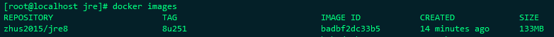

jre镜像制作
===========

基础系统：alpine：3.10.5

jre版本：1.8_251

创建目录
--------

.. code:: shell

   # mkdir -p /data/dockerfile/jre
   # cd /data/dockerfile/jre

jre软件包准备
-------------

软件下载
~~~~~~~~

jre软件包下载连接：

https://download.oracle.com/otn/java/jdk/8u251-b08/3d5a2bb8f8d4428bbe94aed7ec7ae784/jdk-8u251-linux-x64.tar.gz?AuthParam=1589161119_2bc2e690381f17ca44a75be12ee9b2b0

软件瘦身
~~~~~~~~

如果对功能不了解，可以不做此步骤，至于为什么要删除这些包，别问问就是百度

解压下载的软件包
^^^^^^^^^^^^^^^^

.. code:: shell

   # tar xf jdk-8u251-linux-x64.tar.gz ./
   # cd jre1.8.0_251

删除不需要的文件
^^^^^^^^^^^^^^^^

.. code:: shell

   #删除文本文件
   rm -rf COPYRIGHT LICENSE README release THIRDPARTYLICENSEREADME-JAVAFX.txtTHIRDPARTYLICENSEREADME.txt Welcome.html \
   #删除其他无用文件
   rm -rf lib/plugin.jar \
   	      lib/ext/jfxrt.jar \
   	      bin/javaws \
   	      lib/javaws.jar \
   	      lib/desktop \
   	      plugin \
	      lib/deploy* \
	      lib/*javafx* \
	      lib/*jfx* \
	      lib/amd64/libdecora_sse.so \
	      lib/amd64/libprism_*.so \
	      lib/amd64/libfxplugins.so \
	      lib/amd64/libglass.so \
		  lib/amd64/libgstreamer-lite.so \
	      lib/amd64/libjavafx*.so \
		  lib/amd64/libjfx*.so
	

重新打包
^^^^^^^^

.. code:: shell

   # tar -zcvf jre1.8.0_251.tar.gz jre1.8.0_251

创建Dockerfile
--------------

.. code:: shell

   FROM alpine:3.10.5
   MAINTAINER ZHUSHUAI "zhus2015@163.com"
   RUN echo http://mirrors.aliyun.com/alpine/v3.10/main/ > /etc/apk/repositories && \
       echo http://mirrors.aliyun.com/alpine/v3.10/community/ >> /etc/apk/repositories
   RUN apk update && apk upgrade
   RUN apk --no-cache add ca-certificates wget tzdata \
       && wget -q -O /etc/apk/keys/sgerrand.rsa.pub https://alpine-pkgs.sgerrand.com/sgerrand.rsa.pub \
       && wget https://github.com/sgerrand/alpine-pkg-glibc/releases/download/2.30-r0/glibc-2.30-r0.apk \
       && cp /usr/share/zoneinfo/Asia/Shanghai /etc/localtime \
       && echo 'Asia/Shanghai' >/etc/timezone \
       && apk add glibc-2.30-r0.apk \
       && apk del tzdata \
       && rm -rf /var/cache/apk/* /tmp/* glibc-2.30-r0.apk
   ADD jre1.8.0_251.tar.gz /srv/
   RUN ln -s /srv/jre1.8.0_251 /srv/jre
   ENV JAVA_HOME /srv/jre
   ENV CLASSPATH .:$JAVA_HOME/lib/dt.jar:$JAVA_HOME/lib/tools.jar
   ENV PATH $JAVA_HOME/bin:$PATH

生成镜像
--------

.. code:: 

   # docker build . -t zhus2015/jre8:8u251

文档参考连接：

https://github.com/sgerrand/alpine-pkg-glibc

https://wiki.alpinelinux.org/wiki/Running\ *glibc*\ programs

https://blog.csdn.net/water_java/article/details/104389419/

https://www.jianshu.com/p/e824f3446ec6
