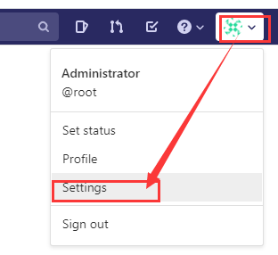
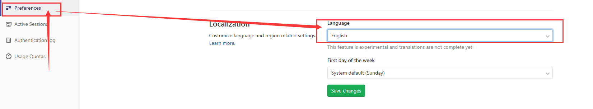

# 强大的代码管理工具Gitlab

!!! node "文档还在努力完善中"

## 关于

## 安装部署

gitlab有两种部署方式，一种是脚本部署，另一种是docker部署

```shell
sudo yum install -y curl policycoreutils-python openssh-server
sudo systemctl enable sshd
sudo systemctl start sshd

sudo firewall-cmd --permanent --add-service=http
sudo firewall-cmd --permanent --add-service=https
sudo systemctl reload firewalld
```


```shell
curl https://packages.gitlab.com/install/repositories/gitlab/gitlab-ee/script.rpm.sh | sudo bash
#可以设置EXTERNAL_URL
sudo EXTERNAL_URL="http://10.10.10.201" yum install -y gitlab-ee
```


## 使用

安装后通过浏览器访问http://10.10.10.201即可

初始要重新设置密码


### 中文设置

新版本的gitlab已经直接支持了中文，只需要进行简单的设置即可


 



设置完成保存后重新刷新页面即可