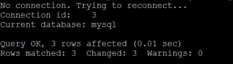

# Mysql日常使用

## 日常操作

> 修改root密码

```sql
mysqladmin -uroot password 'datapassi'
```

由于root初始没有密码所以省略了-p参数

> 查看当前有的数据库

```sql
show databases;
```

> 查询当前在那个数据库下

```
select  database;
```

> ​	查询当前数据可的用户

```sql
select  user();
```

> 查询当前数据的版本

```
select  version();
```

> 选择数据库（可以不使用";"）

```
use database
```

> 显示表字段

```
desc table_name;
```

> 显示表的创建语句

```
show create table table_name;
```

可以加上\G显示的较为清晰

> 查询存储过程

```
show procedure status; 
```

> 查看函数

```
show function status; 
```

> 创建一个库

create database database_name；

> 删除一个库

```
drop database database_name;
```

> 显示当前数据库中的表

```
show tabels;
```

> 创建表

```
create table table_name  (`id` int(4), name char(40)) ENGINE=MyISAM DEFAULT CHARSET=gbk;
```

> 插入数据

```
insert into table_name 参数;
```

> 修改数据

```
update table_name set 条件 where 改变参数数据;
```

> 删除表

```
drop table table_name;
```

> 清空一个表

```
delete from table_name;
```

> 删除指定条件的行

```
delete from table_name where 条件;
```

备注：

    truncate table table_name  清空一个表
    不带where参数的delete语句可以删除mysql表中所有内容，使用truncate table也可以清空mysql表中所有内容。
    效率上truncate比delete快，但truncate删除后不记录mysql日志，不可以恢复数据。
    delete的效果有点像将mysql表中所有记录一条一条删除到删完，
    而truncate相当于保留mysql表的结构，重新创建了这个表，所有的状态都相当于新表


> 刷新权限

```sql
flush privileges;
```

> 查看当前数据库中的队列

```
show processlist;
```

> 查看数据库的变量

```
show variables；
```

> 查看数据库的状态

```
show status；
```


查看所有用户：

​       SELECT DISTINCT CONCAT('User: ''',user,'''@''',host,''';') AS query FROM mysql.user;

repair table 库名.表名; 修复表

mysql的备份与恢复

**备份数据库**: mysqldump -uroot -ppassword 数据库名 >路径+备份名      

**备份数据库中的一个表？（恢复 表与恢复数据库相同）** mysqldump -uroot -ppassword 数据库名  表名>路径+备份名 

**恢复数据库**  mysql -uroot -ppassword 数据库名 <备份文件   

注意：备份的时候也可以增加字符集参数，同样恢复的时候也要增加字符集参数

​    mysqldump -uroot --default-character-set=gbk -ppassword 数据库名 >路径+备份名   备份数据库

**慢日志：**

查询：

SHOW VARIABLES LIKE '%query%';

使用这个语句可以看到当前mysql慢查询是否开启，以及mysql的慢查询日志文件在哪。

slow_query_log   #是否开启慢查询

slow_query_log_file #日志的存放位置

long_query_time   #超过多少秒的查询就写入日志

1、在my.ini的[mysqld]添加如下语句：

log-slow-queries =

2、命令行操作：

set global slow_query_log=on;

set global long_query_time=1;#设置记录查询超过多长时间的sql

set global slow_query_log_file='/data/mysql/log/slow_query.log';#设置mysql慢查询日志路径，此路径需要有写权限

这种方式不用重启mysql服务。 

解析mysql慢查询日志

使用mysqldumpslow命令可以解析mysql慢查询日志。

Mysqldumpslow命令参数如下：

-s，是表示按照何种方式排序，c、t、l、r分别是按照记录次数、时间、查询时间、返回的记录数来排序，ac、at、al、ar，表示相应的倒叙；

-t，是top n的意思，即为返回前面多少条的数据；

-g，后边可以写一个正则匹配模式，大小写不敏感的；

 

比如说要按照sql执行时间最长的前20条sql

mysqldumpslow -s t -t 20 -g 'select'/opt/data/slowquery_2016050921.log

得到按照时间排序的前10条里面含有左连接的查询语句。

mysqldumpslow -s t -t 10 -g 'left join'/opt/data/slowquery_2016050921.log


## 忘记Root密码

### 修改mysql配置文件

  在my.cnf的mysqld中增加：skip-grant-tables 命令跳过认证

###  重启mysqld服务

不同版本的操作系统，命令稍有不同，注意修改

```shell
systemctl restart mysqld
```


### 修改密码

```shell
#登录mysql
mysql -u root -p
#直接回车即可，没有密码

#切换数据库
use mysql
#修改密码
 mysql 5.6之前版本：
 update user set password=password ('password') where user='root';
#('password'):中的password是要修改的密码
#mysql 5.7 : 
#5.7版本user.user表中将password字段换成了authentication_string字段
update user set authentication_string=password('pasaword') where user='root';
```

​              看到下图说明执行成功

 


### 修改配置文件my.cnf 删除skip-grant-tables行

### 重启mysqld服务

```shell
systemctl restart mysqld
```

使用新的密码即可登录mysql

注意5.7版本在使用重置后的密码登录后进行操作可能提示：

ERROR 1820 (HY000): You must reset your **password** using **ALTER** USER statement；

会提示密码过期，使用**SET** **PASSWORD** = **PASSWORD**('yourpass');重新设置密码即可

