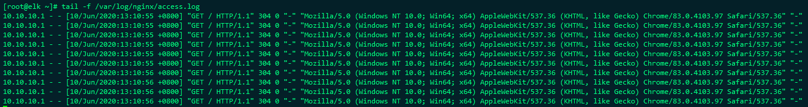
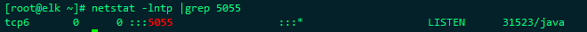
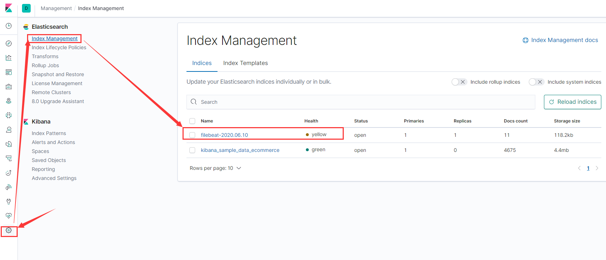
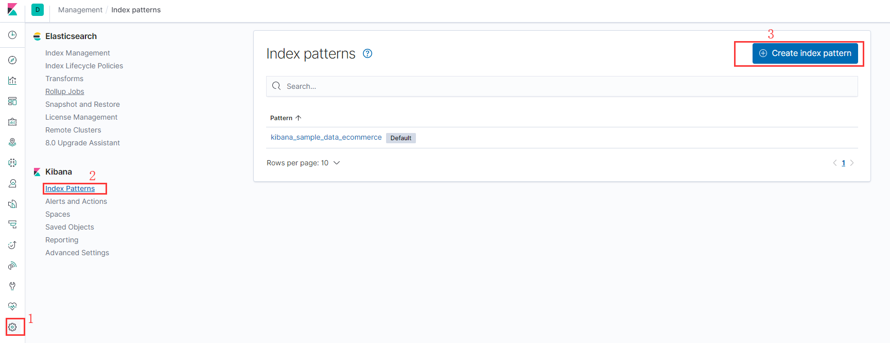
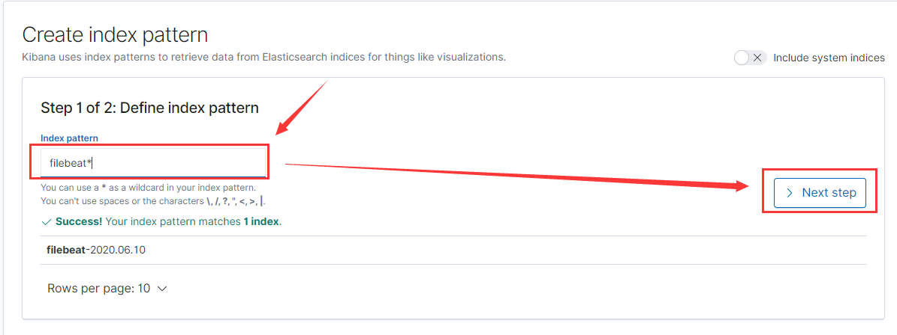
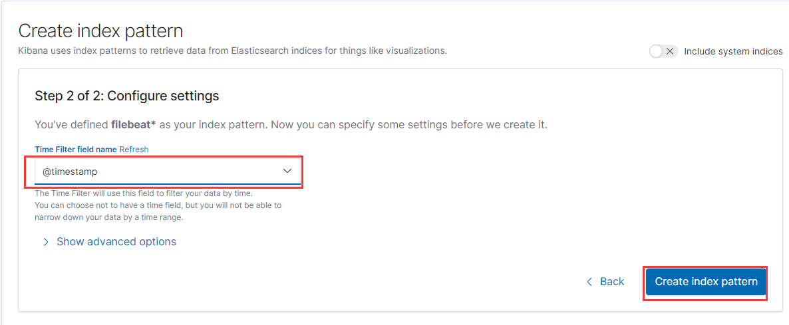
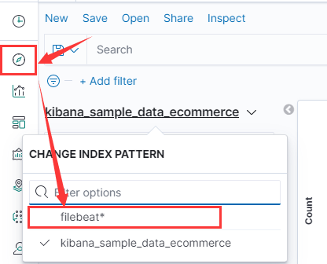

# ELK收集Nginx日志

这里我们使用filebeat收集nginx日志

filebeat官方下载地址：https://www.elastic.co/cn/downloads/beats/filebeat


## 安装Filebeat

### 配置yum源

```
[elastic-7.x]
name=Elastic repository for 7.x packages
baseurl=https://artifacts.elastic.co/packages/7.x/yum
gpgcheck=1
gpgkey=https://artifacts.elastic.co/GPG-KEY-elasticsearch
enabled=1
autorefresh=1
type=rpm-md
```


### 安装

```
yum install -y filebeat
```

??? note "如果安装较慢，可以将rpm包先下载下来然后安装"


## 安装nginx

因为仅仅是测试，这里我们直接使用yum安装了nginx

```
yum install nginx -y
```

!!! warning "如果这里提示找不到nginx，需要安装epel-releases扩展包"

> 启动并访问，使其产生部分日志

```
systemctl start nginx
```

使用浏览器多访问几次，可以看到产生了部分日志




## 修改配置

### 配置logstash

之前搭建的时候我们为logstash增加了一个配置，现在要进行修改使用，当然也可以新增一个配置文件，这里我选择新增一个配置

> vim /etc/logstash/conf.d/nginx_logs.conf

```
# 监听5055端口作为输入,接受filebeat传输过来的数据
input {
    beats {
        port => "5055"
    }
}

# 数据过滤
filter {
    grok {
        match => { "message" => "%{COMBINEDAPACHELOG}" }
    }
    geoip {
        source => "clientip"
    }
}

# 输出配置，这里直接输出到了elasticsearch，这里我是单点就写了一个，如果是集群就
# 将所有的IP写进去使用","分开;这里的索引可以自己定义
output {
    elasticsearch {
        hosts => ["10.10.10.110:9200"]
        manage_template => false
        index => "%{[@metadata][beat]}-%{+YYYY.MM.dd}"
        document_type => "%{[@metadata][type]}"
    }
}

```


### 配置filebeat

> vim /etc/filebeat/filebeat.yml

主配置文件我们只修改输出，将输出elasticsearch注释，将日志输出到logstash的5055端口，filebeat在7.0版本之后已经默认带了modules，我们可以直接使用自带的modules，

```
#output.elasticsearch:
#  hosts: ["localhost:9200"]
output.logstash:
  # The Logstash hosts
  hosts: ["10.10.10.110:5055"]
```


> 启用nginx模块 

```
filebeat modules enable nginx
```

!!! note "这里也可以手动将/etc/filebeat/modules.d/nginx.yml.disabled文件修改为nginx.yml"


> vim /etc/filebeat/modules.d/nginx.yml

??? node "官方配合参考地址"

​	https://www.elastic.co/guide/en/beats/filebeat/7.7/filebeat-module-nginx.html

```yml
- module: nginx
  # Access logs
  access:
    enabled: true
    var.paths: ["/var/log/nginx/access.log*"]

  # Error logs
  error:
    enabled: true
    var.paths: ["/var/log/nginx/error.log*"]

# Ingress-nginx controller logs. This is disabled by default. It could be used in Kubernetes environments to parse ingress-nginx logs
  ingress_controller:
    enabled: false
```


## 启动服务

### 重启logstash

先重启logstash服务，不然filebeat无法将日志输入到指定端口

```
systemctl restart logstash
netstat -lntp |grep 5055
```

可以看到5055端口已经启动




### 启动filebeat

```
systemctl start filebeat
```


## kibana页面配置

通过浏览器访问kibana页面

进入页面后依次选择选择“Management” -> "Index Management" 可以在这个页面看到我们生成的索引




接下来我们创建一个index pattern，这样通过index pattern进行多日志的过滤

> 依次“Management” ->“Index patterns”->"Create index pattern"，



 

> 在过滤框中输入“filebeat*”，点击next step




> 在下拉框中选择“@timestamp”，然后选择"Create index pattern"




接下来就可以进入日志查看界面

选择"Discover"，按照图示选择对应过滤器，这时我们就看到了我们的nginx日志，可以尝试刷新页面尝试，看是否可以看到最新的日志，会有一点时间延迟

 


## 总结

这只是一个简单的展示，还需要我们不停的优化日志格式、索引规则等等，数据量大的时候我们还可能增加kafaka、reids等等作为缓存降低ELK集群的压力，其实在部署当中会遇到一些问题，可以自己尝试通过分析日志进行解决。

