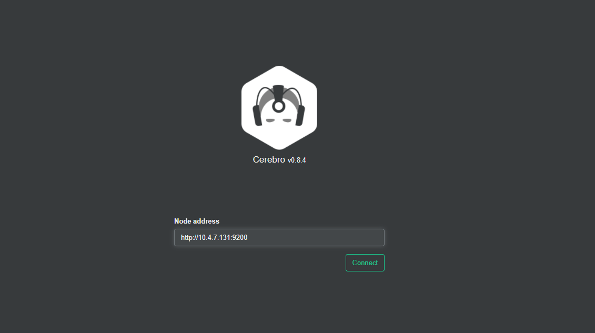
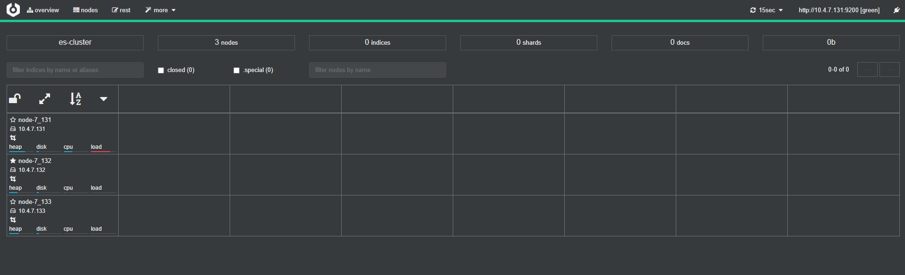

# Docker安装ELK集群

这里使用docker-compose管理elk集群，因此需要安装docker-compose，请自行参考相关文档。

|      |     ip     |      |      |
| ---- | :--------: | ---- | ---- |
|      | 10.4.7.131 |      |      |
|      | 10.4.7.132 |      |      |
|      | 10.4.7.133 |      |      |


## Elasticsearch

### 创建相关目录

```shell
[root@10-4-7-131 ~]# mkdir -p /data/elasticsearch/data
[root@10-4-7-131 ~]# mkdir -p /data/elasticsearch/logs
[root@10-4-7-131 ~]# chmod 777 /data/elasticsearch/logs
[root@10-4-7-131 ~]# chmod 777 /data/elasticsearch/data
```

### 创建配置文件

```shell
[root@10-4-7-131 ~]# vim /data/elasticsearch/elasticsearch.yml
cluster.name: "docker-cluster"
network.host: 0.0.0.0
http.cors.enabled: true
http.cors.allow-origin: "*"
```


### 创建Elasticsearch启动文件

!!! tip "每台机器的配置有细微不同，请自行修改"

> [root@10-4-7-131 ~]# cd /data/elasticsearch && vim docker-compose.yml

```yml
version: '3'
services:
  elasticsearch:                    # 服务名称
    image: elasticsearch:7.9.3      # 使用的镜像
    container_name: elasticsearch   # 容器名称
    restart: always                 # 失败自动重启策略
    environment:                                    
      - node.name=node-7_131
      - network.publish_host=10.4.7.131
      - network.host=0.0.0.0
      - discovery.seed_hosts=10.4.7.131,10.4.7.132,10.4.7.133
      - cluster.initial_master_nodes=10.4.7.131,10.4.7.132,10.4.7.133
      - cluster.name=es-cluster
      - bootstrap.memory_lock=true
      - "ES_JAVA_OPTS=-Xms1024m -Xmx1024m"
    ulimits:        # 栈内存的上限
      memlock:
        soft: -1    # 不限制
        hard: -1    # 不限制
    volumes:
      - /data/elasticsearch/elasticsearch.yml:/usr/share/elasticsearch/config/elasticsearch.yml 
      - /data/elasticsearch/data:/usr/share/elasticsearch/data
      - /data/elasticsearch/logs:/usr/share/elasticsearch/logs
    ports:
      - 9200:9200
      - 9300:9300
volumes:
  esdata:
    driver: local
```

### 启动容器

```shell
[root@10-4-7-131 elasticsearch]# docker-compose up -d
```

> 如果没有优化过内核，容器可能无法启动，请优化内核参数
>
> vm.max_map_count = 262144
> net.ipv4.ip_forward = 1

### 验证Elasticsearch的启动状态

```shell
[root@10-4-7-131 elasticsearch]# curl http://localhost:9200
{
  "name" : "node-7_131",
  "cluster_name" : "es-cluster",
  "cluster_uuid" : "Ns-SB57pQs-JxBssU3lT0Q",
  "version" : {
    "number" : "7.9.3",
    "build_flavor" : "default",
    "build_type" : "docker",
    "build_hash" : "c4138e51121ef06a6404866cddc601906fe5c868",
    "build_date" : "2020-10-16T10:36:16.141335Z",
    "build_snapshot" : false,
    "lucene_version" : "8.6.2",
    "minimum_wire_compatibility_version" : "6.8.0",
    "minimum_index_compatibility_version" : "6.0.0-beta1"
  },
  "tagline" : "You Know, for Search"
}
```

## 安装Elasticsearch页面插件(选装)

> 在一台服务器上安装即可

### 运行Cerebro

```shell
[root@10-4-7-131 elasticsearch]# docker run --name cerebro -d -p 9100:9000 lmenezes/cerebro:latest
```

### 访问Cerebro页面

http://ip:port



配置Elasticsearch集群节点地址，如果是经常使用的话，可以将Cerebro的配置文件映射出来进行配置，进入后我们即可看到集群的信息，入下图



## Kibana

!!! warning "在一台服务器上安装即可"

### 创建相关目录

```shell
[root@10-4-7-131 ~]# mkdir -p /data/kibana
```

### 创建配置文件

> [root@10-4-7-131 kibana]# d /data/kibana && vim kibana.yml

```yml
server.name: kibana
server.host: "0"
elasticsearch.hosts: [ "http://10.4.7.131:9200","http://10.4.7.132:9200","http://10.4.7.133:9200" ]
monitoring.ui.container.elasticsearch.enabled: true
```

### 创建Kibana启动文件

> [root@10-4-7-131 ~]# cd /data/kibana && vim docker-compose.yml

```yml
version: '3'
services:
  kibana:
    image: kibana:7.9.3
    container_name: kibana
    restart: always
    environment:
      #- I18N_LOCALE=zh-CN
      - XPACK_GRAPH_ENABLED=true
      - TIMELION_ENABLED=true
      - XPACK_MONITORING_COLLECTION_ENABLED="true"
    ports:
      - "5601:5601"
    volumes:
      - /etc/localtime:/etc/localtime
      - /data/kibana/kibana.yml:/usr/share/kibana/config/kibana.yml
      - /data/kibana/plugins:/usr/share/kibana/plugins
```

### 启动Kibana容器

```shell
[root@10-4-7-131 kibana]# docker-compose up -d
```


### 页面访问即可

http://10.4.7.131:5601/


添加示例数据进入相关页面即可


## Logstash

### 创建相关目录

```shell
[root@10-4-7-131 ~]# mkdir -p /data/logstash/{conf.d,logs}
```

### 创建相关配置文件

> [root@10-4-7-131 ~]# cd /data/logstash && vim logstash.yml

```yml
path.config: /usr/share/logstash/config/conf.d/*.conf
path.logs: /var/log/logstash
```

> [root@10-4-7-131 logstash ]# cd /data/logstash/conf.d && vim test.conf

```yml
input {
    beats {
    port => 5044
    codec => "json"
}
}

output {
  elasticsearch {
        hosts => ["10.4.7.131:9200","10.4.7.133:9200","10.4.7.133:9200"]
        index => "nginx-access-log-%{+YYYY.MM.dd}"
}
  stdout { codec => rubydebug }
}
```


### 创建Logstash启动文件

> [root@10-4-7-131 conf.d ]# cd /data/logstash && vim docker-compose.yml 

```yml
version: '3'
services:
  logstash:
    image: logstash:7.9.3
    container_name: logstash
    restart: always
    volumes:
      - /etc/localtime:/etc/localtime
      - /data/logstash/conf.d:/usr/share/logstash/config/conf.d
      - /data/logstash/logstash.yml:/usr/share/logstash/config/logstash.yml
      - /data/logstash/logs:/var/logs/logstash
    ports:
      - 9600:9600
      - 5044:5044
```

### 启动容器

```shell
[root@10-4-7-131 logstash]# docker-compose up -d
```