# Jenkins通过ssh插件部署

**安装必要插件**

安装方法参考其他资料，安装插件名称：Publish Over SSH


**配置SSH参数**

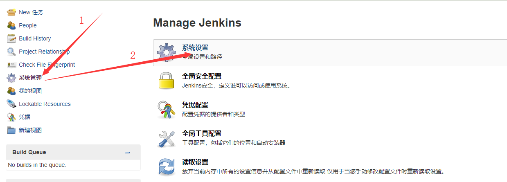

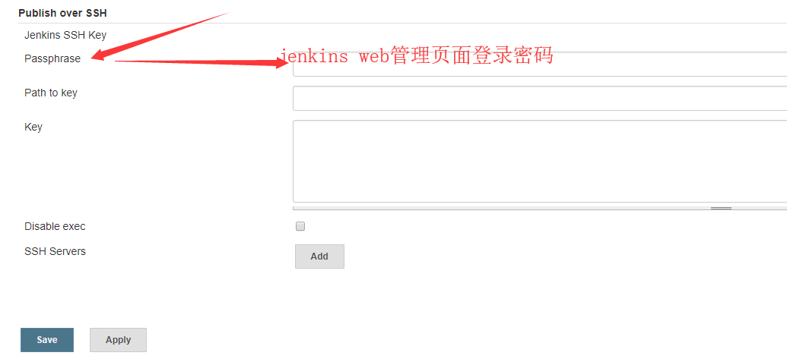

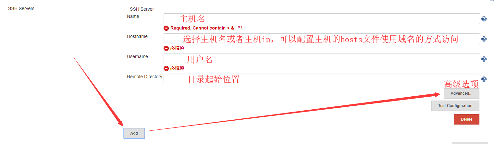

这里Jenkins官方建议是用密码访问，如果想使用密钥验证也是可以的

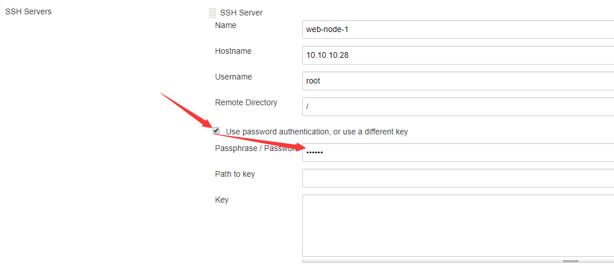

测试后端机器的可连接性，如果不是seccess就要检查相关配置参数

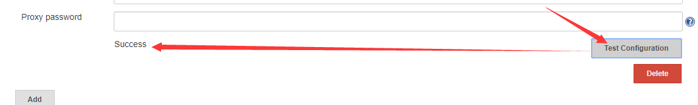

**三、创建一个新的任务**

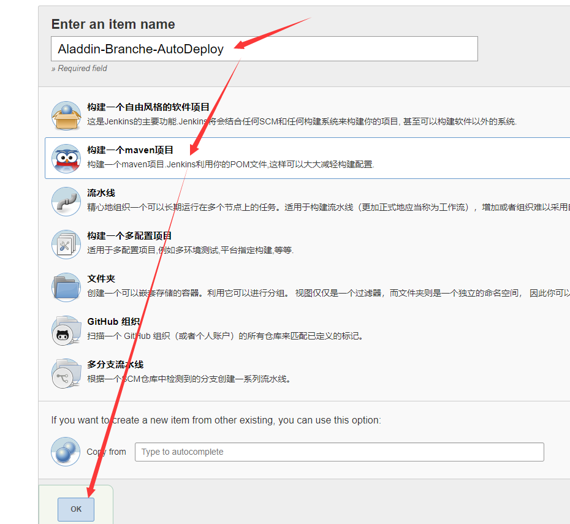

这里我选择了开启参数化构建，也可以不选择

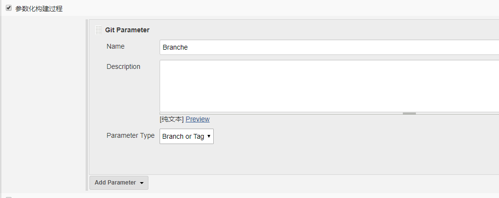

Git版本库信息填写，增加了自定义参数Branche，不了解的查看关于参数化构架的文档

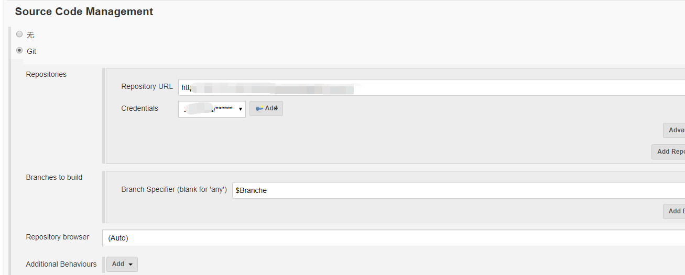

构建参数，我习惯了每次先清理一下然后再进行构建，同时跳过测试


选择通过SSH的方式推送构件好的文件到后端机器上

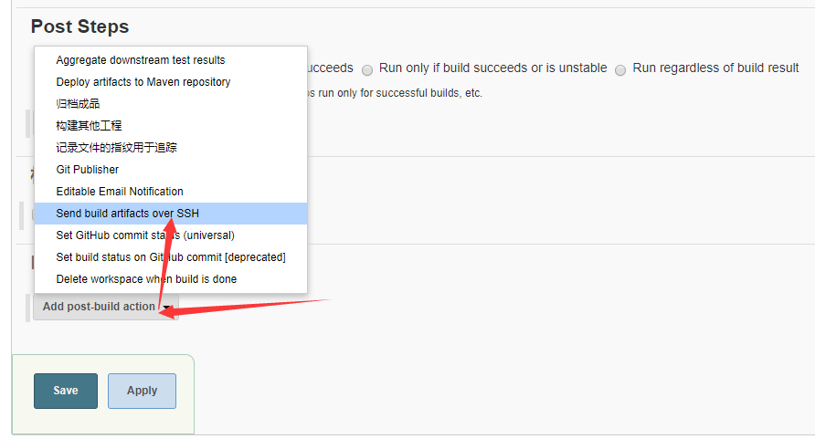

后端机器的相关参数填写

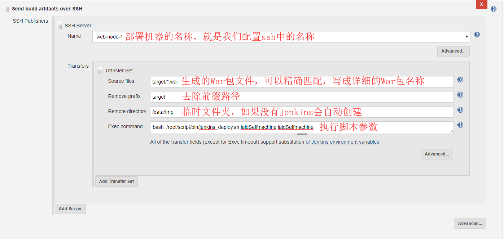

**将脚本上传到后端机器上**

上传目录:/root/script/bin/  这里附上我的脚本

请根据自己的项目名称进行修改

```shell
#!/bin/bash

# 此脚本用于配合Jenkins自动部署War包使用,如果要匹配多项目的话
# 相关配置和参数需要修改
# Version:v1.0
# Time: 2018-12-12

source /etc/profile
Time=`date +%Y%m%d%S`
#WarName="ialdSelfmachine"
WarName=$1
#Project="ialdSelfmachine"
Project=$2

JenkinsDir=/data/tmp
TomcatHome=/home/aladdin/tomcat/apache-tomcat-8.5.23
BackupDir=/data/backup/Aladdin

##Stop Tomcat
Tstatus_a=`ps -ef |grep ${TomcatHome}/ | grep -Evw "cronolog|sh" | grep -v grep | wc -l`
if [ ${Tstatus_a} -gt 0 ]
then
  echo "停止tomcat..."
  sh ${TomcatHome}/bin/shutdown.sh & > /dev/null
  sleep 10
  Tstatus_b=`ps -ef |grep ${TomcatHome}/ | grep -Evw "cronolog|sh" | grep -v grep | wc -l`
  if [ ${Tstatus_b} -gt 0 ]
  then
     Pid=`ps -ef |grep ${TomcatHome}/ | grep -Evw "cronolog|sh" | grep -v grep | awk '{print $2}'`
     kill ${Pid}
  fi
fi

if [ -f "${TomcatHome}/webapps/${Project}.war" ]
then
  echo "备份文件..."
  cp ${TomcatHome}/webapps/${Project}.war ${BackupDir}/${Project}_${Time}.war
  rm -rf ${TomcatHome}/webapps/${Project}.war
fi

if [ -d "${TomcatHome}/webapps/${Project}" ]
then
  rm -rf ${TomcatHome}/webapps/${Project}
fi

echo "部署War包..."
mv ${JenkinsDir}/${WarName}.war ${TomcatHome}/webapps/${Project}.war
##start Tomcat
echo "启动Tomcat..."
sh ${TomcatHome}/bin/startup.sh
sleep 5
```

**构建测试**

看到下面涂总有success及部署成功，这时通过web或者其他方式去测试一下服务是否正常即可

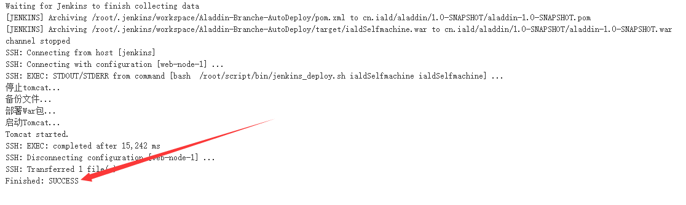