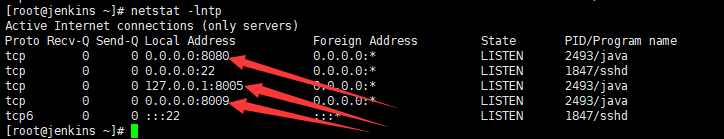
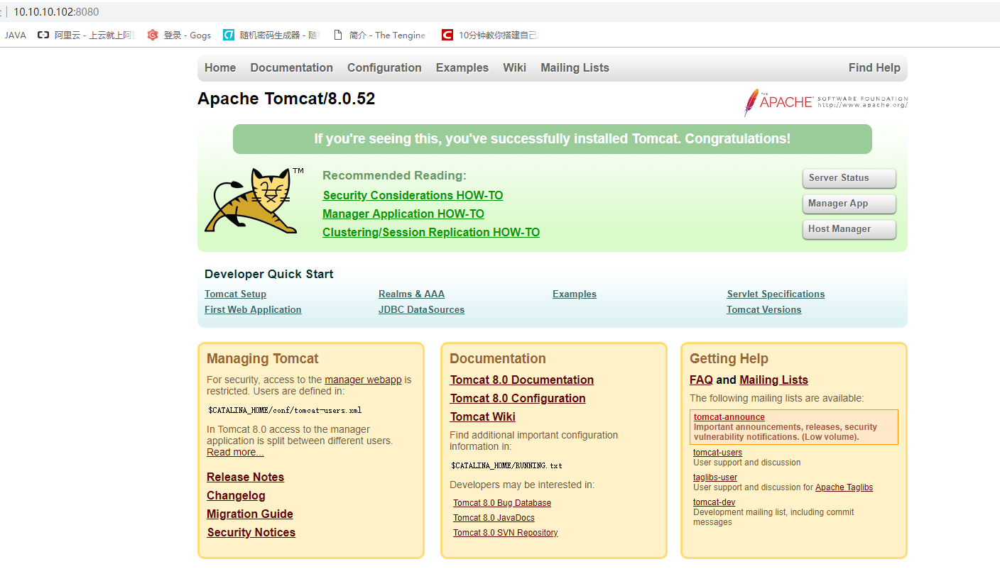
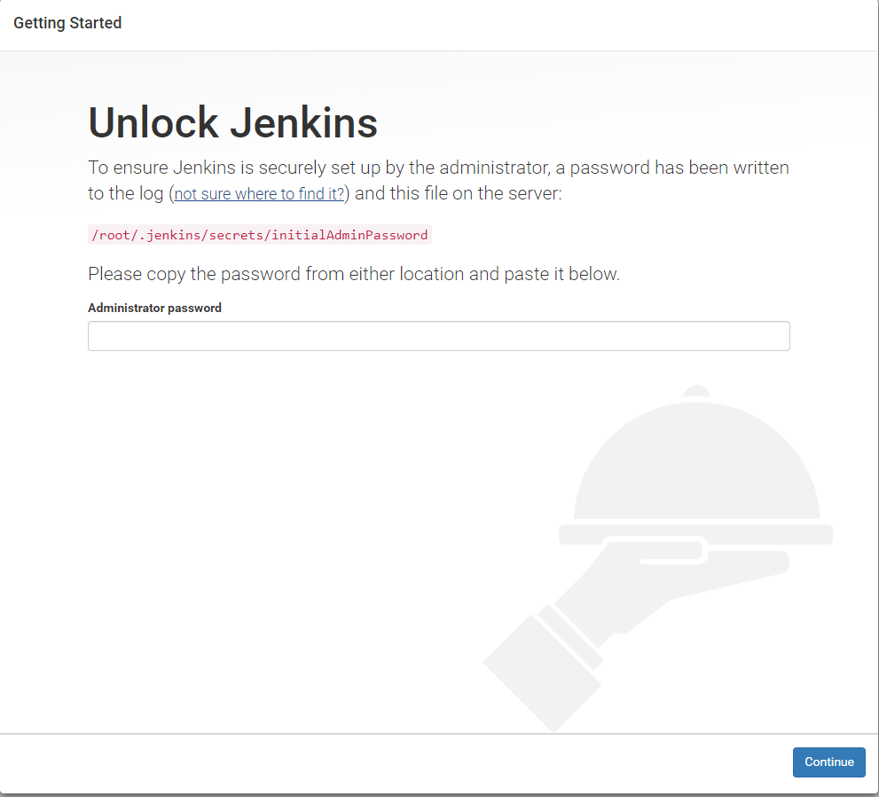
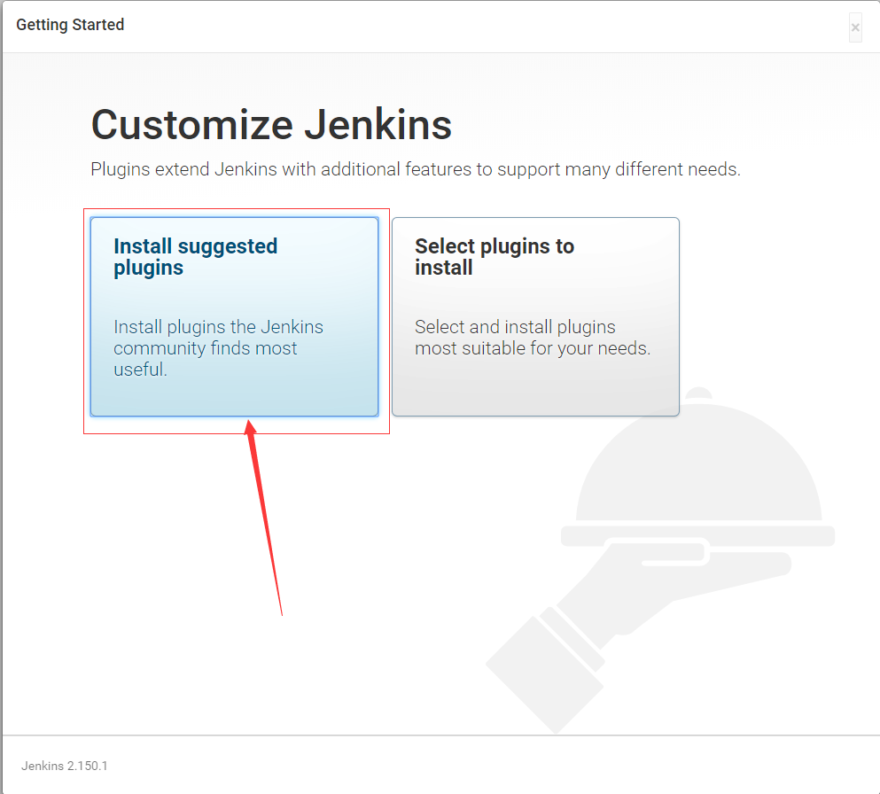
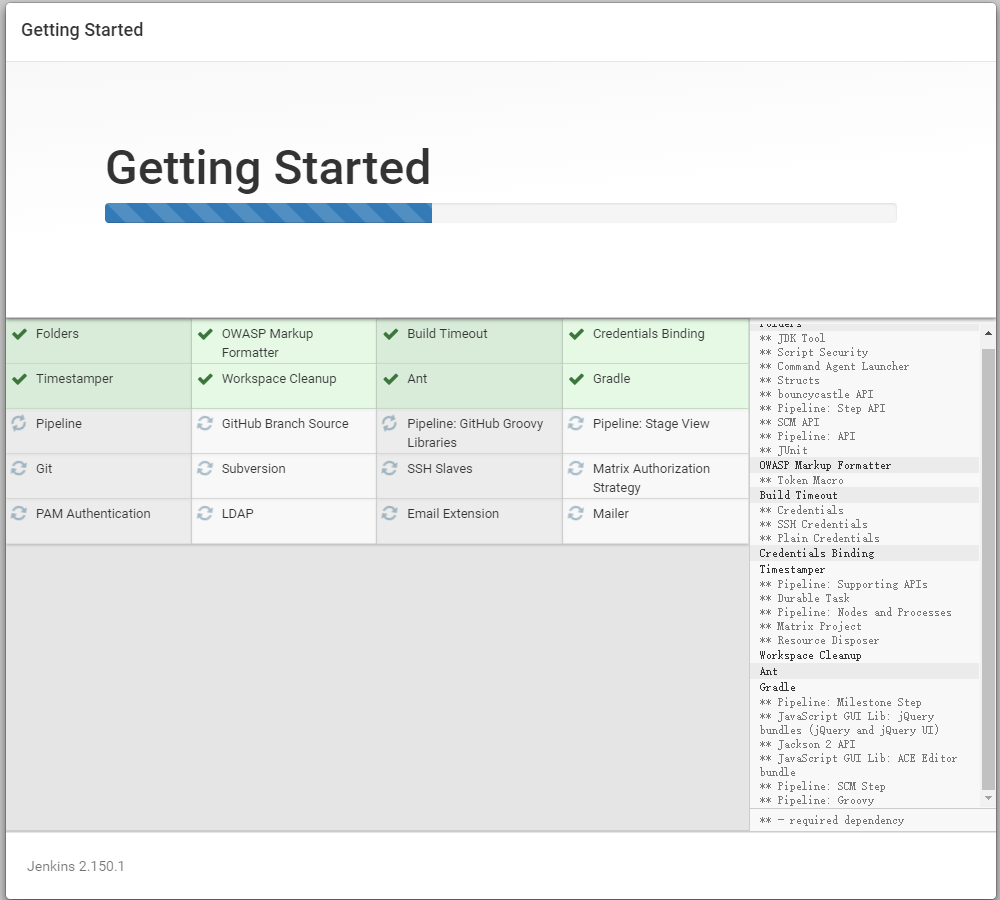
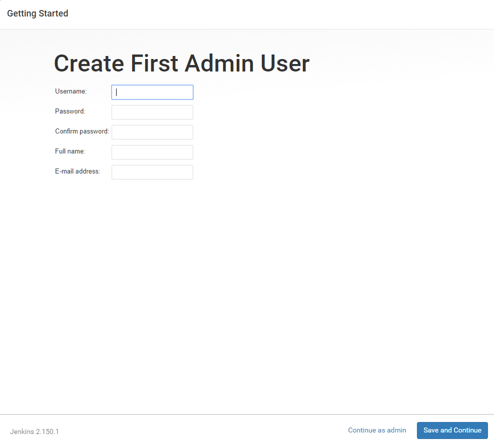
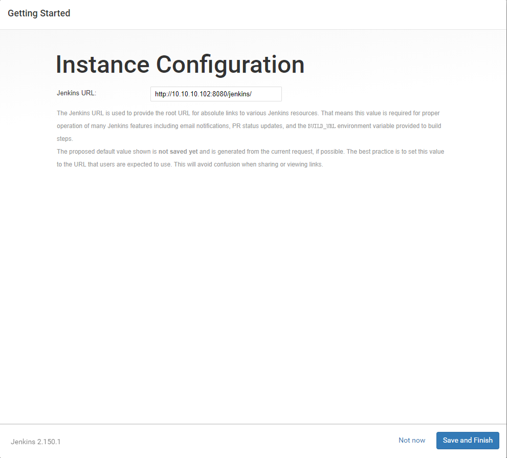
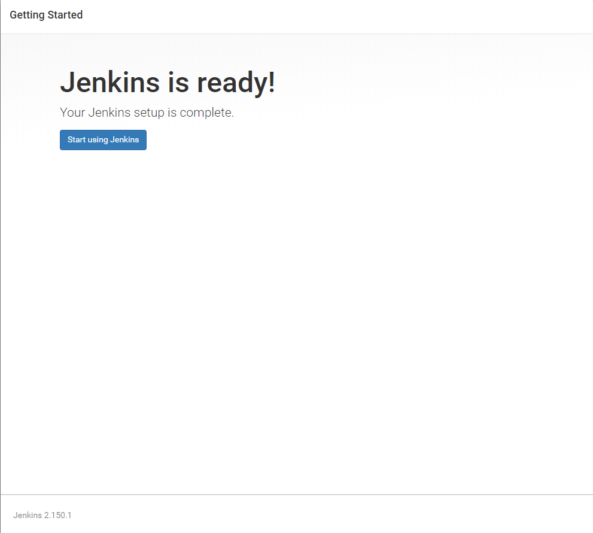
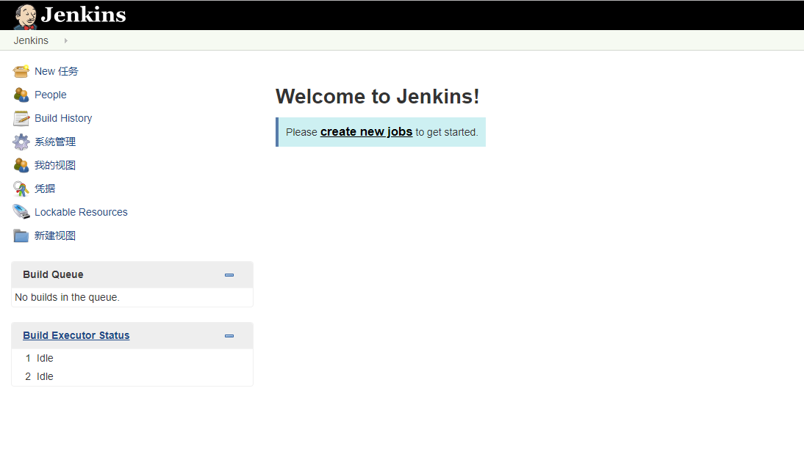

# Jenkins安装部署

**基础环境介绍**

系统版本：Centos

JDK版本：1.8.191

Tomcat版本：8.0.52

Maven版本：3.6.0

 

**JDK安装及环境变量配置**

**下载软件包**

自行到官网下载，官网下载地址：https://www.oracle.com/technetwork/java/javase/downloads/jdk8-downloads-2133151.html

**解压到指定文件夹**

```shell
# tar zxvf jdk-8u191-linux-x64.tar.gz -C /usr/local/
```

**配置环境变量**

由于要增加的环境变量较多，尽量不去改动profile文件

```shell
# vim /etc/profile.d/java.sh
在文件末尾增加以下内容:
JAVA_HOME=/usr/local/jdk1.8.0_191/
JRE_HOME=$JAVA_HOME/jre
CLASS_PATH=.:$JAVA_HOME/lib/dt.jar:$JAVA_HOME/lib/tools.jar:$JRE_HOME/lib/rt.jar
PATH=$PATH:$JAVA_HOME/bin:$JRE_HOME/bin
export JAVA_HOME JRE_HOME CLASS_PATH PATH
```

**验证环境变量**

新打开一个终端，也可以使用当前终端，先执行source /etc/profile,再执行以  下命令：

```shell
# java -version
java version "1.8.0_191"
Java(TM) SE Runtime Environment (build 1.8.0_191-b12)
Java HotSpot(TM) 64-Bit Server VM (build 25.191-b12, mixed mode)
```

看到以上信息说明安装成功

**安装运行Tomcat**

**下载Tomcat**

自行下载tomcat，官网地址：https://tomcat.apache.org/download-80.cgi

**解压配置Tomcat**

```shell
# tar zxvf apache-tomcat-8.0.52.tar.gz
# mv apache-tomcat-8.0.52 /usr/local/tomcat
```

**验证启动**

 启动tomcat

```shell
# sh /usr/local/tomcat/bin/startup.sh
# netstat -lntp
```



使用浏览器访问http://10.10.10.102:8080/,可以看到以下页面，根据自己的服务器地址来访问



**Jenkins部署及初始化**

**下载jenkins的war包**

官网地址：https://jenkins.io

这里我下载了最新版本的war包2.150.1

**上传war包**

将jenkins.war 上传到tomcat的webapps文件夹下

**重启Tomcat**

```shell
# sh /usr/local/tomcat/shutdown.sh
# sh /usr/local/tomcat/startup.sh
```

**Jenkins初始化访问**

**登录jenknis**

通过浏览器访问http://10.10.10.102:8080/jenkins,看到下图页面，即访问成功



如果是没有更改过jenkins的home目录的话，初始化密码文件在/root/.jenkins/secrets/下：

```
# more /root/.jenkins/secrets/initialAdminPassword
```

查看初始化密码，复制登录

**选择安装插件模式**



我们选择第一项，安装推荐的插件，这个根据你网络的情况会耗费不同的时间



**创建Admin用户**

根据自己的情况来设置管理用户及密码



**配置jenkins的url**

我这里不使用外网访问，选择使用了默认的地址，根据自己的需求来进行修改



**配置完成**

点击“Start usering Jenkins”开始使用，看到下图2界面



