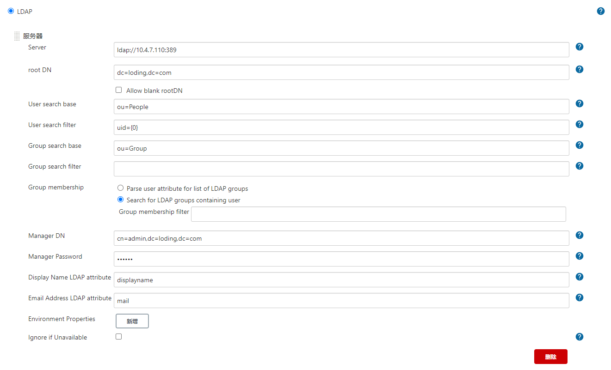
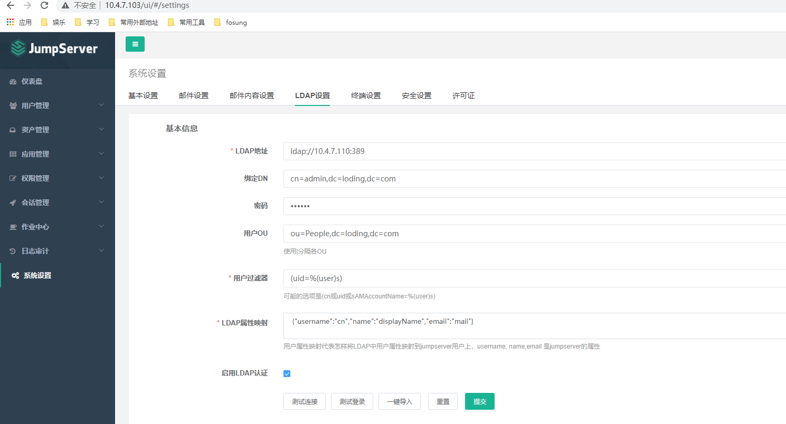

# Jenkins配置LDAP

可以配置权限管理插件使用

(&(|(uid={0})(mail={0}))(memberof=cn=jenkins-admin,ou=Jenkins,ou=Group,dc=loding,dc=com))

(&(|(uid={0})(mail={0}))(|(memberof=cn=jenkins-admin,ou=Jenkins,ou=Group,dc=loding,dc=com)(memberof=cn=jenkins-user,ou=Jenkins,ou=Group,dc=loding,dc=com)))

