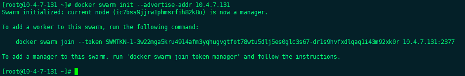
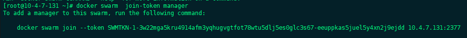
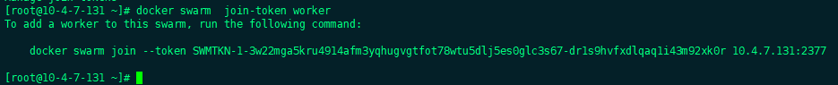
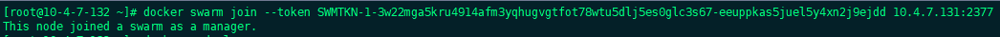
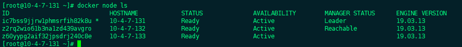

# Docker三剑客

# Docker Compose

## 安装

```sh
yum install docker-compose -y
```


## 使用

```sh
在使用docker-compose的命令时，默认会在当前目录下找docker-compose.yml文件
 
#1.基于docker-compose.yml启动管理的容器
docker-compose up -d
 
#2.关闭并删除容器
docker-compose down
 
#3.开启|关闭|重启已经存在的由docker-compose维护的容器
docker-compose start|stop|restart
 
#4.查看由docker-compose管理的容器
docker-compose ps
 
#5.查看日志
docker-compose logs -f
```


## 例子

```yml
version: '3.1'
services:
  mysql:           # 服务的名称
    restart: always   # 代表只要docker启动，那么这个容器就跟着一起启动
    image: daocloud.io/library/mysql:5.7.4  # 指定镜像路径
    container_name: mysql  # 指定容器名称
    ports:
      - 3306:3306   #  指定端口号的映射
    environment:
      MYSQL_ROOT_PASSWORD: root   # 指定MySQL的ROOT用户登录密码
      TZ: Asia/Shanghai        # 指定时区
    volumes:
     - /opt/docker_mysql_tomcat/mysql_data:/var/lib/mysql   # 映射数据卷
  tomcat:
    restart: always
    image: daocloud.io/library/tomcat:8.5.15-jre8
    container_name: tomcat
    ports:
      - 8080:8080
    environment:
      TZ: Asia/Shanghai
    volumes:
      - /opt/docker_mysql_tomcat/tomcat_webapps:/usr/local/tomcat/webapps
      - /opt/docker_mysql_tomcat/tomcat_logs:/usr/local/tomcat/logs
```


自定义网络

```
networks:
  extnetwork:
    ipam:
      config:
      - subnet: 192.168.255.0/24
```


# Docker Swarm

## Docker Swarm集群搭建

### 创建网络

!!! tip "创建网络的目的是为了尽量避免Docker自动创建的网络与已存在网络冲突"

```shell
docker network create \
--subnet 10.10.0.0/16 \
--gateway 10.10.0.1 \
--opt com.docker.network.bridge.name=docker_gwbridge \
--opt com.docker.network.bridge.enable_icc=false \
--opt com.docker.network.bridge.enable_ip_masquerade=true \
docker_gwbridge
```

### Swarm集群初始化

```shell
docker swarm init --advertise-addr 10.4.7.131
```



这时可以看到加入swarm节点的命令，使用此命令即可使一台机器以work节点的角色加入swarm集群

同时我们还可以通过命令生成加入集群节点的命令

#### 生成添加Manage节点命令

```shell
docker swarm  join-token manager
```



#### 生成添加Worker节点命令

```shell
docker swarm  join-token worker
```



### 节点加入集群

!!! danger "注意"
    是在需要加入集群的节点上执行 

```shell
docker swarm join --token SWMTKN-1-3w22mga5kru4914afm3yqhugvgtfot78wtu5dlj5es0glc3s67-eeuppkas5juel5y4xn2j9ejdd 10.4.7.131:2377
```



### 查看集群运行状态

```
docker node ls
```

