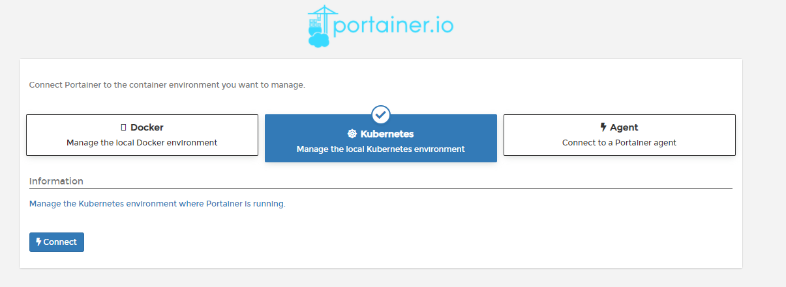
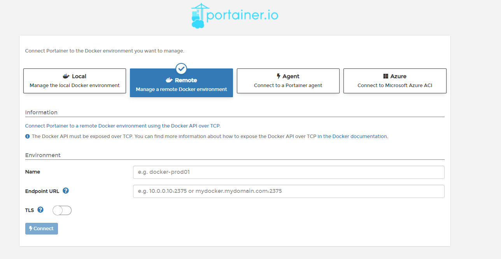
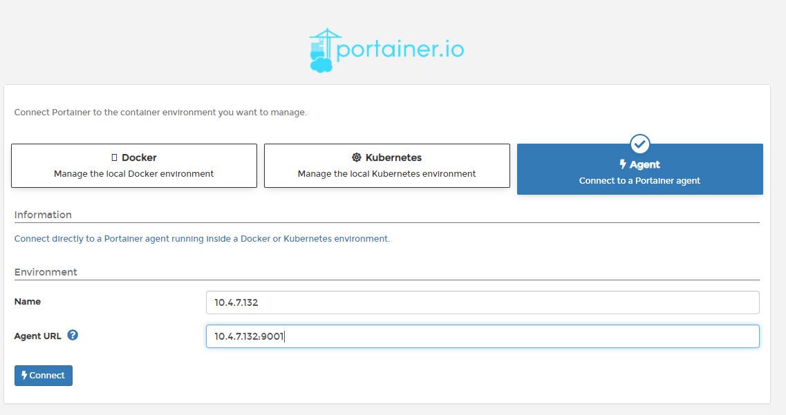
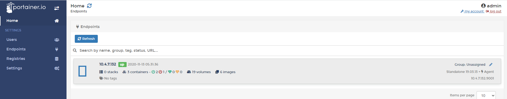
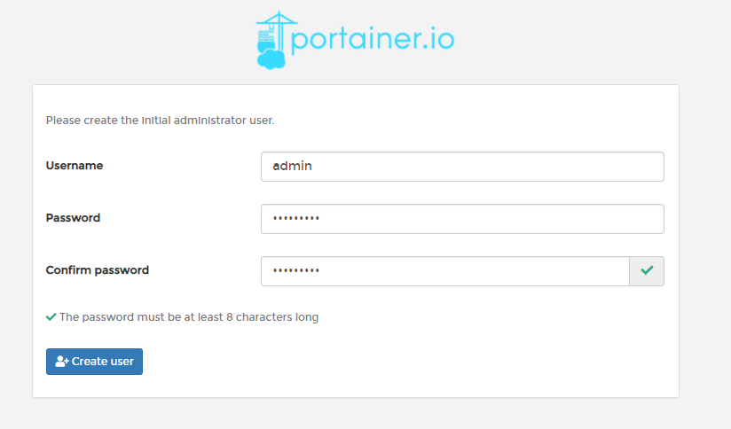
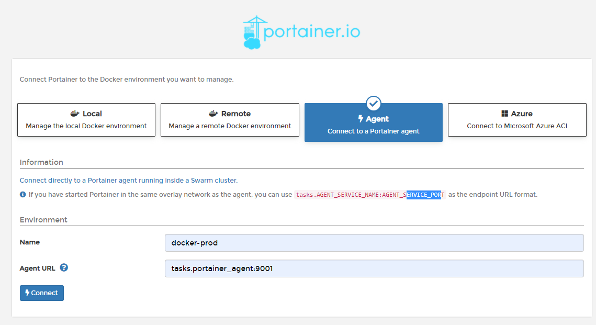
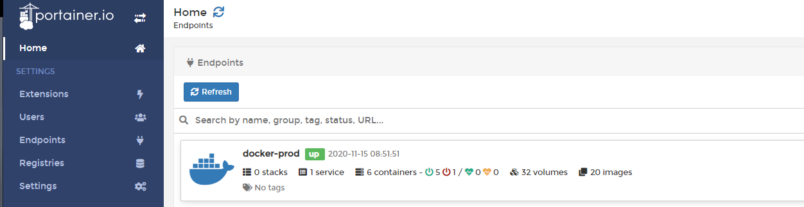
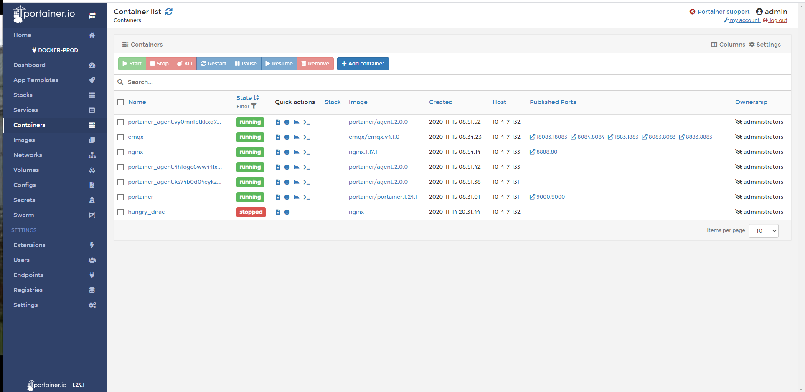

# 容器图形化管理工具Portainer

Portainer是一个可视化的容器镜像的图形管理工具，利用Portainer可以轻松构建，管理和维护Docker环境。 而且完全免费，基于容器化的安装方式，方便高效部署。

官网：https://www.portainer.io/


## 实验环境

| IP         | 角色                            | 备注 |
| ---------- | ------------------------------- | ---- |
| 10.4.7.131 | portainer-server，swarm manager |      |
| 10.4.7.132 | portainer-agent，swarm worker   |      |
| 10.4.7.133 | portainer-agent，swarm worker   |      |


## Portainer快速部署

### Server安装部署

```shell
 # mkdir -p /data/docker/portainer_data
 # docker run -dit -p 8000:8000 -p 9000:9000 --name=portainer --restart=always  \
            -v /var/run/docker.sock:/var/run/docker.sock \
            -v /data/docker/portainer_data:/data \
            portainer/portainer:1.24.1
```

### Agent安装部署

```shell
# docker run -d -p 9001:9001 --name portainer_agent --restart=always \
             -v /var/run/docker.sock:/var/run/docker.sock \
             -v /var/lib/docker/volumes:/var/lib/docker/volumes \
             portainer/agent:2.0.0
```


### 配置管理员用户

直接使用浏览器访问http://ip:9000端口即可


### 选择管理的类型

portainer-ce版本可以选择管理“本机Docker”、Kuberneter集群、和安装了portainer-agent客户端的机器




而普通版本的portainer支持通过Docker API管理其他服务器上的容器，以及支持Azure服务器




### 添加Agent客户端



添加后可以看到一台Agent客户端在线，这时我们就可以开始对这台机器上的容器进行远程管理




## Portainer管理swarm集群

!!! tip "首先你要有一个swarm集群"

### Portainer服务端部署

> 创建一个独立的网络

```
docker network create \
 --driver overlay \
 --attachable \
 --subnet 10.12.0.0/24 \
 portainer_agent_network
```


#### swarm部署Portainer服务端

```shell
docker service create --name portainer --publish 9000:9000 \
         --network portainer_agent_network \
         --constraint 'node.role == manager' \
         --mount type=bind,src=//var/run/docker.sock,dst=/var/run/docker.sock \
         --mount type=bind,src=/data/docker/portainer_data,dst=/data \
         portainer/portainer:1.24.1

```

#### docker模式部署

```shell
docker run -d -p 9000:9000 --name portainer \
 --network portainer_agent_network \
 --restart always \
 -v /var/run/docker.sock:/var/run/docker.sock \
 -v /data/docker/portainer_data:/data \
 portainer/portainer:1.24.1
```


### Portainer客户端(Agent)

```shell
docker service create --name portainer_agent \
         --network portainer_agent_network \
         --mode global \
         --constraint 'node.platform.os == linux' \
         --mount type=bind,src=//var/run/docker.sock,dst=/var/run/docker.sock \
         --mount type=bind,src=//var/lib/docker/volumes,dst=/var/lib/docker/volumes \
         portainer/agent:2.0.0
```


### 配置集群管理

#### 设置管理员用户



#### 配置swarm管理



Name：自己定义

Agent URL：如果是swarm启动的agent客户端，直接使用tasks.portainer_agent:9001即可，请根据实际情况修改

点击Connect后，即可看到我们要管理的集群




进入集群，可以通过左侧的任务栏切换查看不同信息




!!! waring "踩坑：添加私有镜像仓库，设置了用户名密码，但是却无法获取到镜像，一直提示密码不正确或者镜像不存在，原因是因为密码中的特殊字符%或者说是中文用户名导致的!!!!!"

!!! waring "踩坑2：私有仓库，特别是使用外网仓库时，镜像太大会导致获取镜像失败，最好使用局域网搭建的私有仓库"