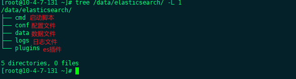
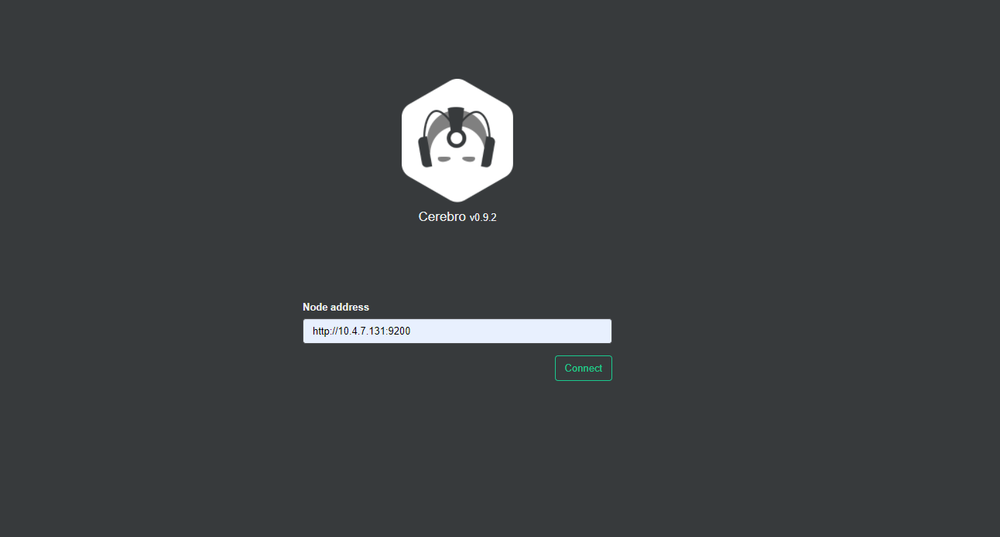
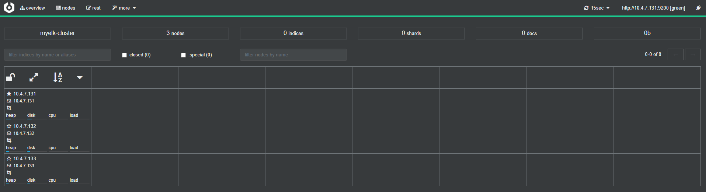

# ElasticSearch安装介绍


### 下载

官网下载地址：https://www.elastic.co/cn/downloads/

官网提供相关组件的下载，截止到2021年1月13日，官网提供的最新版本为7.10.1，这里我就直接选择使用最新版本进行部署


### Docker部署单机

#### 获取镜像

```shell
docker pull elasticsearch:7.10.1
```

这里建议去dockerhub获取镜像，而不是通过官方的镜像仓库获取，从dockerhub获取镜像速度会快一下

#### 创建相关目录并修改权限

这里我将elasticsearch相关文件都放在了/data/elasticsearch文件夹下具体的文件目录如下：

```shell
mkdir -p /data/elasticsearch/{data,logs,cmd,conf,plugins}
chmod 777 /data/elasticsearch/logs
chmod 777 /data/elasticsearch/data
chmod 777 /data/elasticsearch/plugins
```

这里将data目录和logs目录修改为777的原因是因为镜像启动elasticsearch的用户为普通用户，不修改会导致docker无法将数据文件持久化到我们指定的目录



#### 编写启动脚本

> vim /data/elasticsearch/cmd/run-es.sh

```shell
#!/bin/bash
docker stop elasticsearc
docker rm elasticsearc
docker run -dit  --name elasticsearc \
           -p 9200:9200 -p 9300:9300 \
           -v /data/elasticsearch/logs:/usr/share/elastaicsearch/logs \
           -v /data/elasticsearch/data:/usr/share/elasticsearch/data \
           -v /data/elasticsearch/plugins:/usr/share/elasticsearch/plugins \
           -v /data/elasticsearch/conf/elasticsearch.yml:/usr/share/elasticsearch/config/elasticsearch.yml \
           -v /data/elasticsearch/conf/jvm.options:/usr/share/elasticsearch/config/jvm.options \
           elasticsearch:7.10.1
```


#### 编写配置文件

> elasticsearch.yml

```yml
cluster.name: myelk                       #集群名称
node.name: 10.4.7.131                     #节点名称，我这里是用的主机IP
network.host: 0.0.0.0                     #监听地址
http.port: 9200                           #监听端口
discovery.seed_hosts: ["10.4.7.131"]             #启动节点默认节点，这里可以填写主机名称或者IP
cluster.initial_master_nodes: ["10.4.7.131"]     #初始化集群的节点，这里可以填写主机名称或者IP
```

> jvm.options

```yml
## JVM configuration
-Xms1g
-Xmx1g

8-13:-XX:+UseConcMarkSweepGC
8-13:-XX:CMSInitiatingOccupancyFraction=75
8-13:-XX:+UseCMSInitiatingOccupancyOnly
14-:-XX:+UseG1GC
14-:-XX:G1ReservePercent=25
14-:-XX:InitiatingHeapOccupancyPercent=30
-Djava.io.tmpdir=${ES_TMPDIR}
-XX:+HeapDumpOnOutOfMemoryError
-XX:HeapDumpPath=data
-XX:ErrorFile=logs/hs_err_pid%p.log
8:-XX:+PrintGCDetails
8:-XX:+PrintGCDateStamps
8:-XX:+PrintTenuringDistribution
8:-XX:+PrintGCApplicationStoppedTime
8:-Xloggc:logs/gc.log
8:-XX:+UseGCLogFileRotation
8:-XX:NumberOfGCLogFiles=32
8:-XX:GCLogFileSize=64m
9-:-Xlog:gc*,gc+age=trace,safepoint:file=logs/gc.log:utctime,pid,tags:filecount=32,filesize=64m

```

#### 启动

```shell
sh /data/elasticsearch/cmd/run-es.sh
```

启动成功后，访问http://10.4.7.131:9200，看到下面的信息表示成功了


### ElasticSearch可视化工具

这里我先择的是Cerebro，也可以用ElasticSearchHead，相比于ElasticSearchHead，Cerebro主要注重于节点信息的展示，而不是

Cerebro部署一台即可

#### 运行Cerebro

```shell
docker run --name cerebro -d -p 9100:9000 lmenezes/cerebro:latest
```

#### 页面访问

http://10.4.7.131:9100



### Docker部署集群

#### 获取镜像

```shell
docker pull elasticsearch:7.10.1
```

这里建议去dockerhub获取镜像，而不是通过官方的镜像仓库获取，从dockerhub获取镜像速度会快一下

#### 创建相关目录并修改权限

这里我将elasticsearch相关文件都放在了/data/elasticsearch文件夹下具体的文件目录如下：

```shell
mkdir -p /data/elasticsearch/{data,logs,cmd,conf}
chmod 777 /data/elasticsearch/logs
chmod 777 /data/elasticsearch/data
```

这里将data目录和logs目录修改为777的原因是因为镜像启动elasticsearch的用户为普通用户，不修改会导致docker无法将数据文件持久化到我们指定的目录


#### 编写启动脚本

> vim /data/elasticsearch/cmd/run-es.sh

```shell
#!/bin/bash
docker stop elasticsearch
docker rm elasticsearch
docker run -dit  --name elasticsearch --restart=always \
           -p 9200:9200 -p 9300:9300 \
           -v /data/elasticsearch/logs:/usr/share/elastaicsearch/logs \
           -v /data/elasticsearch/data:/usr/share/elasticsearch/data \
           -v /data/elasticsearch/conf/elasticsearch.yml:/usr/share/elasticsearch/config/elasticsearch.yml \
           -v /data/elasticsearch/conf/jvm.options:/usr/share/elasticsearch/config/jvm.options \
           elasticsearch:7.10.1
```


#### 编写配置文件

> vim  /data/elasticsearch/conf/elasticsearch.yml

##### 10.4.7.131

```yml
#集群名称
cluster.name: myelk-cluster
##节点名称，我这里是用的主机IP
node.name: 10.4.7.131
##监听地址
network.host: 0.0.0.0
network.publish_host: 10.4.7.131
##监听端口
http.port: 9200
discovery.zen.minimum_master_nodes: 2
http.cors.enabled: true
http.cors.allow-origin: "*"
discovery.seed_hosts: ["10.4.7.131","10.4.7.132","10.4.7.133"] 
##初始化集群的节点，这里可以填写主机名称或者IP
#cluster.initial_master_nodes: ["10.4.7.131","10.4.7.132","10.4.7.133"]
```

##### 10.4.7.132

```shell
#集群名称
cluster.name: myelk-cluster
##节点名称，我这里是用的主机IP
node.name: 10.4.7.132
##监听地址
network.host: 0.0.0.0
network.publish_host: 10.4.7.132
##监听端口
http.port: 9200
discovery.zen.minimum_master_nodes: 2
http.cors.enabled: true
http.cors.allow-origin: "*"
discovery.seed_hosts: ["10.4.7.131","10.4.7.132","10.4.7.133"] 
##初始化集群的节点，这里可以填写主机名称或者IP
#cluster.initial_master_nodes: ["10.4.7.131","10.4.7.132","10.4.7.133"]
```

##### 10.4.7.133

```shell
#集群名称
cluster.name: myelk-cluster
##节点名称，我这里是用的主机IP
node.name: 10.4.7.133
##监听地址
network.host: 0.0.0.0
network.publish_host: 10.4.7.133
##监听端口
http.port: 9200
discovery.zen.minimum_master_nodes: 2
http.cors.enabled: true
http.cors.allow-origin: "*"
discovery.seed_hosts: ["10.4.7.131","10.4.7.132","10.4.7.133"] 
##初始化集群的节点，这里可以填写主机名称或者IP
#cluster.initial_master_nodes: ["10.4.7.131","10.4.7.132","10.4.7.133"]
```


> jvm.options
>
> 所有机器jvm配置一样，根据自己机器的配置进行调整

```yml
## JVM configuration
-Xms2g
-Xmx2g

8-13:-XX:+UseConcMarkSweepGC
8-13:-XX:CMSInitiatingOccupancyFraction=75
8-13:-XX:+UseCMSInitiatingOccupancyOnly
14-:-XX:+UseG1GC
14-:-XX:G1ReservePercent=25
14-:-XX:InitiatingHeapOccupancyPercent=30
-Djava.io.tmpdir=${ES_TMPDIR}
-XX:+HeapDumpOnOutOfMemoryError
-XX:HeapDumpPath=data
-XX:ErrorFile=logs/hs_err_pid%p.log
8:-XX:+PrintGCDetails
8:-XX:+PrintGCDateStamps
8:-XX:+PrintTenuringDistribution
8:-XX:+PrintGCApplicationStoppedTime
8:-Xloggc:logs/gc.log
8:-XX:+UseGCLogFileRotation
8:-XX:NumberOfGCLogFiles=32
8:-XX:GCLogFileSize=64m
9-:-Xlog:gc*,gc+age=trace,safepoint:file=logs/gc.log:utctime,pid,tags:filecount=32,filesize=64m

```

#### 执行启动

```shell
sh /data/elasticsearch/cmd/run-es/sh
```

不分先后，启动即可

这时我们通过可视化工具Cerebro就能看到我们的集群状态

