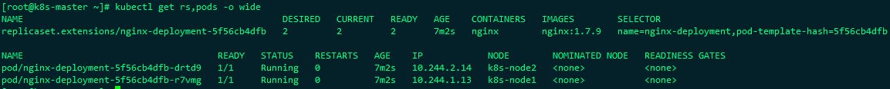
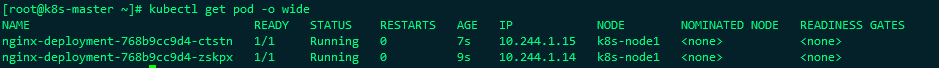

# Pode调度

!!! tip "部分资料参考：Kubernetes权威指南第四版"


## Deployment或RC:全自动调度

nginx-deployment.yaml

```yaml
apiVersion: apps/v1
kind: Deployment
metadata:
  name: nginx-deployment
spec:
  replicas: 2
  selector:
    matchLabels:
      name: nginx-deployment
  template:
    metadata:
      labels:
        app: nginx-deployment
        name: nginx-deployment
    spec:
      containers:
      - name: nginx
        image: nginx:1.7.9
        ports:
        - containerPort: 80
```



这种调度方式用户无法干预，完全是通过Master和Scheduler经过一系列算法计算得出


## NodeSelector：定向调度

此种调度是通过Node的标签和Pod的nodeSelector属性相匹配，来达到调度的目的

1、首先通过kubectl label命令给目标Node打上标签

```shell
kubectl label nodes k8s-node1 zone=north
```

可以通过`kubectl get node --show-labels`查看node的标签

2、修改nginx-deployment.yaml文件

```yaml
apiVersion: apps/v1
kind: Deployment
metadata:
  name: nginx-deployment
spec:
  replicas: 2
  selector:
    matchLabels:
      name: nginx-deployment
  template:
    metadata:
      labels:
        app: nginx-deployment
        name: nginx-deployment
    spec:
      containers:
      - name: nginx
        image: nginx:1.7.9
        ports:
        - containerPort: 80
      nodeSelector:
        zone: north
```

kuberctl apply -f nginx-deployment.yaml

3、应用资源配置就会发现，所有的pod都调度到了一个node节点上




Node预定义标签：

- Kubernetes.io/hostname
- beta.kubernetes.io/os（从1.14版本开始更新为稳定版，到1.18版本删除）
- beta.kubernetes.io/arch（从1.14版本开始更新为稳定版，到1.18版本删除）
- kubernetes.io/os（从1.14版本开始启用）
- kubernetes.io/arch（从1.14版本开始启用）

如果我们给多个Node都定义了相同的标签，则schedule会根据调度算法从这些Node中挑选一个或多个(看pod的副本数量)可用的Node进行Pod调度

!!! warning "注意：如果我们指定了Pod的nodeSelector条件，且在集群中不存在包含相对应标签的Node，则即使在集群中还有其他可供使用的Node，这个Pod也无法被成功调度"


## NodeAffinity：Node亲和性调度

 NodeAffinity意为Node亲和性的调度策略，是用于替换NodeSelector的全新调度策略。目前有两种节点亲和性表达。

- RequiredDuringSchedulingIgnoredDuringExcution：必须满足指定的规则才可以调度Pod到Node上（功能与nodeSelector很像，但是使用的是不同的语法），相当于硬限制

- PreferredDuringSchedulingIgnoredDuringExecution：强调优先满足指定规则，调度器会尝试调度Pod到Node上，但并不强求，相当于软限制。多个优先级规则还可以设置权重值，以定义执行的先后顺序。IgnoredDuringExecution的意思是：如果一个Pod所在的节点在Pod运 行期间标签发生了变更，不再符合该Pod的节点亲和性需求，则系统将忽略Node上Label的变化，该Pod能继续在该节点运行。

  

  下面的例子设置了NodeAffinity调度的如下规则。 

  - requiredDuringSchedulingIgnoredDuringExecution要求只运行在 

    amd64的节点上（beta.kubernetes.io/arch In amd64）。 

  - preferredDuringSchedulingIgnoredDuringExecution的要求是尽量 

    运行在磁盘类型为ssd（disk-type In ssd）的节点上。 

  

  代码如下：

  ```yaml
  apiVersion: v1
  kind: Pod
  metadata:
    name: with-node-affinity
  spec:
    affinity:
      nodeAffinity:
        requiredDuringSchedulingIgnoredDuringExecution:
          nodeSelectorTerms:
          - matchExpressions:
            - key: beta.kubernetes.io/arch
              operator: In
              values:
              - amd64
        preferredDuringSchedulingIgnoredDuringExecution:
        - weight: 1
          preference:
            matchExpressions:
            - key: disk-type
              operator: In
              values:
              - ssd
  ```

  从上面的配置中可以看到In操作符，NodeAffinity语法支持的操作符包括In、NotIn、Exists、DoesNotExist、Gt、Lt。虽然没有节点排斥功能，但是用NotIn和DoesNotExist就可以实现排斥的功能了。 

  NodeAffinity规则设置的注意事项如下。 

  - 如果同时定义了nodeSelector和nodeAffinity，那么必须两个条件都得到满足，Pod才能最终运行在指定的Node上。 

  - 如果nodeAffinity指定了多个nodeSelectorTerms，那么其中一个能够匹配成功即可。 

  - 如果在nodeSelectorTerms中有多个matchExpressions，则一个节点必须满足所有matchExpressions才能运行该Pod。


## PodAffinity：Pod亲和与互斥调度策略


## Taints和Tolerations（污点和容忍）

NodeAffinity节点亲和性，是在Pod上定义的一种属性，使得Pod能够被调度到某些Node上运行（优先选择或强制要求）。Taints则正好相反，它让Node拒绝Pod的运行。

Taint需要和Toleration配合使用，让Pod避开那些不合适的Node。在Node上设置一个或多个Taint之后，除非Pod明确声明能够容忍这些污点，否则无法在这些Node上运行。Toleration是Pod的属性，让Pod能够（注意，只是能够，而非必须）运行在标注了Taint的Node上。

可以用kubectl taint命令为Node设置Taint信息：

```shell
kuberctl taint nodes node1 key=value:NoSchedule
```

这个设置为node1加上了一个Taint。该Taint的键为key，值为value，Taint的效果是NoSchedule。这意味着除非Pod明确声明可以容忍这个Taint，否则就不会被调度到node1上。 

然后，需要在Pod上声明Toleration。下面的两个Toleration都被设置为可以容忍（Tolerate）具有该Taint的Node，使得Pod能够被调度到node1上： 

```yaml
tolerations:
- key: "key"
  operator: "Equal"
  value: "value"
  effect: "NoSchedule"
```


## Pod Priority Preemption：Pod优先级调度


## DaemonSet：在每个Node上都调度一个Pod

DaemonSet是Kubernetes1.2版本新增的一种资源对象，用于管理在集群中每个Node上仅运行一份Pod的副本实例

这种用法适合有这种需求的应用

- 在每个Node上都运行一个GlusterFs存储或者Ceph存储的Daemon进程
- 在每个Node上都运行一个日志采集程序，例如Fluentd或者Logstash
- 在每个Node上都运行一个性能监控程序，采集该Node的运行性能数据，例如：Prometheus Node Exporter、collectd、New Relic agent或者Ganglia gmond等


## Job：批处理调度


## Cronjob：定时任务


## 自定义调度器