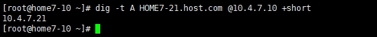
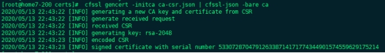
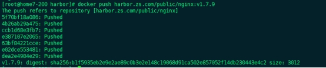
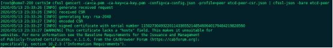
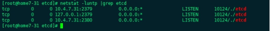
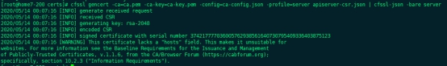
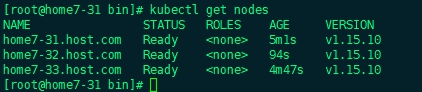
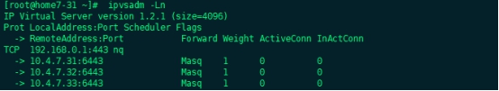

# Kubernetes二进制安装部署

## 1、基础环境介绍

### 1.1、硬件环境

### 1.2、虚拟机环境

这里我准备使用七台虚拟机来完成当前的部署，如果主机资源不充足，部分部件可以复用，例如DNS和LVS服务器可以合并使用，相关规划如下：

| 主机名             | 角色     | IP         | 配置    | 备注             |
| ------------------ | -------- | ---------- | ------- | ---------------- |
| HOME7-10.host.com  | DNS      | 10.4.7.10  | 2C2G40G | Bind9            |
| HOME7-21.host.com  | LVS      | 10.4.7.21  | 2C2G40G | nginx+keepalived |
| HOME7-22.host.com  | LVS      | 10.4.7.22  | 2C2G40G | nginx+keepalived |
| HOME7-31.host.com  | Etcd+k8s | 10.4.7.31  | 2C4G40G | K8S全部组件      |
| HOME7-32.host.com  | Etcd+k8s | 10.4.7.32  | 2C4G40G | K8S全部组件      |
| HOME7-33.host.com  | Etcd+k8s | 10.4.7.33  | 2C4G40G | K8S全部组件      |
| HOME7-200.host.com | 运维主机 | 10.4.7/200 | 2C2G40G | 相关运维组件     |

这里还用到了一个VIP：10.4.7.20


这里为了节省资源节省资源我将k8s的控制节点和运算节点都部署在了一起，其实生产环境中也是可以这样做的，除非有特别的需求将其拆分，其实都可以将控制节点和运算节点部署在同一台服务器上。


## 2、基础环境准备

### 2.1、系统环境设置

此步骤未有特殊说明的情况下在所有虚拟机上执行

#### 2.1.1、设置主机名

不同机器使用地理位置+ip后两位

> 10.10.10.10

```
hostnamectl set-hostname  HOME7-10.host.com
```

>10.10.10.21

```
hostnamectl set-hostname  HOME7-21.host.com
```

> 10.10.10.22

```
hostnamectl set-hostname  HOME7-22.host.com
```

> 10.10.10.31

```
hostnamectl set-hostname  HOME7-31.host.com
```

> 10.10.10.32

```
hostnamectl set-hostname  HOME7-32.host.com
```

> 10.10.10.33

```
hostnamectl set-hostname  HOME7-33.host.com
```

> 10.10.10.200

```
hostnamectl set-hostname  HOME7-200.host.com
```


#### 2.1.2、关闭防火墙和selinux

> 关闭防火墙，生产环境可以选择开放指定端口

```
systemctl stop firewalld
systemctl disable firewalld
```

> 管理selinux

```
setenforce 0
sed -i 's/enforcing/disabled/' /etc/selinux/config
```


#### 2.1.3、配置yum源

```
curl -o /etc/yum.repos.d/CentOS-Base.repo http://mirrors.aliyun.com/repo/Centos-7.repo
```

 

#### 2.1.4、内核优化

嗯。。。网上找来的优化，可以根据自己的需求来判断做不做。。

```
cat > /etc/sysctl.conf <<EOF
fs.file-max = 65536
net.ipv6.conf.all.disable_ipv6 = 1
net.ipv6.conf.default.disable_ipv6 = 1
net.ipv6.conf.lo.disable_ipv6 = 1
net.ipv4.conf.all.rp_filter=0
net.ipv4.conf.default.rp_filter=0
net.ipv4.conf.default.arp_announce = 2
net.ipv4.conf.lo.arp_announce=2
net.ipv4.conf.all.arp_announce=2
net.ipv4.ip_local_port_range = 5000 65000
net.ipv4.tcp_fin_timeout = 30
net.ipv4.tcp_max_syn_backlog = 1024
net.ipv4.tcp_max_tw_buckets = 5000
net.ipv4.tcp_syn_retries = 2
net.ipv4.tcp_synack_retries = 2
net.ipv4.tcp_syncookies = 1
net.ipv4.tcp_timestamps = 1
net.ipv4.tcp_tw_recycle = 0
net.ipv4.tcp_tw_reuse = 1
EOF
```

 

```
# cat > /etc/security/limits.conf <<EOF
* soft noproc 65536
* hard noproc 65536
* soft nofile 65536
* hard nofile 65536
EOF
```

 

```
ulimit -n 65536

ulimit -u 65536
echo > /etc/security/limits.d/20-nproc.conf
```

 

#### 2.1.5、关闭swap

如果没有的话可以不关闭，其实不关闭也可以，如果是使用kubeadmin安装的话可能会报错，我们这里还是选择关闭swap

```
swapoff /dev/mapper/centos-swap
```

同时注释/etc/fstab文件中的相关挂载项

 

#### 2.1.6、升级系统

> 主要是为了修复一些软件漏洞

```
yum update -y
```

> 重启系统，有些软件升级需要重启后才会重新加载

```
reboot
```

 

#### 2.1.7、安装扩展源及常规软件包

> 安装epel扩展源

```
yum install epel-release -y
```

> 安装常用软件包

```
yum install vim telnet wget net-tools nmap sysstat lrzsz dos2unix bind-utils chrony ntpdate -y
```


#### 2.1.8、同步时间

```
ntpdate -u ntp.aliyun.com
```

 

### 2.2、安装DNS服务

此步骤在10.4.7.10上执行

#### 2.2.1、安装bind9软件

```
yum install bind -y
```

 

#### 2.2.2、配置bind9

先备份配置文件，防止出错，建议修改配置前先进行备份。

```
cp /etc/named.conf /etc/named.conf.bak
```

> vim /etc/named.conf

```
listen-on port 53 { 10.4.7.10; };
allow-query   { any; };
forwarders    { 10.4.7.1; };  #指向宿主机的地址
recursion yes; 
```

> 检查配置

```
named-checkconf
```

无任何输出即为没有错误，如果有输出请按照相关提示进行修改

 

#### 2.2.3、配置区域文件

> vim /etc/named.rfc1912.zones

在配置文件最后添加

```
zone "host.com" IN {
    type  master;
    file  "host.com.zone";
    allow-update { 10.4.7.10; };
}; 

zone "zs.com" IN {
    type  master;
    file  "zs.com.zone";
    allow-update { 10.4.7.10; };
}; 
```

> 检查配置

```
named-checkconf
```

 

#### 2.2.4、配置数据文件

##### 2.2.4.1、配置主机域

> vim /var/named/host.com.zone

```
$ORIGIN host.com.
$TTL 600  ;  10 minutes
@     IN SOA  dns.host.com. dnsadmin.host.com. (
         2020051301 ; serial
         10800    ; refresh (3 hours)
         900     ; retry (15 minutes)
         604800   ; expire (1 week)
         86400    ; minimum (1 day)
         )
       NS  dns.host.com.

$TTL 60 ; 1 minute
dns          A   10.4.7.10
HOME7-10      A   10.4.7.10
HOME7-21      A   10.4.7.21
HOME7-22      A   10.4.7.22
HOME7-31      A   10.4.7.31
HOME7-32      A   10.4.7.32
HOME7-33      A   10.4.7.33
HOME7-200      A   10.4.7.200
```

 

##### 2.2.4.2、配置业务域

> vim /var/named/zs.com.zone

```
$ORIGIN zs.com.
$TTL 600  ;  10 minutes
@     IN SOA  dns.host.com. dnsadmin.host.com. (
         2020051301 ; serial
         10800    ; refresh (3 hours)
         900     ; retry (15 minutes)
         604800   ; expire (1 week)
         86400    ; minimum (1 day)
         )
       NS  dns.zs.com.
$TTL 60 ; 1 minute
dns          A   10.4.7.10
```

 

#### 2.2.5、启动bind并设置开机启动

```
systemctl start named
systemctl enable named
```


#### 2.2.6、测试解析是否成功

```
dig -t A HOME7-21.host.com @10.4.7.10 +short
```

 

 

#### 2.2.7、配置各机器的dns服务

将所有机器的DNS服务器地址指向10.4.7.10

 

### 2.3、签发CA证书

此步骤在运维主机10.4.7.200上进行

#### 2.3.1、安装CFSSL

```
wget https://pkg.cfssl.org/R1.2/cfssl_linux-amd64 -O /usr/bin/cfssl
wget https://pkg.cfssl.org/R1.2/cfssljson_linux-amd64  -O /usr/bin/cfssl-json
wget https://pkg.cfssl.org/R1.2/cfssl-certinfo_linux-amd64 -O /usr/bin/cfssl-certinfo
增加可执行权限
chmod +x /usr/bin/cfssl*
```


#### 2.3.2、创建生成CA证书签名请求文件

```
mkdir -p /opt/certs
```

> vim /opt/certs/ca-csr.json

```json
{
  "CN": "zs.com",
  "hosts": [
  ],
  "key": {
    "algo": "rsa",
    "size": 2048
  },
  "names": [
    {
      "C": "CN",
      "ST": "jinan",
      "L": "jinan",
      "O": "zs",
      "OU": "ops"
    }
  ],
  "ca": {
    "expiry": "175200h"
  }
}
```

证书参数说明：

CN：CommonName，浏览器使用该字段验证网站是否合法，一般写的是域名。非常重要。

C：Country，国家

ST：State，洲、省

L：Locality，地区、城市

O：Organization Name，组织名称、公司名称

OU：Organization Unit Name，组织单位名称，公司部门

 

#### 2.3.3、生成CA证书和私钥

```
cd /opt/certs
cfssl gencert -initca ca-csr.json | cfssl-json -bare ca
```

 


### 2.4、准备docker环境

此步骤10.4.7.31、10.4.7.32、10.4.7.33和10.4.7.200上执行


#### 2.4.1、安装docker

##### 2.4.1.1、方法一

```
curl -fsSL https://get.docker.com | bash -s docker --mirror Aliyun
```

##### 2.4.1.2、方法二

```
wget https://mirrors.aliyun.com/docker-ce/linux/centos/docker-ce.repo -O /etc/yum.repos.d/docker-ce.repo
yum -y install docker-ce
```

 

#### 2.4.2、修改相关配置

> 创建相关目录

```
mkdir -p /etc/docker
mkdir -p /data/docker
```


> vim /etc/docker/daemon.json

```
##注意变更bip的值，第三段为机器IP最后一位
{

 "graph": "/data/docker",
 "storage-driver": "overlay2",
 "insecure-registries": ["registry.access.redhat.com","quay.io","harbor.zs.com"],
 "registry-mirrors": ["https://vprbki78.mirror.aliyuncs.com"],
 "bip": "172.7.31.1/24",
 "exec-opts": ["native.cgroupdriver=systemd"],
 "live-restore": true

}
```


#### 2.4.3、启动docker并设置开机启动

```
systemctl start docker
systemctl enable docker
```

 

### 2.5、搭建docker私有仓库

此步骤在运维主机HOME7-200上进行


#### 安装docker-compose

Harbor是通过docker-compose单机编排安装

```
 yum install docker-compose -y
```


#### 下载Harbor软件包

下载地址：https://github.com/goharbor/harbor/releases

下载版本为v1.10.2

因使用虚拟机下载较慢，所以是用宿主机下载后上传到/opt/src目录下

我们这里所有的二进制源码包都放置在/opt/src目录下


#### 解压移动文件

```
cd /opt/src
tar zxvf harbor-offline-installer-v1.10.2.tgz
mv harbor /opt/harbor-v1.10.2
ln -s /opt/harbor-v1.10.2 /opt/harbor
```

在本次部署中我们所有二进制软件都是以软连接的方式部署，方便后续升级


#### 配置harbor

> vim /opt/harbor/harbor.yaml

```
hostname: harbor.zs.com
port: 180  #需要安装nginx因此将默认监听端口进行修改
#https:  # 将https相关配置进行注释，这是我们使用http
#  # https port for harbor, default is 443
#  port: 443
#  # The path of cert and key files for nginx
#  certificate: /your/certificate/path
#  private_key: /your/private/key/path
harbor_admin_password: Harbor12345  #密码测试环境可以不修改
data_volume: /data/harbor/data  #数据目录
location: /data/harbor/logs   #日志目录
```


#### 创建相关目录

```
mkdir -p /data/harbor/logs

mkdir -p /data/harbor/data
```


#### 执行安装脚本

```
/opt/harbor/install.sh
```

等待安装结束即可，看到以下信息即安装成功

✔ ----Harbor has been installed and started successfully.----


#### 安装配置nginx

因为这里nginx还有其他作用，就不使用负载均衡集群去做代理

##### 安装

```
yum install nginx -y
```


##### 配置

> vim /etc/nginx/conf.d/harbor.zs.com.conf

```
server {
  listen 80;
  server_name harbor.zs.com;
  client_max_body_size 1000m;

  location / {
    proxy_pass http://127.0.0.1:180;
   }
}
```

 

##### 启动并设置开机启动

```
systemctl start nginx
systemctl enable nginx
```


#### 配置域名解析

此步骤在HOME7-10上进行，增加一条关于harbor的A记录

harbor        A   10.4.7.200

重启DNS服务使其生效

```
systemctl restart named
```


#### 验证harbor

harbor默认用户名密码admin/Harbor12345

这个初始密码可以在安装时在配置文件中修改，为了方便测试我这里没有修改，生产环境下必须进行修改

##### 确定解析正常

```
dig -t A harbor.zs.com @10.4.7.10 +short
```


##### 推送镜像到Harbor仓库

推送镜像前需要在harbor中新建一个公开项目public，通过web页面创建即可

> 下载nginx镜像

```
docker pull nginx:1.7.9
```

> 打私有tag

```
docker tag 84581e99d807 harbor.zs.com/public/nginx:v1.7.9
```

> 推送镜像

```
docker push harbor.zs.com/public/nginx:v1.7.9
```

??? warning "此时你会发现推送失败，原因是我们需要登录harbor仓库才能推送镜像"

 

 

> 登录私有harbor仓库

```
docker login harbo.zs.com
```

登录成功如下图，这时我们就可以推送镜像了

 

```
docker push harbor.zs.com/public/nginx:v1.7.9
```

 

可以从上图看到已经推送成功，在harbor的web页面也能看到相关镜像

 


### 2.6、安装supervisor进程管理器

此步骤在HOME7-31、HOME7-32和HOME7-33上执行

Supervisor是一款很好的进程管理程序，可以在程序异常退出的情况下自动拉起程序

#### 安装

```
 yum install -y supervisor
```


#### 启动并设置开机启动

```
systemctl start supervisord
systemctl enable supervisord
```


### 2.7、搭建k8s资源配置清单内部站点服务

此步骤在运维主机HOME7-200上操作

部署此服务主要是为了可以统一管理资源配置清单

#### 配置nginx

```
# cat > /etc/nginx/conf.d/k8s-yaml.zs.com.conf << EOF

server {
  listen 80;
  server_name k8s-yaml.zs.com;   
  
  location / {
    autoindex on;
    default_type text/plain;
    root /data/k8s-yaml;
  }
}
EOF
```


#### 创建目录

```
mkdir -p /data/k8s-yaml
```


#### 重启nginx 使配置生效

```
nginx -s reload
```


#### 配置域名解析

在内部DNS服务器上增加k8s-yaml的记录，解析到10.4.7.200服务器上


#### 测试访问

```
dig -t A k8s-yaml.zs.com @10.4.7.10 +short
```


## 3、部署master节点服务

### 3.1、部署etcd集群

此步骤无特殊说明的情况下都是在HOME7-31、HOME7-32和HOME7-33上操作

#### 3.1.1、签发证书

此步骤在运维主机上操作

##### 3.1.1.1、创建正式配置文件

```
cd /opt/cert
```

> vim ca-config.json

```json
{
	"signing": {
		"default": {
			"expiry": "175200h"
		},
		"profiles": {
			"server": {
				"expiry": "175200h",
				"usages": [
					"signing",
					"key encipherment",
					"server auth"
				]
			},
			"client": {
				"expiry": "175200h",
				"usages": [
					"signing",
					"key encipherment",
					"client auth"
				]
			},
			"peer": {
				"expiry": "175200h",
				"usages": [
					"signing",
					"key encipherment",
					"server auth",
					"client auth"
				]
			}
		}
	}
}
```


##### 3.1.1.2、创建自签证书签名请求文件

> vim etcd-peer-csr.json

```json
{
  "CN": "k8s-etcd",
  "hosts": [
    "10.4.7.31",
    "10.4.7.32",
    "10.4.7.33",
    "10.4.7.34",
    "10.4.7.35",
    "10.4.7.200"
  ],
  "key": {
    "algo": "rsa",
    "size": 2048
  },
  "names": [
    {
      "C": "CN",
      "ST": "jinan",
      "L": "jinan",
      "O": "zs",
      "OU": "ops"
    }
  ]
}
  },
  "names": [
    {
      "C": "CN",
      "ST": "beijing",
      "L": "beijing",
      "O": "od",
      "OU": "ops"
    }
  ]
}
```


##### 3.1.1.3、生成证书和私钥

```
cfssl gencert -ca=ca.pem -ca-key=ca-key.pem -config=ca-config.json -profile=peer etcd-peer-csr.json | cfssl-json -bare etcd-peer
```

 

 

3.1.2、下载解压etcd软件

使用GitHub下载慢或者无法下载的可以选择使用国内的地址进行下载

github地址：https://github.com/etcd-io/etcd/releases

华为云地址：https://mirrors.huaweicloud.com/etcd/

下载版本：3.1.20

3.1.20版本下载连接：https://mirrors.huaweicloud.com/etcd/v3.1.20/etcd-v3.1.20-linux-amd64.tar.gz

```
mkdir -p /opt/src
cd /opt/src
wget https://mirrors.huaweicloud.com/etcd/v3.1.20/etcd-v3.1.20-linux-amd64.tar.gz
tar zxvf etcd-v3.1.20-linux-amd64.tar.gz
```


#### 3.1.3、移动文件并创建相关目录

```
mv etcd-v3.1.20-linux-amd64 /opt/etcd-v3.1.20
ln -s /opt/etcd-v3.1.20 /opt/etcd
mkdir -p /opt/etcd/certs /data/etcd /data/logs/etcd-server
```


#### 3.1.4、拷贝相关证书

```
cd /opt/etcd/certs
scp 10.4.7.200:/opt/certs/ca.pem .
scp 10.4.7.200:/opt/certs/etcd-peer.pem .
scp 10.4.7.200:/opt/certs/etcd-peer-key.pem .
```


#### 3.1.5、创建启动脚本

```
cd /opt/etcd
```

> vim etcd-server-startup.sh

注意修改相关地址

```shell
#!/bin/bash
./etcd --name etcd-server-7-31 \
    --data-dir /data/etcd/etcd-server \
    --listen-peer-urls https://10.4.7.31:2380 \
    --listen-client-urls https://10.4.7.31:2379,http://127.0.0.1:2379 \
    --quota-backend-bytes 800000000 \
    --initial-advertise-peer-urls https://10.4.7.31:2380 \
    --advertise-client-urls https://10.4.7.31:2379,http://127.0.0.1:2379 \
    --initial-cluster etcd-server-7-31=https://10.4.7.31:2380,etcd-server-7-32=https://10.4.7.32:2380,etcd-server-7-33=https://10.4.7.33:2380 \
    --ca-file ./certs/ca.pem \
    --cert-file ./certs/etcd-peer.pem \
    --key-file ./certs/etcd-peer-key.pem \
    --client-cert-auth \
    --trusted-ca-file ./certs/ca.pem \
    --peer-ca-file ./certs/ca.pem \
    --peer-cert-file ./certs/etcd-peer.pem \
    --peer-key-file ./certs/etcd-peer-key.pem \
    --peer-client-cert-auth \
    --peer-trusted-ca-file ./certs/ca.pem \
    --log-output stdout
```


#### 3.1.6、创建用户并修改文件权限

```
useradd -s /sbin/nologin -M etcd
chmod +x /opt/etcd/etcd-server-startup.sh
chown -R etcd.etcd /opt/etcd-v3.1.20
chown -R etcd.etcd /data/etcd
chown -R etcd.etcd /data/logs/etcd-server
```

 

#### 3.1.7、创建supervisor启动配置

> vim /etc/supervisord.d/etcd-server.ini

```ini
[program:etcd-server]
command=/opt/etcd/etcd-server-startup.sh
numprocs=1
directory=/opt/etcd
autostart=true
autorestart=true
startsecs=30
startretries=3
exetcodes=0,2
stopsignal=QUIT
stopwaitsecs=10
killasgroup=true
user=etcd
rediect_stderr=true
stdout_logfile=/data/logs/etcd-server/etcd.stdout.log
stdout_logfile_maxbytes=64MB
stdout_logfile_backups=4
stdout_captyre_maxbytes=1MB
stdout_events_enabled=false
```


#### 3.1.8、启动etcd程序

```
supervisorctl update
```

注意首次创建启动文件或者修改启动文件内容时使用此命令，其他时间使用正常命令，使用说明如下：

```
启动某个进程：supervisorctl start process_name

停止某个进程：supervisorctl stop process_name

重启某个进程：supervisorctl restart process_name
```


#### 3.1.9、检查启动情况

> netstat -luntp |grep etcd

 

> /opt/etcd/etcdctl cluster-health

 

到此etcd集群安装完毕

 

### 3.2、部署kube-apiserver集群

#### 3.2.1、签发client证书

此步骤在运维主机HOME7-200上进行操作

此次签发的证书为apiserver与etcd集群通信使用的正式，为client证书

3.2.1.①、\*创建生成证书签名请求文件\

 

\# cd /opt/certs

\# vim client-csr.json

{

  "CN": "k8s-node",

  "hosts": [

  ],

  "key": {

​    "algo": "rsa",

​    "size": 2048

  },

  "names": [

​    {

​      "C": "CN",

​      "ST": "jinan",

​      "L": "jinan",

​      "O": "zs",

​      "OU": "ops"

​    }

  ]

}

3.2.1.②、\*生成client证书及私钥\

\# cfssl gencert -ca=ca.pem -ca-key=ca-key.pem -config=ca-config.json -profile=client client-csr.json | cfssl-json -bare client

 

#### 3.2.2、签发apiserver证书

此步骤在运维主机HOME7-200上进行操作

##### 3.2.2.1、创建生成证书签名请求

这里为了以后的扩展多添加了一些IP，注意10.4.7.20这个IP是LVS的VIP

\# cd /opt/certs/

> vim apiserver-csr.json

```json
{
  "CN": "k8s-apiserver",
  "hosts": [
    "127.0.0.1",
    "192.168.0.1",
    "kubernetes.default",
    "kubernetes.default.svc",
    "kubernetes.default.svc.cluster",
    "kubernetes.default.svc.cluster.local",
    "10.4.7.31",
    "10.4.7.32",
    "10.4.7.33",
    "10.4.7.34",
    "10.4.7.35",
    "10.4.7.36",
    "10.4.7.37",
    "10.4.7.38",
    "10.4.7.20"
  ],

  "key": {
    "algo": "rsa",
    "size": 2048
  },

  "names": [
    {
      "C": "CN",
      "ST": "jinan",
      "L": "jinan",
      "O": "zs",
      "OU": "ops"
    }
  ]
}
```


##### 3.2.2.2、生成server证书和私钥

```
cfssl gencert -ca=ca.pem -ca-key=ca-key.pem -config=ca-config.json -profile=server apiserver-csr.json | cfssl-json -bare server
```

 

#### 3.2.3、下载软件包

这里由于软件包都是托管在国外的服务器上，我们使用虚拟机下载较慢，我选择使用宿主机进行下载，然后进行上传到虚拟机的/opt/src目录下

下载地址(全版本)：https://github.com/kubernetes/kubernetes/releases

下载版本：v1.5.10

版本下载链接：https://github.com/kubernetes/kubernetes/blob/master/CHANGELOG/CHANGELOG-1.15.md#downloads-for-v11510

软件包链接：https://storage.googleapis.com/kubernetes-release/release/v1.15.10/kubernetes-server-linux-amd64.tar.gz

 

可以下载其他版本，下载方式在release版本中点击连接CHANGELOG-1.15.md.，在新页面中找到Server Binaries项，下载相关平台版本包即可

#### 3.2.4、解压、删除需要的文件

```shell
cd /opt/src
tar zxvf kubernetes-server-linux-amd64.tar.gz
mv kubernetes /opt/kubernetes-v1.5.10
ln -s /opt/kubernetes-v1.5.10 /opt/kubernetes

删除用不到的源码包、docker镜像及tag文件，也可以不删除
rm -rf /opt/kubernetes/kubernetes-src.tar.gz
rm -rf /opt/kubernetes/server/bin/*.tar
rm -rf /opt/kubernetes/server/bin/*_tag
```

 

#### 3.2.5、拷贝证书

```shell
cd /opt/kubernetes/server && mkdir certs && cd certs
scp root@10.4.7.200:/opt/certs/apiserver-key.pem .
scp root@10.4.7.200:/opt/certs/apiserver.pem .
scp root@10.4.7.200:/opt/certs/ca-key.pem .
scp root@10.4.7.200:/opt/certs/ca.pem .
scp root@10.4.7.200:/opt/certs/client-key.pem .
scp root@10.4.7.200:/opt/certs/client.pem .
```


#### 3.2.6、创建配置文件

##### 3.2.6.1、创建audit.yaml审计文件

\# cd /opt/kubernetes/server

\# mkdir conf && cd conf

日志审计规则

\# vim audit.yaml

```yaml
apiVersion: audit.k8s.io/v1 # This is required.
kind: Policy
# Don't generate audit events for all requests in RequestReceived stage.
omitStages:
  - "RequestReceived"
  rules:
  # Log pod changes at RequestResponse level
    - level: RequestResponse
      resources:
      - group: ""
       # Resource "pods" doesn't match requests to any subresource of pods,
       # which is consistent with the RBAC policy.
        resources: ["pods"]
  # Log "pods/log", "pods/status" at Metadata level
    - level: Metadata
      resources:
      - group: ""
        resources: ["pods/log", "pods/status"]
        
  # Don't log requests to a configmap called "controller-leader"
    - level: None
      resources:
      - group: ""
        resources: ["configmaps"]
        resourceNames: ["controller-leader"]

  # Don't log watch requests by the "system:kube-proxy" on endpoints or services
    - level: None
      users: ["system:kube-proxy"]
      verbs: ["watch"]
      resources:
      - group: "" # core API group
        resources: ["endpoints", "services"]

  # Don't log authenticated requests to certain non-resource URL paths.

    - level: None
      userGroups: ["system:authenticated"]
      nonResourceURLs:
      - "/api*" # Wildcard matching.
      - "/version"

  # Log the request body of configmap changes in kube-system.
    - level: Request
      resources:
      - group: "" # core API group
        resources: ["configmaps"]
        # This rule only applies to resources in the "kube-system" namespace.
        # The empty string "" can be used to select non-namespaced resources.
      namespaces: ["kube-system"]

  # Log configmap and secret changes in all other namespaces at the Metadata level.
    - level: Metadata
      resources:
      - group: "" # core API group
        resources: ["secrets", "configmaps"]

  # Log all other resources in core and extensions at the Request level.
    - level: Request
      resources:
      - group: "" # core API group
      - group: "extensions" # Version of group should NOT be included.
      
  # A catch-all rule to log all other requests at the Metadata level.
    - level: Metadata
    # Long-running requests like watches that fall under this rule will not
    # generate an audit event in RequestReceived.
      omitStages:
        - "RequestReceived"
```


##### 3.2.6.2、创建apiserver启动脚本

```
cd /opt/kubernetes/server/bin
```

> vim kube-apiserver.sh

```shell
#!/bin/bash
./kube-apiserver \
 --apiserver-count=2 \
 --audit-log-path=/data/logs/kubernetes/kube-apiserver/audit.log \
 --audit-policy-file ../conf/audit.yaml \
 --authorization-mode RBAC \
 --client-ca-file ../certs/ca.pem \
 --enable-admission-plugins NamespaceLifecycle,LimitRanger,ServiceAccount,DefaultStorageClass,DefaultTolerationSeconds,MutatingAdmissionWebhook,ValidatingAdmissionWebhook,ResourceQuota \
 --etcd-cafile ../certs/ca.pem \
 --etcd-certfile ../certs/client.pem \
 --etcd-keyfile ../certs/client-key.pem \
 --etcd-servers=https://10.4.7.31:2379,https://10.4.7.32:2379,https://10.4.7.33:2379 \
 --service-account-key-file ../certs/ca-key.pem \
 --service-cluster-ip-range 192.168.0.0/16 \
 --service-node-port-range 3000-29999 \
 --target-ram-mb=1024 \
 --kubelet-client-certificate ../certs/client.pem \
 --kubelet-client-key ../certs/client-key.pem \
 --log-dir=/data/logs/kubernetes/kube-apiserver \
 --tls-cert-file ../certs/apiserver.pem \
 --tls-private-key-file ../certs/apiserver-key.pem \
 --v 2
```


#### 3.2.7、调整权限和目录

> 增加启动权限

```
chmod +x /opt/kubernetes/server/bin/kube-apiserver.sh
```

> 创建相关目录

```
 mkdir -p /data/logs/kubernetes/kube-apiserver
```


#### 3.2.8、创建supervisor启动配置文件

> vim /etc/supervisord.d/kube-apiserver.ini

```ini
[program:kube-apiserver]
command=/opt/kubernetes/server/bin/kube-apiserver.sh
numprocs=1
directory=/opt/kubernetes/server/bin
autostart=true
autorestart=true
startsecs=30
startretries=3
exetcodes=0,2
stopsignal=QUIT
stopwaitsecs=10
killasgroup=true
user=root
rediect_stderr=true
stdout_logfile=/data/logs/kubernetes/kube-apiserver/apiserver.stdout.log
stdout_logfile_maxbytes=64MB
stdout_logfile_backups=4
stdout_captyre_maxbytes=1MB
stdout_events_enabled=false
```


#### 3.2.9、启动服务并检查

```
supervisorctl update
```

 

### 3.3、部署4层反向代理

此步骤在HOME7-21和HOME7-22上执行

#### 3.3.1、安装nginx和keepalived

```
yum install -y nginx keepalived
```


#### 3.3.1.1配置nginx

> vim /etc/nginx/nginx.conf
>
> 在最后增加以下配置

```
stream {
  upstream kube-apiserver {
    server 10.4.7.31:6443 max_fails=3 fail_timeout=30s;
    server 10.4.7.32:6443 max_fails=3 fail_timeout=30s;
    server 10.4.7.33:6443 max_fails=3 fail_timeout=30s;
  }

  server {
    listen 7443;
    proxy_connect_timeout 2s;
    proxy_timeout 900s;
    proxy_pass kube-apiserver;
  }
}
```


#### 3.3.3、配置keepalived

##### 3.3.3.1、创建脚本check_port.sh

注意两台机器上都要创建此脚本文件

> vim /etc/keepalived/check_port.sh

```
#!/bin/bash
#keepalived 监控端口脚本
#使用方法：
#vrrp_script check_port {#创建一个vrrp_script甲苯。检查配置
#   script "/etc/keepalived/check_port.sh 6379" #配置监听的端口
#   interval 2 #检查脚本的频率
#}
CHK_PORT=$1
if [ -n "${CHK_PORT}" ]
then
  PORT_PROCESS=`ss -lnt |grep ${CHK_PORT} | wc -l`
  if [ ${PORT_PROCESS} -eq 0 ]
  then
    echo "Port ${CHK_PORT} Is Not Used,End."
    exit 1
  fi
else
   echo "Check Port Cant Be Empty!"
fi
```

> 增加脚本权限

```
chmod +x /etc/keepalived/check_port.sh
```

 

##### 3.3.3.2、配置keepalived主

这里我将10.4.7.21设置为主服务器

> vim /etc/keepalived/keepalived.conf

```
global_defs {
  router_id 10.4.7.21
}

vrrp_script chk_nginx {
  script "/etc/keepalived/check_port.sh 7443"
  interval 2
  weight -20
}

vrrp_instance VI_1 {
  state MASTER
  interface ens33
  virtual_router_id 251
  priority 100
  advert_int 1
  mcast_src_ip 10.4.7.21
  nopreempt

  authentication {
    auth_type PASS
    auth_pass 1111
  }

  track_script {
    chk_nginx
  }

  virtual_ipaddress {
    10.4.7.20
  }
}
```

 

##### 3.3.3.3、配置keepalived备

> vim /etc/keepalived/keepalived.conf

```
global_defs {
  router_id 10.4.7.22
}
 

vrrp_script chk_nginx {

  script "/etc/keepalived/check_port.sh 7443"
  interval 2
  weight -20
}

vrrp_instance VI_1 {
  state BACKUP
  interface ens33
  virtual_router_id 251
  priority 90
  advert_int 1
  mcast_src_ip 10.4.7.22

  authentication {
    auth_type PASS
    auth_pass 1111
  }

  track_script {
    chk_nginx
  }

  virtual_ipaddress {
    10.4.7.20
  }
}
```


##### 3.3.4、\*启动代理并检查\

```shell
systemctl start nginx
systemctl enable nginx
systemctl start keepalived
systemctl enable keepalived
ip addr
```

 

可以通过停止主节点上的nginx来测试vip是否漂移，这里有一个问题，就是systemctl stop keepalived时会出现子进程无法停止的问题，可以将 /usr/lib/systemd/system/keepalived.service 中的KillMode=process注释掉


### 3.4、部署controller-manager集群服务

#### 3.4.1、创建启动脚本

> vim /opt/kubernetes/server/bin/kube-controller-manager.sh

```shell
#!/bin/sh
./kube-controller-manager \
 --cluster-cidr 172.7.0.0/16 \
 --leader-elect true \
 --log-dir /data/logs/kubernetes/kube-controller-manager \
 --master http://127.0.0.1:8080 \
 --service-account-private-key-file ../certs/ca-key.pem \
 --service-cluster-ip-range 192.168.0.0/16 \
 --root-ca-file ../certs/ca.pem \
 --v 2
```


#### 3.4*.2、调整文件权限创建文件目录

```shell
chmod +x /opt/kubernetes/server/bin/kube-controller-manager.sh
mkdir -p /data/logs/kubernetes/kube-controller-manager
```


#### 3.4.3、\*创建supervisor启动配置文件

> vim /etc/supervisord.d/kube-conntroller-manager.ini

```ini
[program:kube-controller-manager]
command=/opt/kubernetes/server/bin/kube-controller-manager.sh           
numprocs=1
directory=/opt/kubernetes/server/bin
autostart=true
autorestart=true
startsecs=30
startretries=3
exitcodes=0,2
stopsignal=QUIT
stopwaitsecs=10
killasgroup=true
user=root
redirect_stderr=false
stdout_logfile=/data/logs/kubernetes/kube-controller-manager/controll.stdout.log
stdout_logfile_maxbytes=64MB
stdout_logfile_backups=4
stdout_capture_maxbytes=1MB
stdout_events_enabled=false
stderr_logfile=/data/logs/kubernetes/kube-controller-manager/controll.stderr.log
stderr_logfile_maxbytes=64MB
stderr_logfile_backups=4
stderr_capture_maxbytes=1MB
stderr_events_enabled=false
```


#### 3.4.4、启动服务并检查

```shell
supervisorctl update 
supervisorctl status
```


### 3.5、部署kube-scheduler集群服务

#### 3.5.1、创建启动脚本

> vim /opt/kubernetes/server/bin/kube-scheduler.sh

```shell
#!/bin/sh
./kube-scheduler \
 --leader-elect  \
 --log-dir /data/logs/kubernetes/kube-scheduler \
 --master http://127.0.0.1:8080 \
 --v 2
```


#### 3.5*.2、调整文件权限创建目录

```
chmod +x /opt/kubernetes/server/bin/kube-scheduler.sh
mkdir -p /data/logs/kubernetes/kube-scheduler
```


#### 3.5.3、创建supervisor启动配置文件

> vim /etc/supervisord.d/kube-scheduler.ini 

```ini
[program:kube-controller-scheduler]
command=/opt/kubernetes/server/bin/kube-scheduler.sh           
numprocs=1
directory=/opt/kubernetes/server/bin
autostart=true
autorestart=true
startsecs=30
startretries=3
exitcodes=0,2
stopsignal=QUIT
stopwaitsecs=10
killasgroup=true
user=root
redirect_stderr=false
stdout_logfile=/data/logs/kubernetes/kube-scheduler/scheduler.stdout.log
stdout_logfile_maxbytes=64MB
stdout_logfile_backups=4
stdout_capture_maxbytes=1MB
stdout_events_enabled=false
stderr_logfile=/data/logs/kubernetes/kube-scheduler/scheduler.stderr.log
stderr_logfile_maxbytes=64MB
stderr_logfile_backups=4
stderr_capture_maxbytes=1MB
stderr_events_enabled=false
```


#### 3.5.4、启动服务并检查

```
supervisorctl update 
supervisorctl status
```


#### 3.6、检查集群健康状况

```shell
ln -s /opt/kubernetes/server/bin/kubectl /usr/bin/kubectl
kubectl get cs
```

 

 

 

## 4、部署node节点服务

!!! tip "此步骤无特殊声明情况下都在HOME7-31、HOME7-32和HOME7-33上执行"

### 4.1、部署kubelet集群服务

#### 4.1.1、签发证书

!!! tip "此步骤在运维主机HOME7-200上进行"

##### 4.1.1.1、创建自签证书请求文件

> vim /opt/certs/kubelet-csr.json

```json
{

  "CN": "k8s-node",
  "hosts": [
    "127.0.0.1",
    "10.4.7.31",
    "10.4.7.32",
    "10.4.7.33",
    "10.4.7.34",
    "10.4.7.35",
    "10.4.7.36",
    "10.4.7.37",
    "10.4.7.38",
    "10.4.7.20"
  ],

  "key": {
    "algo": "rsa",
    "size": 2048
  },

  "names": [
    {
      "C": "CN",
      "ST": "jinan",
      "L": "jinan",
      "O": "zs",
      "OU": "ops"
    }
  ]
}
```


##### 4.1.1.2、生成证书

```shell
cd /opt/certs 
cfssl gencert -ca=ca.pem -ca-key=ca-key.pem -config=ca-config.json -profile=server kubelet-csr.json | cfssl-json -bare kubelet
```

 

 

##### 4.1*.1.3、复制证书到计算节点

```
cd /opt/kubernetes/server/bin/certs
scp root@10.4.7.200:/opt/certs/kubelet.pem ./
scp root@10.4.7.200:/opt/certs/kubelet-key.pem ./
```


#### 4.1.3、创建配置文件

在任意计算节点执行，我这里是在HOME7-31上执行的

##### 4.1.3.1、设置set-cluster

创建需要连接的集群信息，可以创建多个k8s集群信息

注意这里的server地址是用的LVS的VIP

```shell
mkdir -p /opt/kubernetes/server/conf
cd /opt/kubernetes/server/conf/
kubectl config set-cluster zsk8s \
 --certificate-authority=/opt/kubernetes/server/certs/ca.pem \
 --embed-certs=true \
 --server=https://10.4.7.20:7443 \
 --kubeconfig=kubelet.kubeconfig
```


##### 4.1.3.2、设置set-credentials

创建用户账号，即用户登陆使用的客户端私有和证书，可以创建多个证书

```shell
kubectl config set-credentials k8s-node \
 --client-certificate=/opt/kubernetes/server/certs/client.pem \
 --client-key=/opt/kubernetes/server/certs/client-key.pem \
 --embed-certs=true --kubeconfig=kubelet.kubeconfig 
```


##### 4.1.3.3、设置set-context

确定账号与集群的关系

```shell
kubectl config set-context zsk8s-context \
 --cluster=zsk8s \
 --user=k8s-node \
 --kubeconfig=kubelet.kubeconfig
```


##### 4.1.3.4、设置use-context

设置使用那个context

```
kubectl config use-context zsk8s-context --kubeconfig=kubelet.kubeconfig
```

注意将生成的文件拷贝到其他两台机器对应的目录下去

##### 4.1.3.5、创建资源配置清单

\# vim /opt/kubernetes/server/bin/conf/k8s-node.yaml

```yaml
apiVersion: rbac.authorization.k8s.io/v1
kind: ClusterRoleBinding
metadata:
  name: k8s-node
roleRef:
  apiGroup: rbac.authorization.k8s.io
  kind: ClusterRole
  name: system:node
subjects:
- apiGroup: rbac.authorization.k8s.io
  kind: User
  name: k8s-node
```


##### 4.1.3.6、应用资源配置清单

```
cd /opt/kubernetes/server/bin/conf/
kubectl create -f k8s-node.yaml
```


##### 4.1.3.7、检查

```
kubectl get clusterrolebinding k8s-node
```


##### 4.1.3.8、复制kubelet.kubeconfig到其他机器

将生成的kubelet.kubeconfig文件复制到另外两台主机的/opt/kubernetes/server/conf/目录下

```
cd /opt/kubernetes/server/conf/
scp kubelet.kubeconfig root@10.4.7.32:/opt/kubernetes/server/conf/
scp kubelet.kubeconfig root@10.4.7.33:/opt/kubernetes/server/conf/
```


#### 4.1.4、获取基础镜像pause

此步骤在运维主机HOME7-200上执行

我们启动需要基础镜像pause，这里我先将pause镜像放到私有仓库，加快获取速度

##### 4.1.4.1、获取镜像

\# docker pull kubernetes/pause


##### 4.1.4.2、为镜像打私有tag

\# docker images | grep pause

\# docker tag kubernetes/pause:latest harbor.zs.com/public/pause:latest


##### 4.1.4.3、推送到私有仓库

\# docker login harbor.zs.com

\# docker push harbor.zs.com/public/pause:latest


##### 4.1.4.4、验证是否推送成功

可以通过web页面确认镜像推送成功

#### 4.1.5、创建kubelet启动脚本

!!! warning "注意修改主机名称"

> vim /opt/kubernetes/server/bin/kubelet.sh

```shell
#!/bin/sh

./kubelet \
 --anonymous-auth=false \
 --cgroup-driver systemd \
 --cluster-dns 192.168.0.2 \
 --cluster-domain cluster.local \
 --runtime-cgroups=/systemd/system.slice --kubelet-cgroups=/systemd/system.slice \
 --fail-swap-on="false" \
 --client-ca-file ../certs/ca.pem \
 --tls-cert-file ../certs/kubelet.pem \
 --tls-private-key-file ../certs/kubelet-key.pem \
 --hostname-override HOME7-31.host.com \
 --image-gc-high-threshold 20 \
 --image-gc-low-threshold 10 \
 --kubeconfig ../conf/kubelet.kubeconfig \
 --log-dir /data/logs/kubernetes/kube-kubelet \
 --pod-infra-container-image harbor.zs.com/public/pause:latest \
 --root-dir /data/kubelet
```


#### 4.1.6、调整文件权限及创建目录

```
chmod +x /opt/kubernetes/server/bin/kubelet.sh
mkdir -p /data/logs/kubernetes/kube-kubelet  /data/kubelet
```


#### 4.1.7、创建supervisor启动配置文件

> vim /etc/supervisord.d/kube-kubelet.ini 

```shell
[program:kube-kubelet]
command=/opt/kubernetes/server/bin/kubelet.sh           
numprocs=1
directory=/opt/kubernetes/server/bin
autostart=true
autorestart=true
startsecs=30
startretries=3
exitcodes=0,2
stopsignal=QUIT
stopwaitsecs=10
killasgroup=true
user=root
redirect_stderr=false
stdout_logfile=/data/logs/kubernetes/kube-kubelet/kubelet.stdout.log
stdout_logfile_maxbytes=64MB
stdout_logfile_backups=4
stdout_capture_maxbytes=1MB
stdout_events_enabled=false
stderr_logfile=/data/logs/kubernetes/kube-kubelet/kubelet.stderr.log
stderr_logfile_maxbytes=64MB
stderr_logfile_backups=4
stderr_capture_maxbytes=1MB
stderr_events_enabled=false
```


#### 4.1.8、启动服务并检查

```shell
supervisorctl update
supervisorctl status
```


#### 4.1.9、检查节点运行情况

任意计算节点执行即可

```
kubectl get nodes
```

 


### 4.2、部署kube-proxy集群服务

#### 4.2.1、证书签发

!!! tip "此步骤在运维主机HOME7-200上进行"

##### 4.2.1.1、创建自签证书请求文件

> vim /opt/certs/kube-proxy.json

```json
{
  "CN": "system:kube-proxy",
  "key": {
    "algo": "rsa",
    "size": 2048
  },

  "names": [
    {
      "C": "CN",
      "ST": "jinan",
      "L": "jinan",
      "O": "zs",
      "OU": "ops"
    }
  ]
}
```


##### 4.2.1.2、生成证书

```
cd /opt/certs
cfssl gencert -ca=ca.pem -ca-key=ca-key.pem -config=ca-config.json -profile=client kube-proxy.json | cfssl-json -bare kube-proxy-client
```

 

##### 4.2.1.3、复制证书到计算节点

```shell
cd /opt/kubernetes/server/bin/certs
scp -r root@10.4.7.200:/opt/certs/kube-proxy-client-key.pem ./
scp -r root@10.4.7.200:/opt/certs/kube-proxy-client.pem ./
```

 

#### 4.2.3、创建配置文件

##### 4.2.3.1、设置set-cluster

在任意计算节点上执行即可

注意server地址和集群名称

```
cd /opt/kubernetes/server/conf
# kubectl config set-cluster zsk8s \
 --certificate-authority=/opt/kubernetes/server/certs/ca.pem \
 --embed-certs=true \
 --server=https://10.4.7.20:7443 \
 --kubeconfig=kube-proxy.kubeconfig
```


##### 4.2.3.2、设置set-credentials

```
 kubectl config set-credentials kube-proxy \
 --client-certificate=/opt/kubernetes/server/certs/kube-proxy-client.pem \
 --client-key=/opt/kubernetes/server/certs/kube-proxy-client-key.pem \
 --embed-certs=true \
 --kubeconfig=kube-proxy.kubeconfig
```


##### 4.2.3.3、设置set-context

```
 kubectl config set-context zsk8s-context \
 --cluster=zsk8s \
 --user=kube-proxy \
 --kubeconfig=kube-proxy.kubeconfig
```


##### 4.2.3.4、设置use-context

```
 kubectl config use-context zsk8s-context --kubeconfig=kube-proxy.kubeconfig
```


##### 4.2.3.5、复制kubelet-proxy.kubeconfig到其他机器

将生成的kubelet-proxy.kubeconfig文件复制到另外两台主机的/opt/kubernetes/server/conf/目录下:

```
cd /opt/kubernetes/server/conf/
scp kubelet.kubeconfig root@10.4.7.32:/opt/kubernetes/server/conf/
scp kubelet.kubeconfig root@10.4.7.33:/opt/kubernetes/server/conf/
```


#### 4.2.4、开启IPVS模块

##### 4.2.4.1、检查模块是否开启

```
lsmod | grep ip_vs
```


##### 4.2.4.2、开启IPVS

已开启的跳过此步骤即可

> vim /root/ipvs.sh

```shell
#!/bin/bash
ipvs_mods_dir="/usr/lib/modules/$(uname -r)/kernel/net/netfilter/ipvs"
for i in $(ls $ipvs_mods_dir|grep -o "^[^.]*")
do
 /sbin/modinfo -F filename $i &>/dev/null
 if [ $? -eq 0 ];then
  /sbin/modprobe $i
 fi
done
```

> 执行ipvs脚本

```
cd /root
chmod +x ipvs.sh
./ipvs.sh
lsmod | grep ip_vs
```

开启后执行结果如下图

 


#### 4.2.5、添加kube-proxy启动脚本

> vim /opt/kubernetes/server/bin/kube-proxy.sh

```shell
#!/bin/sh
./kube-proxy \
 --cluster-cidr 172.7.0.0/16 \
 --hostname-override HOME7-31.host.com \
 --proxy-mode=ipvs  \
 --ipvs-scheduler=nq \
 --kubeconfig ../conf/kube-proxy.kubeconfig
```


#### 4.2.6、调整脚本权限及创建文件夹

```
chmod +x /opt/kubernetes/server/bin/kube-proxy.sh
mkdir -p /data/logs/kubernetes/kube-proxy
```


#### 4.2.7、创建supervisor启动配置文件

> vim /etc/supervisord.d/kube-proxy.ini

```ini
[program:kube-proxy]
command=/opt/kubernetes/server/bin/kube-proxy.sh           
numprocs=1
directory=/opt/kubernetes/server/bin
autostart=true
autorestart=true
startsecs=30
startretries=3
exitcodes=0,2
stopsignal=QUIT
stopwaitsecs=10
killasgroup=true
user=root
redirect_stderr=false
stdout_logfile=/data/logs/kubernetes/kube-proxy/proxy.stdout.log
stdout_logfile_maxbytes=64MB
stdout_logfile_backups=4
stdout_capture_maxbytes=1MB
stdout_events_enabled=false
stderr_logfile=/data/logs/kubernetes/kube-proxy/proxy.stderr.log
stderr_logfile_maxbytes=64MB
stderr_logfile_backups=4
stderr_capture_maxbytes=1MB
stderr_events_enabled=false
```


#### 4.2.8、启动服务并检查

```shell
supervisorctl update
supervisorctl status
```


#### 4.2.9、安装ipvsadm模块

```
yum install ipvsadm -y
ipvsadm -Ln
```

 


### 4.3、验证集群

创建一个nginx-daemo资源清单

> vim /root/daemon.yaml 

```yaml
apiVersion: extensions/v1beta1
kind: DaemonSet
metadata:
 name: nginx-ds
 labels:
  addonmanager.kubernetes.io/mode: Reconcile
spec:
 template:
  metadata:
   labels:
     app: nginx-ds
  spec:
   containers:
   - name: my-nginx
     image: harbor.zs.com/public/nginx:v1.7.9
     ports:
     - containerPort: 80
```


> 应用资源清单

```
kubectl apply -f daemon.yaml
```


> 查看运行情况

```
kubectl get pods -o wide
```

由于还没有安装网络插件 因此跨node节点的pod无法通信
