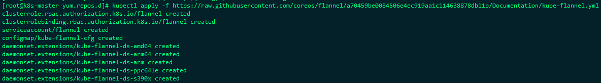

#  kubeadm安装部署k8s

官方文档：https://kubernetes.io/zh/docs/setup/independent/create-cluster-kubeadm/

**注意注意：使用kubeadm部署的k8s集群证书的有效期只有1年，ca证书有效期是10年，一定要注意提前更换**

证书更换参考文档[Kubeadm部署集群证书更新](../advanced/k8s_kubeadm_ca_update.md)


## 主机信息

所有机器配置位2c2g 40G硬盘

| 主机名     | ip          | 用途             |
| ---------- | ----------- | ---------------- |
| k8s-master | 10.10.10.10 | etcd、k8s-master |
| k8s-node1  | 10.10.10.11 | etcd、k8s-worker |
| k8s-node2  | 10.10.10.12 | etcd、k8s-worker |


## 环境初始化

### 设置主机名

```shell
#10.10.10.10
hostnamectl set-hostname k8s-master

#10.10.10.11
hostnamectl set-hostname k8s-node1

#10.10.10.12
hostnamectl set-hostname k8s-node2
```


### 关闭防火墙

```shell
systemctl stop firewalld
systemctl disable firewalld
```


### 关闭selinux

```shell
setenforce 0
sed -i 's/enforcing/disabled/' /etc/selinux/config
```


### 关闭swap

```
swapoff -a
vi /etc/fstab
注释关于swap挂载的信息
```


### 添加主机名和IP的对应关系

```shell
cat >> /etc/hosts << EOF 
10.10.10.10 k8s-master
10.10.10.11 k8s-node1 
10.10.10.12 k8s-node2 
EOF
```


### 调整内核参数

```shell
# cat > /etc/sysctl.d/k8s.conf << EOF
net.bridge.bridge-nf-call-ip6tables = 1
net.bridge.bridge-nf-call-iptables = 1
net.ipv4.ip_forward = 1
EOF

# sysctl --system
```


### 修改yum源

```
#修改base源
mv /etc/yum.repos.d/CentOS-Base.repo /etc/yum.repos.d/CentOS-Base.repo.backup
curl -o /etc/yum.repos.d/CentOS-Base.repo https://mirrors.aliyun.com/repo/Centos-7.repo


#增加k8s的源
cat <<EOF > /etc/yum.repos.d/kubernetes.repo
[kubernetes]
name=Kubernetes
baseurl=https://mirrors.aliyun.com/kubernetes/yum/repos/kubernetes-el7-x86_64/
enabled=1
gpgcheck=1
repo_gpgcheck=1
gpgkey=https://mirrors.aliyun.com/kubernetes/yum/doc/yum-key.gpg https://mirrors.aliyun.com/kubernetes/yum/doc/rpm-package-key.gpg
EOF
```


## 安装docker

### 修改yum源

```
#增加docker源
curl -o /etc/yum.repos.d/docker-ce.repo https://mirrors.aliyun.com/docker-ce/linux/centos/docker-ce.repo
```


```
yum -y install docker-ce-18.06.1.ce-3.el7
systemctl start docker
systemctl enable docker
docker --version
```


## 安装kubernetes组件

```shell
yum install -y kubelet-1.15.10 kubeadm-1.15.10 kubectl-1.15.10
systemctl enable kubelet
```


## 部署kubernets Master

在master服务器10.10.10.10上执行

### 初始化master节点

```
kubeadm init \
--apiserver-advertise-address=10.10.10.10 \
--image-repository registry.aliyuncs.com/google_containers \
--kubernetes-version v1.15.10 \
--service-cidr=10.1.0.0/16 \
--pod-network-cidr=10.244.0.0/16
```


### 准备kubeclt工具使用环境

```
mkdir -p $HOME/.kube
sudo cp -i /etc/kubernetes/admin.conf $HOME/.kube/config
sudo chown $(id -u):$(id -g) $HOME/.kube/config
```


### 安装网络插件

```
kubectl apply -f https://raw.githubusercontent.com/coreos/flannel/a70459be0084506e4ec919aa1c114638878db11b/Documentation/kube-flannel.yml
```



由于这里的镜像是国外的，可能会出现下载失败，或者下载缓慢的问题，可以将yml文件下载下来修改为国内镜像使用。


## 部署node节点

在初始化master节点是会生成加入master节点集群的token，此token有效期为1小时，如果失效了需要手动生成新的token

```
kubeadm join 10.10.10.10:6443 --token 0et5h5.8qheqfbgklfmd6yj \
    --discovery-token-ca-cert-hash sha256:8e0a3a651da53442966febc2eee384767702aef9dbb5cd0976720dbc2f43e9d0
```


## 检查集群运行状态

在master节点上执行

```
kubectl get nodes
```


```
kubectl get pod,svc -n kube-system
```

确认所有服务都的状态都在Running状态


到这里我们的K8S集群就基本部署完成了，接下来可以根据自己的需求进行部署dashboard、ingress等插件


## 部署Dashboard控制台

这里我们是测试环境，没有域名之类的访问方式，这里我们将dashboard修改为nodeport的方式进行访问

先下载doashboard的文件，地址：https://raw.githubusercontent.com/kubernetes/dashboard/v2.0.3/aio/deploy/recommended.yaml

将service的类型修改为NodePort，并设置nodePort端口30001，修改后的Service部分内容如下：

```yml
---

kind: Service
apiVersion: v1
metadata:
  labels:
    k8s-app: kubernetes-dashboard
  name: kubernetes-dashboard
  namespace: kubernetes-dashboard
spec:
  type: NodePort
  ports:
    - port: 443
      targetPort: 8443
      nodePort: 30001
  selector:
    k8s-app: kubernetes-dashboard
```


然后使用kubectl apply -f recommended.yaml 创建资源即可


创建service account并绑定默认cluster-admin管理员集群角色：

```shell
# 创建用户
$ kubectl create serviceaccount dashboard-admin -n kube-system
# 用户授权
$ kubectl create clusterrolebinding dashboard-admin --clusterrole=cluster-admin --serviceaccount=kube-system:dashboard-admin
# 获取用户Token
$ kubectl describe secrets -n kube-system $(kubectl -n kube-system get secret | awk '/dashboard-admin/{print $1}')
```

