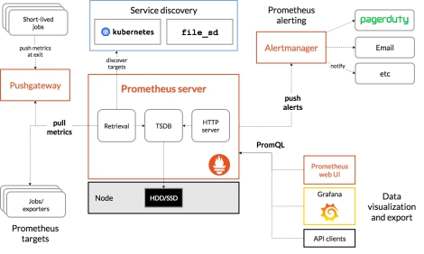
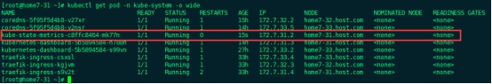
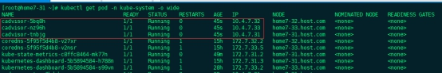
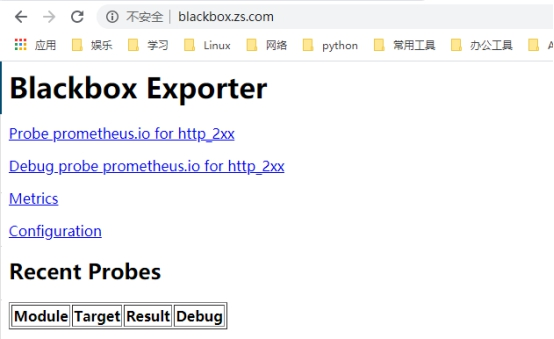

# K8S交付Prometheus监控(1)

## 1、基础说明

由于docker容器的特殊性，传统的zabbix无法对k8s集群内的docker状态进行监控，所以需要使用prometheus来进行监控：

### 1.1、什么是Prometheus?

Prometheus是由SoundCloud开发的开源监控报警系统和时序列数据库(TSDB)。	Prometheus使用Go语言开发，是Google BorgMon监控系统的开源版本。
2016年由Google发起Linux基金会旗下的原生云基金会(Cloud Native Computing 	Foundation), 将Prometheus纳入其下第2大开源项目。
Prometheus目前在开源社区相当活跃。
Prometheus和Heapster(Heapster是K8S的一个子项目，用于获取集群的性能数据。)相比功能更完善、更全面。Prometheus性能也足够支撑上万台规模的集群。

### 1.2、Prometheus的特点

多维度数据模型。

灵活的查询语言。

不依赖分布式存储，单个服务器节点是自主的。

通过基于HTTP的pull方式采集时序数据。

可以通过中间网关进行时序列数据推送。

通过服务发现或者静态配置来发现目标服务对象。

支持多种多样的图表和界面展示，比如Grafana等。

 

 

 

基本原理

Prometheus的基本原理是通过HTTP协议周期性抓取被监控组件的状态，任意组件只要提供对应的HTTP接口就可以接入监控。不需要任何SDK或者其他的集成过程。这样做非常适合做虚拟化环境监控系统，比如VM、Docker、Kubernetes等。输出被监控组件信息的HTTP接口被叫做exporter 。目前互联网公司常用的组件大部分都有exporter可以直接使用，比如Varnish、Haproxy、Nginx、MySQL、Linux系统信息(包括磁盘、内存、CPU、网络等等)。

 

服务过程

Prometheus Daemon负责定时去目标上抓取metrics(指标)数据，每个抓取目标需要暴露一个http服务的接口给它定时抓取。Prometheus支持通过配置文件、文本文件、Zookeeper、Consul、DNS SRV Lookup等方式指定抓取目标。Prometheus采用PULL的方式进行监控，即服务器可以直接通过目标PULL数据或者间接地通过中间网关来Push数据。

Prometheus在本地存储抓取的所有数据，并通过一定规则进行清理和整理数据，并把得到的结果存储到新的时间序列中。

Prometheus通过PromQL和其他API可视化地展示收集的数据。Prometheus支持很多方式的图表可视化，例如Grafana、自带的Promdash以及自身提供的模版引擎等等。Prometheus还提供HTTP API的查询方式，自定义所需要的输出。

PushGateway支持Client主动推送metrics到PushGateway，而Prometheus只是定时去Gateway上抓取数据。

Alertmanager是独立于Prometheus的一个组件，可以支持Prometheus的查询语句，提供十分灵活的报警方式。

3大套件

Server 主要负责数据采集和存储，提供PromQL查询语言的支持。

Alertmanager 警告管理器，用来进行报警。

Push Gateway 支持临时性Job主动推送指标的中间网关。

prometheus不同于zabbix，没有agent，使用的是针对不同服务的exporter：

prometheus官网：官网地址 

正常情况下，监控k8s集群及node，pod，常用的exporter有4个：

kube-state-metrics -- 收集k8s集群master&etcd等基本状态信息

node-exporter -- 收集k8s集群node信息

cadvisor -- 收集k8s集群docker容器内部使用资源信息

blackbox-exporte -- 收集k8s集群docker容器服务是否存活

接下来逐一创建以上exporter：

老套路，下载docker镜像，准备资源配置清单，应用资源配置清单：

 

## 2、Kube-state-metrics

### 2.1、镜像准备

资源获取

```shell
docker pull quay.io/coreos/kube-state-metrics:v1.5.0
docker tag 91599517197a harbor.zs.com/public/kube-state-metrics:v1.5.0
docker push harbor.zs.com/public/kube-state-metrics:v1.5.0
```


### 2.2、资源配置清单准备

> 创建相关目录

```
mkdir /data/k8s-yaml/kube-state-metrics 
cd /data/k8s-yaml/kube-state-metrics
```

#### 2.2.1、RBAC

> vim rbac.yaml

```yaml
apiVersion: v1
kind: ServiceAccount
metadata:
  labels:
    addonmanager.kubernetes.io/mode: Reconcile
    kubernetes.io/cluster-service: "true"
  name: kube-state-metrics
  namespace: kube-system
---
apiVersion: rbac.authorization.k8s.io/v1
kind: ClusterRole
metadata:
  labels:
    addonmanager.kubernetes.io/mode: Reconcile
    kubernetes.io/cluster-service: "true"
  name: kube-state-metrics
rules:
- apiGroups:
  - ""
  resources:
  - configmaps
  - secrets
  - nodes
  - pods
  - services
  - resourcequotas
  - replicationcontrollers
  - limitranges
  - persistentvolumeclaims
  - persistentvolumes
  - namespaces
  - endpoints
  verbs:
  - list
  - watch
- apiGroups:
  - policy
  resources:
  - poddisruptionbudgets
  verbs:
  - list
  - watch
- apiGroups:
  - extensions
  resources:
  - daemonsets
  - deployments
  - replicasets
  verbs:
  - list
  - watch
- apiGroups:
  - apps
  resources:
  - statefulsets
  verbs:
  - list
  - watch
- apiGroups:
  - batch
  resources:
  - cronjobs
  - jobs
  verbs:
  - list
  - watch
- apiGroups:
  - autoscaling
  resources:
  - horizontalpodautoscalers
  verbs:
  - list
  - watch
---
apiVersion: rbac.authorization.k8s.io/v1
kind: ClusterRoleBinding
metadata:
  labels:
    addonmanager.kubernetes.io/mode: Reconcile
    kubernetes.io/cluster-service: "true"
  name: kube-state-metrics
roleRef:
  apiGroup: rbac.authorization.k8s.io
  kind: ClusterRole
  name: kube-state-metrics
subjects:
- kind: ServiceAccount
  name: kube-state-metrics
  namespace: kube-system
```


#### 2.2.2、Deployment

> vim dp.yaml

```yaml
apiVersion: extensions/v1beta1
kind: Deployment
metadata:
  annotations:
    deployment.kubernetes.io/revision: "2"
  labels:
    grafanak8sapp: "true"
    app: kube-state-metrics
  name: kube-state-metrics
  namespace: kube-system
spec:
  selector:
    matchLabels:
      grafanak8sapp: "true"
      app: kube-state-metrics
  strategy:
    rollingUpdate:
      maxSurge: 25%
      maxUnavailable: 25%
    type: RollingUpdate
  template:
    metadata:
      labels:
        grafanak8sapp: "true"
        app: kube-state-metrics
    spec:
      containers:
      - name: kube-state-metrics
        image: harbor.zs.com/public/kube-state-metrics:v1.5.0
        imagePullPolicy: IfNotPresent
        ports:
        - containerPort: 8080
          name: http-metrics
          protocol: TCP
        readinessProbe:
          failureThreshold: 3
          httpGet:
            path: /healthz
            port: 8080
            scheme: HTTP
          initialDelaySeconds: 5
          periodSeconds: 10
          successThreshold: 1
          timeoutSeconds: 5
      serviceAccountName: kube-state-metrics
```


### 2.3、应用资源配置清单

```shell
kubectl apply -f http://k8s-yaml.zs.com/kube-state-metrics/rbac.yaml
kubectl apply -f http://k8s-yaml.zs.com/kube-state-metrics/dp.yaml
```


### 2.4、确认资源配置启动

```
kubectl get pod -n kube-system -o wide
```

 


## 3、Node-exporter

由于node-exporter是监控node的，所有需要每个节点启动一个，所以使用ds控制器

### 3.1、镜像准备

```
docker pull prom/node-exporter:v0.15.0
docker tag 12d51ffa2b22 harbor.zs.com/public/node-exporter:v0.15.0
docker push harbor.zs.com/public/node-exporter:v0.15.0
```

 

### 3.2、准备资源配置清单

> 创建项目目录

```
cd /data/k8s-yaml
mkdir node-exporter && cd node-exporter
```

> vim ds.yaml

```yaml
kind: DaemonSet
apiVersion: extensions/v1beta1
metadata:
  name: node-exporter
  namespace: kube-system
  labels:
    daemon: "node-exporter"
    grafanak8sapp: "true"
spec:
  selector:
    matchLabels:
      daemon: "node-exporter"
      grafanak8sapp: "true"
  template:
    metadata:
      name: node-exporter
      labels:
        daemon: "node-exporter"
        grafanak8sapp: "true"
    spec:
      volumes:
      - name: proc
        hostPath: 
          path: /proc
          type: ""
      - name: sys
        hostPath:
          path: /sys
          type: ""
      containers:
      - name: node-exporter
        image: harbor.zs.com/public/node-exporter:v0.15.0
        imagePullPolicy: IfNotPresent
        args:
        - --path.procfs=/host_proc
        - --path.sysfs=/host_sys
        ports:
        - name: node-exporter
          hostPort: 9100
          containerPort: 9100
          protocol: TCP
        volumeMounts:
        - name: sys
          readOnly: true
          mountPath: /host_sys
        - name: proc
          readOnly: true
          mountPath: /host_proc
      hostNetwork: true
```


### 3.3、应用资源配置清单

```
kubectl apply -f http://k8s-yaml.zs.com/node-exporter/ds.yaml
```


### 3.4、检查应用启动

```
kubectl get pod -n kube-system -o wide
```

我这里有3台机器因此这里启动了3个pod

 

 

 

## 4、Cadvisor

GitHub地址：https://github.com/google/cadvisor

### 4.1、镜像准备

```shell
docker pull gcr.io/google_containers/cadvisor:v0.28.3
docker tag 75f88e3ec333 harbor.zs.com/public/cadvisor:v0.28.3
docker push harbor.zs.com/public/cadvisor:v0.28.3
```

 

### 4.2、准备资源配置清单

> 创建项目目录

```
# cd /data/k8s-yaml
# mkdir cadvisor && cd cadvisor
```

> vim ds.yaml

```yaml
apiVersion: apps/v1
kind: DaemonSet
metadata:
  name: cadvisor
  namespace: kube-system
  labels:
    app: cadvisor
spec:
  selector:
    matchLabels:
      name: cadvisor
  template:
    metadata:
      labels:
        name: cadvisor
    spec:
      hostNetwork: true
      tolerations:
      - key: node-role.kubernetes.io/master
        effect: NoSchedule
      containers:
      - name: cadvisor
        image: harbor.zs.com/public/cadvisor:v0.28.3
        imagePullPolicy: IfNotPresent
        volumeMounts:
        - name: rootfs
          mountPath: /rootfs
          readOnly: true
        - name: var-run
          mountPath: /var/run
        - name: sys
          mountPath: /sys
          readOnly: true
        - name: docker
          mountPath: /var/lib/docker
          readOnly: true
        ports:
          - name: http
            containerPort: 4194
            protocol: TCP
        readinessProbe:
          tcpSocket:
            port: 4194
          initialDelaySeconds: 5
          periodSeconds: 10
        args:
          - --housekeeping_interval=10s
          - --port=4194
      terminationGracePeriodSeconds: 30
      volumes:
      - name: rootfs
        hostPath:
          path: /
      - name: var-run
        hostPath:
          path: /var/run
      - name: sys
        hostPath:
          path: /sys
      - name: docker
        hostPath:
          path: /data/docker
```


 

### 4.3、挂载资源调整

所有计算节点

```
mount -o remount,rw /sys/fs/cgroup/
ln -s /sys/fs/cgroup/cpu,cpuacct /sys/fs/cgroup/cpuacct,cpu
```


### 4.4、应用资源配置清单

!!! tip "此步骤在任意计算节点进行"

```
kubectl apply -f http://k8s-yaml.zs.com/cadvisor/ds.yaml
```


### 4.5、检查应用启动

!!! tip "此步骤在任意计算节点进行"

```
# kubectl get pod -n kube-system -o wide
```




## 5、Blackbox-exporter

### 5.1、镜像准备

```
docker pull prom/blackbox-exporter:v0.15.1
docker tag 81b70b6158be harbor.zs.com/public/blackbox-exporter:v0.15.1
docker push harbor.zs.com/public/blackbox-exporter:v0.15.1
```


### 5.2、资源配置清单准备

> 创建项目目录

```
cd /data/k8s-yaml
mkdir blackbox-exporter && cd blackbox-exporter
```

#### 5.2.1、ConfigMap

> vim cm.yaml

```yaml
apiVersion: v1
kind: ConfigMap
metadata:
  labels:
    app: blackbox-exporter
  name: blackbox-exporter
  namespace: kube-system
data:
  blackbox.yml: |-
    modules:
      http_2xx:
        prober: http
        timeout: 2s
        http:
          valid_http_versions: ["HTTP/1.1", "HTTP/2"]
          valid_status_codes: [200,301,302]
          method: GET
          preferred_ip_protocol: "ip4"
      tcp_connect:
        prober: tcp
        timeout: 2s
```


#### 5.2.2、Deployment

> vim dp.yaml

```yaml
kind: Deployment
apiVersion: extensions/v1beta1
metadata:
  name: blackbox-exporter
  namespace: kube-system
  labels:
    app: blackbox-exporter
  annotations:
    deployment.kubernetes.io/revision: 1
spec:
  replicas: 1
  selector:
    matchLabels:
      app: blackbox-exporter
  template:
    metadata:
      labels:
        app: blackbox-exporter
    spec:
      volumes:
      - name: config
        configMap:
          name: blackbox-exporter
          defaultMode: 420
      containers:
      - name: blackbox-exporter
        image: harbor.zs.com/public/blackbox-exporter:v0.15.1
        imagePullPolicy: IfNotPresent
        args:
        - --config.file=/etc/blackbox_exporter/blackbox.yml
        - --log.level=info
        - --web.listen-address=:9115
        ports:
        - name: blackbox-port
          containerPort: 9115
          protocol: TCP
        resources:
          limits:
            cpu: 200m
            memory: 256Mi
          requests:
            cpu: 100m
            memory: 50Mi
        volumeMounts:
        - name: config
          mountPath: /etc/blackbox_exporter
        readinessProbe:
          tcpSocket:
            port: 9115
          initialDelaySeconds: 5
          timeoutSeconds: 5
          periodSeconds: 10
          successThreshold: 1
          failureThreshold: 3
```


#### 5.2.3、Service

>  vim svc.yaml

```yaml
kind: Service
apiVersion: v1
metadata:
  name: blackbox-exporter
  namespace: kube-system
spec:
  selector:
    app: blackbox-exporter
  ports:
    - name: blackbox-port
      protocol: TCP
      port: 9115
```


### 5.2.4、Ingress

> vim ingress.yaml

```
apiVersion: extensions/v1beta1
kind: Ingress
metadata:
  name: blackbox-exporter
  namespace: kube-system
spec:
  rules:
  - host: blackbox.zs.com
    http:
      paths:
      - path: /
        backend:
          serviceName: blackbox-exporter
          servicePort: blackbox-port
```


### 5.3、添加域名解析

blackbox       A   10.4.7.20


### 5.4、应用资源配置清单

```shell
kubectl apply -f http://k8s-yaml.zs.com/blackbox-exporter/cm.yaml
kubectl apply -f http://k8s-yaml.zs.com/blackbox-exporter/dp.yaml
kubectl apply -f http://k8s-yaml.zs.com/blackbox-exporter/svc.yaml
kubectl apply -f http://k8s-yaml.zs.com/blackbox-exporter/ingress.yaml
```


### 5.5、访问测试

访问blackbox.zs.com

 

 