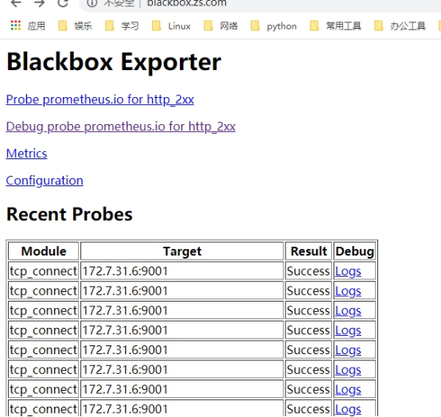
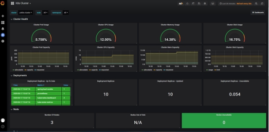
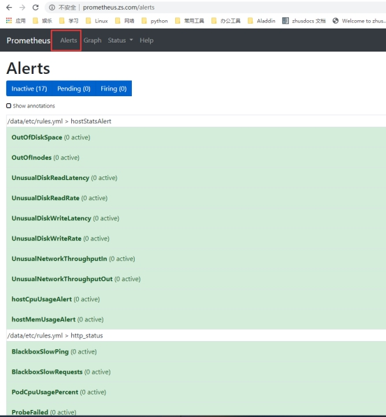

# K8S交付Prometheus监控(2)

## 6、部署prometheus server

### 6.1、镜像准备

```
docker pull prom/prometheus:v2.14.0
docker tag 7317640d555e harbor.zs.com/infra/prometheus:v2.14.0
docker push harbor.zs.com/infra/prometheus:v2.14.0
```


### 6.2、资源配置清单准备

```
cd /data/k8s-yaml/
mkdir prometheus-server && cd prometheus-server
```


### 6.2.1、RBAC

> vim rbac.yaml

```yaml
apiVersion: v1
kind: ServiceAccount
metadata:
  labels:
    addonmanager.kubernetes.io/mode: Reconcile
    kubernetes.io/cluster-service: "true"
  name: prometheus
  namespace: infra
---
apiVersion: rbac.authorization.k8s.io/v1
kind: ClusterRole
metadata:
  labels:
    addonmanager.kubernetes.io/mode: Reconcile
    kubernetes.io/cluster-service: "true"
  name: prometheus
rules:
- apiGroups:
  - ""
  resources:
  - nodes
  - nodes/metrics
  - services
  - endpoints
  - pods
  verbs:
  - get
  - list
  - watch
- apiGroups:
  - ""
  resources:
  - configmaps
  verbs:
  - get
- nonResourceURLs:
  - /metrics
  verbs:
  - get
---
apiVersion: rbac.authorization.k8s.io/v1
kind: ClusterRoleBinding
metadata:
  labels:
    addonmanager.kubernetes.io/mode: Reconcile
    kubernetes.io/cluster-service: "true"
  name: prometheus
roleRef:
  apiGroup: rbac.authorization.k8s.io
  kind: ClusterRole
  name: prometheus
subjects:
- kind: ServiceAccount
  name: prometheus
  namespace: infra
```


### 6.2.2、Deployment

加上--web.enable-lifecycle启用远程热加载配置文件

调用指令是curl -X POST http://localhost:9090/-/reload

storage.tsdb.min-block-duration=10m #只加载10分钟数据到内

storage.tsdb.retention=72h #保留72小时数据

> vim dp.yaml

```yaml
apiVersion: extensions/v1beta1
kind: Deployment
metadata:
  annotations:
    deployment.kubernetes.io/revision: "5"
  labels:
    name: prometheus
  name: prometheus
  namespace: infra
spec:
  progressDeadlineSeconds: 600
  replicas: 1
  revisionHistoryLimit: 7
  selector:
    matchLabels:
      app: prometheus
  strategy:
    rollingUpdate:
      maxSurge: 1
      maxUnavailable: 1
    type: RollingUpdate
  template:
    metadata:
      labels:
        app: prometheus
    spec:
      containers:
      - name: prometheus
        image: harbor.zs.com/infra/prometheus:v2.14.0
        imagePullPolicy: IfNotPresent
        command:
        - /bin/prometheus
        args:
        - --config.file=/data/etc/prometheus.yml
        - --storage.tsdb.path=/data/prom-db
        - --storage.tsdb.min-block-duration=10m
        - --storage.tsdb.retention=72h
        - --web.enable-lifecycle
        ports:
        - containerPort: 9090
          protocol: TCP
        volumeMounts:
        - mountPath: /data
          name: data
        resources:
          requests:
            cpu: "1000m"
            memory: "1.5Gi"
          limits:
            cpu: "2000m"
            memory: "3Gi"
      imagePullSecrets:
      - name: harbor
      securityContext:
        runAsUser: 0
      serviceAccountName: prometheus
      volumes:
      - name: data
        nfs:
          server: HOME7-200
          path: /data/nfs-volume/prometheus
```


### 6.2.3、Service

> vim svc.yaml

```yaml
apiVersion: v1
kind: Service
metadata:
  name: prometheus
  namespace: infra
spec:
  ports:
  - port: 9090
    protocol: TCP
    targetPort: 9090
  selector:
    app: prometheus
```


### 6.2.4、Ingress.yaml

> vim ingress.yaml

```yaml
apiVersion: extensions/v1beta1
kind: Ingress
metadata:
  annotations:
    kubernetes.io/ingress.class: traefik
  name: prometheus
  namespace: infra
spec:
  rules:
  - host: prometheus.zs.com
    http:
      paths:
      - path: /
        backend:
          serviceName: prometheus
          servicePort: 9090
```


### 6.3、增加域名解析

prometheus     A   10.4.7.20


### 6.4、创建相关目录

```
mkdir -p /data/nfs-volume/prometheus/{etc,prom-db}
```


### 6.5、修改配置文件

> vi /data/nfs-volume/prometheus/etc/prometheus.yml

```yml
global:
  scrape_interval:     15s
  evaluation_interval: 15s
scrape_configs:
- job_name: 'etcd'
  tls_config:
    ca_file: /data/etc/ca.pem
    cert_file: /data/etc/client.pem
    key_file: /data/etc/client-key.pem
  scheme: https
  static_configs:
  - targets:
    - '10.4.7.31:2379'
    - '10.4.7.32:2379'
    - '10.4.7.33:2379'
- job_name: 'kubernetes-apiservers'
  kubernetes_sd_configs:
  - role: endpoints
  scheme: https
  tls_config:
    ca_file: /var/run/secrets/kubernetes.io/serviceaccount/ca.crt
  bearer_token_file: /var/run/secrets/kubernetes.io/serviceaccount/token
  relabel_configs:
  - source_labels: [__meta_kubernetes_namespace, __meta_kubernetes_service_name, __meta_kubernetes_endpoint_port_name]
    action: keep
    regex: default;kubernetes;https
- job_name: 'kubernetes-pods'
  kubernetes_sd_configs:
  - role: pod
  relabel_configs:
  - source_labels: [__meta_kubernetes_pod_annotation_prometheus_io_scrape]
    action: keep
    regex: true
  - source_labels: [__meta_kubernetes_pod_annotation_prometheus_io_path]
    action: replace
    target_label: __metrics_path__
    regex: (.+)
  - source_labels: [__address__, __meta_kubernetes_pod_annotation_prometheus_io_port]
    action: replace
    regex: ([^:]+)(?::\d+)?;(\d+)
    replacement: $1:$2
    target_label: __address__
  - action: labelmap
    regex: __meta_kubernetes_pod_label_(.+)
  - source_labels: [__meta_kubernetes_namespace]
    action: replace
    target_label: kubernetes_namespace
  - source_labels: [__meta_kubernetes_pod_name]
    action: replace
    target_label: kubernetes_pod_name
- job_name: 'kubernetes-kubelet'
  kubernetes_sd_configs:
  - role: node
  relabel_configs:
  - action: labelmap
    regex: __meta_kubernetes_node_label_(.+)
  - source_labels: [__meta_kubernetes_node_name]
    regex: (.+)
    target_label: __address__
    replacement: ${1}:10255
- job_name: 'kubernetes-cadvisor'
  kubernetes_sd_configs:
  - role: node
  relabel_configs:
  - action: labelmap
    regex: __meta_kubernetes_node_label_(.+)
  - source_labels: [__meta_kubernetes_node_name]
    regex: (.+)
    target_label: __address__
    replacement: ${1}:4194
- job_name: 'kubernetes-kube-state'
  kubernetes_sd_configs:
  - role: pod
  relabel_configs:
  - action: labelmap
    regex: __meta_kubernetes_pod_label_(.+)
  - source_labels: [__meta_kubernetes_namespace]
    action: replace
    target_label: kubernetes_namespace
  - source_labels: [__meta_kubernetes_pod_name]
    action: replace
    target_label: kubernetes_pod_name
  - source_labels: [__meta_kubernetes_pod_label_grafanak8sapp]
    regex: .*true.*
    action: keep
  - source_labels: ['__meta_kubernetes_pod_label_daemon', '__meta_kubernetes_pod_node_name']
    regex: 'node-exporter;(.*)'
    action: replace
    target_label: nodename
- job_name: 'blackbox_http_pod_probe'
  metrics_path: /probe
  kubernetes_sd_configs:
  - role: pod
  params:
    module: [http_2xx]
  relabel_configs:
  - source_labels: [__meta_kubernetes_pod_annotation_blackbox_scheme]
    action: keep
    regex: http
  - source_labels: [__address__, __meta_kubernetes_pod_annotation_blackbox_port,  __meta_kubernetes_pod_annotation_blackbox_path]
    action: replace
    regex: ([^:]+)(?::\d+)?;(\d+);(.+)
    replacement: $1:$2$3
    target_label: __param_target
  - action: replace
    target_label: __address__
    replacement: blackbox-exporter.kube-system:9115
  - source_labels: [__param_target]
    target_label: instance
  - action: labelmap
    regex: __meta_kubernetes_pod_label_(.+)
  - source_labels: [__meta_kubernetes_namespace]
    action: replace
    target_label: kubernetes_namespace
  - source_labels: [__meta_kubernetes_pod_name]
    action: replace
    target_label: kubernetes_pod_name
- job_name: 'blackbox_tcp_pod_probe'
  metrics_path: /probe
  kubernetes_sd_configs:
  - role: pod
  params:
    module: [tcp_connect]
  relabel_configs:
  - source_labels: [__meta_kubernetes_pod_annotation_blackbox_scheme]
    action: keep
    regex: tcp
  - source_labels: [__address__, __meta_kubernetes_pod_annotation_blackbox_port]
    action: replace
    regex: ([^:]+)(?::\d+)?;(\d+)
    replacement: $1:$2
    target_label: __param_target
  - action: replace
    target_label: __address__
    replacement: blackbox-exporter.kube-system:9115
  - source_labels: [__param_target]
    target_label: instance
  - action: labelmap
    regex: __meta_kubernetes_pod_label_(.+)
  - source_labels: [__meta_kubernetes_namespace]
    action: replace
    target_label: kubernetes_namespace
  - source_labels: [__meta_kubernetes_pod_name]
    action: replace
    target_label: kubernetes_pod_name
- job_name: 'traefik'
  kubernetes_sd_configs:
  - role: pod
  relabel_configs:
  - source_labels: [__meta_kubernetes_pod_annotation_prometheus_io_scheme]
    action: keep
    regex: traefik
  - source_labels: [__meta_kubernetes_pod_annotation_prometheus_io_path]
    action: replace
    target_label: __metrics_path__
    regex: (.+)
  - source_labels: [__address__, __meta_kubernetes_pod_annotation_prometheus_io_port]
    action: replace
    regex: ([^:]+)(?::\d+)?;(\d+)
    replacement: $1:$2
    target_label: __address__
  - action: labelmap
    regex: __meta_kubernetes_pod_label_(.+)
  - source_labels: [__meta_kubernetes_namespace]
    action: replace
    target_label: kubernetes_namespace
  - source_labels: [__meta_kubernetes_pod_name]
    action: replace
    target_label: kubernetes_pod_name
```


### 6.6、拷贝证书

```
cd /data/nfs-volume/prometheus/etc/
cp /opt/certs/ca.pem ./
cp /opt/certs/client.pem ./
cp /opt/certs/client-key.pem ./
```


### 6.7、应用资源配置清单

```
kubectl apply -f http://k8s-yaml.zs.com/prometheus-server/rbac.yaml
kubectl apply -f http://k8s-yaml.zs.com/prometheus-server/dp.yaml
kubectl apply -f http://k8s-yaml.zs.com/prometheus-server/svc.yaml
kubectl apply -f http://k8s-yaml.zs.com/prometheus-server/ingress.yaml
```


### 6.8、访问验证

通过浏览器访问promethues.zs.com

 

 

 


### 6.9、纳入其他应用监控

### 6.9.1、Traefik纳入监控

修改traefik的yaml：

从dashboard里找到traefik的yaml，跟labels同级添加annotations

```
"annotations": {
 "prometheus_io_scheme": "traefik",
 "prometheus_io_path": "/metrics",
 "prometheus_io_port": "8080"
}
```

 

 

等pod重启后，可以从Prometheus的web页面上看到

 

### 6.9.2、blackbox纳入

这个是检测容器内服务存活性的，也就是端口健康状态检查，分为tcp和http

我这里是启动的我们公司的一个eureka注册中心的服务

等服务起来以后，首先在对应的资源中添加一个TCP的annotation：

注意配置中的端口号，要对应自己的服务情况

```
"annotations": {
 "blackbox_port": "9001",
 "blackbox_scheme": "tcp"
}
```

 

可以通过Prometheus的web页面查看到下述页面

 

 

通过blackbox.zs.com页面可以看到新加入服务信息

 

也可以增加以下http资源，方法与tcp增加相同

```
"annotations": {
 "blackbox_path": "/hello?name=health",
 "blackbox_port": "8080",
 "blackbox_scheme": "http"
}

Jvm监控

"annotations": {
 "prometheus_io_scrape": "true",
 "prometheus_io_port": "12346",
 "prometheus_io_path": "/"
}
```

 

 

## 7、部署配置grafana

### 7.1、镜像准备

```
docker pull grafana/grafana:5.4.2
docker tag 6f18ddf9e552 harbor.zs.com/infra/grafana:v5.4.2
docker push harbor.zs.com/infra/grafana:v5.4.2
```


### 7.2、准备资源清单

```
cd /data/k8s-yaml/
mkdir grafana && cd grafana
```


### 7.2.1、RBAC

> vim rbac.yaml

```yaml
apiVersion: rbac.authorization.k8s.io/v1
kind: ClusterRole
metadata:
  labels:
    addonmanager.kubernetes.io/mode: Reconcile
    kubernetes.io/cluster-service: "true"
  name: grafana
rules:
- apiGroups:
  - "*"
  resources:
  - namespaces
  - deployments
  - pods
  verbs:
  - get
  - list
  - watch
---
apiVersion: rbac.authorization.k8s.io/v1
kind: ClusterRoleBinding
metadata:
  labels:
    addonmanager.kubernetes.io/mode: Reconcile
    kubernetes.io/cluster-service: "true"
  name: grafana
roleRef:
  apiGroup: rbac.authorization.k8s.io
  kind: ClusterRole
  name: grafana
subjects:
- kind: User
  name: k8s-node
```


### 7.2.2、Deployment

> vim dp.yaml

```yaml
apiVersion: extensions/v1beta1
kind: Deployment
metadata:
  labels:
    app: grafana
    name: grafana
  name: grafana
  namespace: infra
spec:
  progressDeadlineSeconds: 600
  replicas: 1
  revisionHistoryLimit: 7
  selector:
    matchLabels:
      name: grafana
  strategy:
    rollingUpdate:
      maxSurge: 1
      maxUnavailable: 1
    type: RollingUpdate
  template:
    metadata:
      labels:
        app: grafana
        name: grafana
    spec:
      containers:
      - name: grafana
        image: harbor.zs.com/infra/grafana:v5.4.2
        imagePullPolicy: IfNotPresent
        ports:
        - containerPort: 3000
          protocol: TCP
        volumeMounts:
        - mountPath: /var/lib/grafana
          name: data
      imagePullSecrets:
      - name: harbor
      securityContext:
        runAsUser: 0
      volumes:
      - nfs:
          server: HOME7-200
          path: /data/nfs-volume/grafana
        name: data
```


### 7.2.3、Service

> vim svc.yaml

```yaml
apiVersion: v1
kind: Service
metadata:
  name: grafana
  namespace: infra
spec:
  ports:
  - port: 3000
    protocol: TCP
    targetPort: 3000
  selector:
    app: grafana
```


### 7.2.4、Ingress

> vim ingress.yaml

```yaml
apiVersion: extensions/v1beta1
kind: Ingress
metadata:
  name: grafana
  namespace: infra
spec:
  rules:
  - host: grafana.zs.com
    http:
      paths:
      - path: /
        backend:
          serviceName: grafana
          servicePort: 3000
```


### 7.3、增加域名解析

grafana        A   10.4.7.20


### 7.4、应用资源配置清单

```
kubectl apply -f http://k8s-yaml.zs.com/grafana/rbac.yaml
kubectl apply -f http://k8s-yaml.zs.com/grafana/dp.yaml
kubectl apply -f http://k8s-yaml.zs.com/grafana/svc.yaml
kubectl apply -f http://k8s-yaml.zs.com/grafana/ingress.yaml
```


### 7.5、验证

```
kubectl get pod -n infra
```

 

访问web页面grafana.zs.com，默认用户名密码admin/admin


### 7.6、配置

#### 7.6.1、进入容器安装相关插件

# kubectl exec -it grafana-768f8957cc-qk68b /bin/bash -n infra

grafana-cli plugins install grafana-kubernetes-app

grafana-cli plugins install grafana-clock-panel

grafana-cli plugins install grafana-piechart-panel

grafana-cli plugins install briangann-gauge-panel

grafana-cli plugins install natel-discrete-panel

所有插件安装完成后，重启grafana启用插件

#### 7.6.2、配置数据源

选择prometheus，把3个证书添加进来

 

#### 7.6.3、配置集群

找到刚才安装的kubernetes插件，启用然后新建cluster

 

 

 

 

 

 

## 8、配置告警插件

### 8.1、镜像准备

```
docker pull docker.io/prom/alertmanager:v0.14.0
docker tag 23744b2d645c harbor.zs.com/infra/alertmanager:v0.14.0
docker push harbor.zs.com/infra/alertmanager:v0.14.0
```


### 8.2、准备资源配置清单

```
cd /data/k8s-yaml
mkdir alertmanager && cd alertmanager
```


#### 8.2.1、ConfigMap

> vim cm.yaml

```yaml
apiVersion: v1
kind: ConfigMap
metadata:
  name: alertmanager-config
  namespace: infra
data:
  config.yml: |-
    global:
      # 在没有报警的情况下声明为已解决的时间
      resolve_timeout: 5m
      # 配置邮件发送信息
      smtp_smarthost: 'smtp.163.com:25'
      smtp_from: 'xxx@163.com'
      smtp_auth_username: 'xxx@163.com'
      smtp_auth_password: 'xxxxxx'
      smtp_require_tls: false
    # 所有报警信息进入后的根路由，用来设置报警的分发策略
    route:
      # 这里的标签列表是接收到报警信息后的重新分组标签，例如，接收到的报警信息里面有许多具有 cluster=A 和 alertname=LatncyHigh 这样的标签的报警信息将会批量被聚合到一个分组里面
      group_by: ['alertname', 'cluster']
      # 当一个新的报警分组被创建后，需要等待至少group_wait时间来初始化通知，这种方式可以确保您能有足够的时间为同一分组来获取多个警报，然后一起触发这个报警信息。
      group_wait: 30s

      # 当第一个报警发送后，等待'group_interval'时间来发送新的一组报警信息。
      group_interval: 5m

      # 如果一个报警信息已经发送成功了，等待'repeat_interval'时间来重新发送他们
      repeat_interval: 5m

      # 默认的receiver：如果一个报警没有被一个route匹配，则发送给默认的接收器
      receiver: default

    receivers:
    - name: 'default'
      email_configs:
      - to: 'xxxx@qq.com'
        send_resolved: true
```


#### 8.2.2、Deloyment

> vim dp.yaml

```yaml
apiVersion: extensions/v1beta1
kind: Deployment
metadata:
  name: alertmanager
  namespace: infra
spec:
  replicas: 1
  selector:
    matchLabels:
      app: alertmanager
  template:
    metadata:
      labels:
        app: alertmanager
    spec:
      containers:
      - name: alertmanager
        image: harbor.zs.com/infra/alertmanager:v0.14.0
        args:
          - "--config.file=/etc/alertmanager/config.yml"
          - "--storage.path=/alertmanager"
        ports:
        - name: alertmanager
          containerPort: 9093
        volumeMounts:
        - name: alertmanager-cm
          mountPath: /etc/alertmanager
      volumes:
      - name: alertmanager-cm
        configMap:
          name: alertmanager-config
      imagePullSecrets:
      - name: harbor
```


#### 8.2.3、Service

>  vim svc.yaml

```yaml
apiVersion: v1
kind: Service
metadata:
  name: alertmanager
  namespace: infra
spec:
  selector: 
    app: alertmanager
  ports:
    - port: 80
      targetPort: 9093
```


### 8.3、配置基础告警规则

#### 8.3.1、增加规则

> vi /data/nfs-volume/prometheus/etc/rules.yml

```yml
groups:
- name: hostStatsAlert
  rules:
  - alert: hostCpuUsageAlert
    expr: sum(avg without (cpu)(irate(node_cpu{mode!='idle'}[5m]))) by (instance) > 0.85
    for: 5m
    labels:
      severity: warning
    annotations:
      summary: "{{ $labels.instance }} CPU usage above 85% (current value: {{ $value }}%)"
  - alert: hostMemUsageAlert
    expr: (node_memory_MemTotal - node_memory_MemAvailable)/node_memory_MemTotal > 0.85
    for: 5m
    labels:
      severity: warning
    annotations:
      summary: "{{ $labels.instance }} MEM usage above 85% (current value: {{ $value }}%)"
  - alert: OutOfInodes
    expr: node_filesystem_free{fstype="overlay",mountpoint ="/"} / node_filesystem_size{fstype="overlay",mountpoint ="/"} * 100 < 10
    for: 5m
    labels:
      severity: warning
    annotations:
      summary: "Out of inodes (instance {{ $labels.instance }})"
      description: "Disk is almost running out of available inodes (< 10% left) (current value: {{ $value }})"
  - alert: OutOfDiskSpace
    expr: node_filesystem_free{fstype="overlay",mountpoint ="/rootfs"} / node_filesystem_size{fstype="overlay",mountpoint ="/rootfs"} * 100 < 10
    for: 5m
    labels:
      severity: warning
    annotations:
      summary: "Out of disk space (instance {{ $labels.instance }})"
      description: "Disk is almost full (< 10% left) (current value: {{ $value }})"
  - alert: UnusualNetworkThroughputIn
    expr: sum by (instance) (irate(node_network_receive_bytes[2m])) / 1024 / 1024 > 100
    for: 5m
    labels:
      severity: warning
    annotations:
      summary: "Unusual network throughput in (instance {{ $labels.instance }})"
      description: "Host network interfaces are probably receiving too much data (> 100 MB/s) (current value: {{ $value }})"
  - alert: UnusualNetworkThroughputOut
    expr: sum by (instance) (irate(node_network_transmit_bytes[2m])) / 1024 / 1024 > 100
    for: 5m
    labels:
      severity: warning
    annotations:
      summary: "Unusual network throughput out (instance {{ $labels.instance }})"
      description: "Host network interfaces are probably sending too much data (> 100 MB/s) (current value: {{ $value }})"
  - alert: UnusualDiskReadRate
    expr: sum by (instance) (irate(node_disk_bytes_read[2m])) / 1024 / 1024 > 50
    for: 5m
    labels:
      severity: warning
    annotations:
      summary: "Unusual disk read rate (instance {{ $labels.instance }})"
      description: "Disk is probably reading too much data (> 50 MB/s) (current value: {{ $value }})"
  - alert: UnusualDiskWriteRate
    expr: sum by (instance) (irate(node_disk_bytes_written[2m])) / 1024 / 1024 > 50
    for: 5m
    labels:
      severity: warning
    annotations:
      summary: "Unusual disk write rate (instance {{ $labels.instance }})"
      description: "Disk is probably writing too much data (> 50 MB/s) (current value: {{ $value }})"
  - alert: UnusualDiskReadLatency
    expr: rate(node_disk_read_time_ms[1m]) / rate(node_disk_reads_completed[1m]) > 100
    for: 5m
    labels:
      severity: warning
    annotations:
      summary: "Unusual disk read latency (instance {{ $labels.instance }})"
      description: "Disk latency is growing (read operations > 100ms) (current value: {{ $value }})"
  - alert: UnusualDiskWriteLatency
    expr: rate(node_disk_write_time_ms[1m]) / rate(node_disk_writes_completedl[1m]) > 100
    for: 5m
    labels:
      severity: warning
    annotations:
      summary: "Unusual disk write latency (instance {{ $labels.instance }})"
      description: "Disk latency is growing (write operations > 100ms) (current value: {{ $value }})"
- name: http_status
  rules:
  - alert: ProbeFailed
    expr: probe_success == 0
    for: 1m
    labels:
      severity: error
    annotations:
      summary: "Probe failed (instance {{ $labels.instance }})"
      description: "Probe failed (current value: {{ $value }})"
  - alert: StatusCode
    expr: probe_http_status_code <= 199 OR probe_http_status_code >= 400
    for: 1m
    labels:
      severity: error
    annotations:
      summary: "Status Code (instance {{ $labels.instance }})"
      description: "HTTP status code is not 200-399 (current value: {{ $value }})"
  - alert: SslCertificateWillExpireSoon
    expr: probe_ssl_earliest_cert_expiry - time() < 86400 * 30
    for: 5m
    labels:
      severity: warning
    annotations:
      summary: "SSL certificate will expire soon (instance {{ $labels.instance }})"
      description: "SSL certificate expires in 30 days (current value: {{ $value }})"
  - alert: SslCertificateHasExpired
    expr: probe_ssl_earliest_cert_expiry - time()  <= 0
    for: 5m
    labels:
      severity: error
    annotations:
      summary: "SSL certificate has expired (instance {{ $labels.instance }})"
      description: "SSL certificate has expired already (current value: {{ $value }})"
  - alert: BlackboxSlowPing
    expr: probe_icmp_duration_seconds > 2
    for: 5m
    labels:
      severity: warning
    annotations:
      summary: "Blackbox slow ping (instance {{ $labels.instance }})"
      description: "Blackbox ping took more than 2s (current value: {{ $value }})"
  - alert: BlackboxSlowRequests
    expr: probe_http_duration_seconds > 2 
    for: 5m
    labels:
      severity: warning
    annotations:
      summary: "Blackbox slow requests (instance {{ $labels.instance }})"
      description: "Blackbox request took more than 2s (current value: {{ $value }})"
  - alert: PodCpuUsagePercent
    expr: sum(sum(label_replace(irate(container_cpu_usage_seconds_total[1m]),"pod","$1","container_label_io_kubernetes_pod_name", "(.*)"))by(pod) / on(pod) group_right kube_pod_container_resource_limits_cpu_cores *100 )by(container,namespace,node,pod,severity) > 80
    for: 5m
    labels:
      severity: warning
    annotations:
      summary: "Pod cpu usage percent has exceeded 80% (current value: {{ $value }}%)"
```


#### 8.3.2、Prometheus增加配置

> vi prometheus.yml

```yml
alerting:
  alertmanagers:
    - static_configs:
        - targets: ["alertmanager"]
rule_files:
 - "/data/etc/rules.yml"
```


### 8.4、应用资源配置清单

```yaml
kubectl apply -f http://k8s-yaml.zs.com/alertmanager/cm.yaml
kubectl apply -f http://k8s-yaml.zs.com/alertmanager/dp.yaml
kubectl apply -f http://k8s-yaml.zs.com/alertmanager/svc.yaml
```


### 8.5、重载配置

```
curl -X POST http://prometheus.zs.com/-/reload
```


### 8.6、Web验证

使用浏览器访问：http://prometheus.zs.com/alerts

 

### 8.7、告警测试

这里没做告警测试