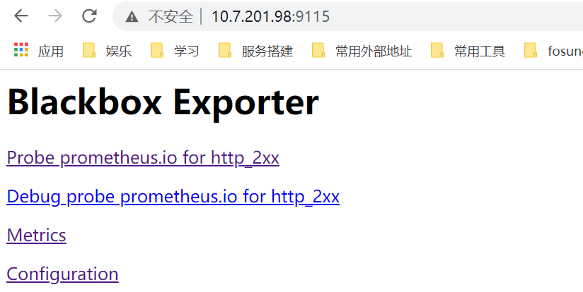
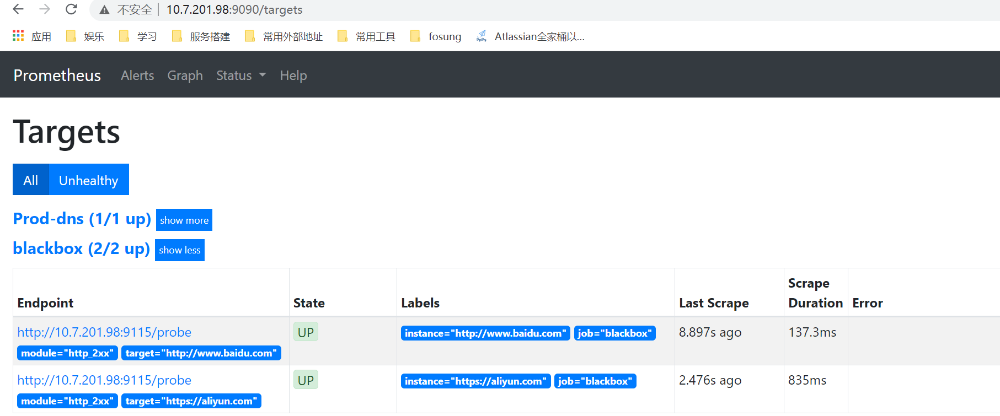

# Prometheus安装部署

## Prometheus简介

参考官网文档：   https://prometheus.io/docs/prometheus/latest/installation/


## Prometheus server服务

```yml
# my global config
global:
  scrape_interval:     15s # Set the scrape interval to every 15 seconds. Default is every 1 minute.
  evaluation_interval: 15s # Evaluate rules every 15 seconds. The default is every 1 minute.
  # scrape_timeout is set to the global default (10s).

# Alertmanager configuration
#alerting:
#  alertmanagers:
#  - static_configs:
#    - targets:
#       - alertmanager:9093

# Load rules once and periodically evaluate them according to the global 'evaluation_interval'.
#rule_files:
#  - "/etc/prometheus/*rules.yml"
  #- "/etc/prometheus/rules.yml"
  #- "/etc/prometheus/node-exporter-alert-rules.yml"
  #- "/etc/prometheus/node-exporter-record-rules.yml"
  # - "first_rules.yml"
  # - "second_rules.yml"

scrape_configs:
  - job_name: 'prometheus'
    scrape_interval: 10s
    static_configs:
      - targets: ['localhost:9090']
        labels:
          instance: prometheus
  - job_name: 'linux_hosts'
    static_configs:
      - targets: ['10.10.10.103:9100','10.10.10.10:9100']
        labels:
          group: 'client-node-exporter'
      - targets: ['10.10.10.103:8080','10.10.10.10:8080']
        labels:
          group: 'cadvisor'
      - targets: ['10.10.10.103:9091']
        labels:
          group: 'pushgateway'

```

注意先创建相关目录

```shell
docker run --name=prometheus -itd \
           --restart=always -p 9090:9090 \
           -v /data/docker/prometheus/data:/prometheus/data \
           -v /data/docker/prometheus/conf/prometheus.yml:/etc/prometheus/prometheus.yml \
           -v /data/docker/prometheus/rules:/etc/prometheus/rules \
           -v "/etc/localtime:/etc/localtime" \
           prom/prometheus:v2.20.0 \
           --config.file=/etc/prometheus/prometheus.yml \
           --storage.tsdb.retention=90d \
           --web.enable-lifecycle
```

- --web.enable-lifecycle：启用热加载配置文件
  可以通过 curl -X POST  http://localhost:9090/-/reload 命令不重启加载新的配置项目
- --storage.tsdb.retention=90d：配置数据存储时间，Prometheus默认保留数据时间为15天
- --config.file：指定配置文件

!!! waring "注意挂载之前需要将配置文件的权限修改为777，否则有可能出现配置文件无法同步"


## Grafana--数据展示平台

```shell
$ mkdir -p /data/grafana 
$ docker run -itd -p 3000:3000 \
           --restart=always --user=root --name=grafana \
           -v "/etc/localtime:/etc/localtime" \
           -v /data/docker/grafana/data:/var/lib/grafana \
           grafana/grafana
```

这里不使用--network=host 可能grafana会出现无法联网的情况

 -v /data/grafana:/var/lib/grafana 是为了持久化数据

```
cat <<EOF | curl --data-binary @- http://10.10.10.103:9091/metrics/job/cqh/instance/test
muscle_metric{label="gym"} 8800
bench_press 100
dead_lift 180
deep_squal 160
EOF
```


## Node exporter--节点监控工具

用于提供metrics，通过接口进行信息的收集，主要用来收集服务器的相关数据

```shell
docker run -d --restart=always \
           --name=node-exporter \
           -p 9100:9100 \
           -v "/etc/localtime:/etc/localtime" \
           prom/node-exporter
```


## Cadvisor--容器监控插件

cadvisor用于收集容器信息

```shell
docker run -d --restart=always \
           -v "/etc/localtime:/etc/localtime" \
           --volume=/:/rootfs:ro \
           --volume=/var/run:/var/run:ro \
           --volume=/sys:/sys:ro \
           --volume=/var/lib/docker/:/var/lib/docker:ro \
           --volume=/dev/disk/:/dev/disk:ro \
           --publish=8080:8080 \
           --detach=true \
           --name=cadvisor \
           google/cadvisor
```


## Alertmanager--告警插件

> 启动命令

```shell
docker run -d -p 9093:9093 \
           --name alertmanager \
           -v "/etc/localtime:/etc/localtime" \
           -v /etc/prometheus/alertmanager.yml:/etc/alertmanager/alertmanager.yml \
           prom/alertmanager
```

> alertmanager.yml

```yml
global:
  resolve_timeout: 5m

route:
  group_by: ['alertname']
  group_wait: 10s
  group_interval: 10s
  repeat_interval: 1h
  receiver: 'dingtalk'
receivers:
- name: 'dingtalk'
  webhook_configs:
  - url: 'http://10.10.10.103:8060/dingtalk/webhookedu/send'  #钉钉web-hook地址
    send_resolved: true

inhibit_rules:
  - source_match:
      severity: 'critical'
    target_match:
      severity: 'warning'
    equal: ['alertname', 'dev', 'instance']
```

> 需要在Prometheus中添加相关配置

```yml
alerting:
  alertmanagers:
    - static_configs:
        - targets: ["10.10.10.103:9093"]
```


## Blackbox_exporter

### 部署启动

>启动脚本  runblackbox.sh

```shell
#! /bin/bash

comtainer_name=blackbox-exporter
docker stop $comtainer_name
docker rm $comtainer_name
docker run --name $comtainer_name -d -p 9115:9115 \
	-v /data/docker/prometheus/blackbox.yml:/etc/blackbox_exporter/config.yml \
        -v "/etc/localtime:/etc/localtime" \
	prom/blackbox-exporter \
```

> 配置文件blackbox.yml

```yml
modules:
  http_2xx:
    prober: http
    timeout: 10s
    http:
      preferred_ip_protocol: "ip4"  #IPv4,如果不写很多网站会有问题
  http_post_2xx:
    prober: http
    timeout: 10s
    http:
      method: POST
      preferred_ip_protocol: "ip4"
      headers:
        Content-Type: application/json
  tcp_connect:
    prober: tcp
  pop3s_banner:
    prober: tcp
    tcp:
      query_response:
      - expect: "^+OK"
      tls: true
      tls_config:
        insecure_skip_verify: false
  ssh_banner:
    prober: tcp
    tcp:
      query_response:
      - expect: "^SSH-2.0-"
  irc_banner:
    prober: tcp
    tcp:
      query_response:
      - send: "NICK prober"
      - send: "USER prober prober prober :prober"
      - expect: "PING :([^ ]+)"
        send: "PONG ${1}"  
      - expect: "^:[^ ]+ 001"
  icmp:
    prober: icmp
    timeout: 5s
```

### 服务测试

可以通过浏览器访问ip:9115的方法查看服务启动状态



### 应用场景

- HTTP 测试
  定义 Request Header 信息
  判断 Http status / Http Respones Header / Http Body 内容
- TCP 测试
  业务组件端口状态监听
  应用层协议定义与监听
- ICMP 测试
  主机探活机制
- POST 测试
  接口联通性
- SSL 证书过期时间

HTTP测试

- 相关配置内容添加到 Prometheus 配置文件内
- 对应 blackbox.yml文件的 http_2xx 模块

```shell
###WEB-TEST##
- job_name: 'blackbox'
  metrics_path: /probe
  params:
    module: [http_2xx]  # Look for a HTTP 200 response.
  static_configs:
    - targets:
      - http://www.baidu.com    # Target to probe with http.
      - https://aliyun.com      # Target to probe with https.
  relabel_configs:
    - source_labels: [__address__]
      target_label: __param_target
    - source_labels: [__param_target]
      target_label: instance
    - target_label: __address__
      replacement: 10.7.201.98:9115  # The blackbox exporter's real hostname:port.
```

重启Prometheus加载新的配置项目，我们就能在Prometheus的监控中看到相关监控项目



#### TCP测试

```yml
- job_name: "blackbox_telnet_port]"
  scrape_interval: 10s
  metrics_path: /probe
  params:
    module: [tcp_connect]
  static_configs:
      - targets: [ '10.7.202.202:80' ]
        labels:
          group: 'download'
  relabel_configs:
      - source_labels: [__address__]
        target_label: __param_target
      - source_labels: [__param_target]
        target_label: instance
      - target_label: __address__
        replacement: 10.7.201.98:9115
```

#### ICMP测试

```yml
- job_name: 'blackbox00_ping_idc_ip'
  scrape_interval: 10s
  metrics_path: /probe
  params:
    module: [icmp]  #ping
  static_configs:
      - targets: [ '10.7.202.202' ]
        labels:
          group: 'download'
  relabel_configs:
      - source_labels: [__address__]
        regex: (.*)(:80)?
        target_label: __param_target
        replacement: ${1}
      - source_labels: [__param_target]
        regex: (.*)
        target_label: ping
        replacement: ${1}
      - source_labels: []
        regex: .*
        target_label: __address__
        replacement: 10.7.201.98:9115
```


#### HTTP、TCP、ICMP告警

> blackbox-alert.yml

```yml
groups:
- name: blackbox_network_stats
  rules:
  - alert: blackbox_network_stats
    expr: probe_success == 0
    for: 45s
    labels:
      severity: warning
    annotations:
      summary: "Instance {{ $labels.instance }}  is down"
      description: "This requires immediate action!"
```


## Redis_exporter

!!! waring "这个项目并不是官方项目"

项目地址：https://github.com/oliver006/redis_exporter/releases

下载相对应平台的软件包，也可以使用docker运行

Docker仓库地址：https://hub.docker.com/r/oliver006/redis_exporter

### Redis_exporter安装配置

这里我们将其可执行文件解压放置到/usr/bin目录下

```shell
# 下载redis_exporter
wget https://github.com/oliver006/redis_exporter/releases/download/v1.3.4/redis_exporter-v1.3.4.linux-amd64.tar.gz
# 解压
tar xzf redis_exporter-v1.3.4.linux-amd64.tar.gz 
# 安装redis_exporter
cp redis_exporter-v1.3.4.linux-amd64/redis_exporter /usr/bin/
```

### Redis_exporter启动

#### 创建Prometheus用户(存在则跳过)

```shell
useradd -g prometheus -M -s /sbin/nologin prometheus
```

#### 调整文件权限

```shell
chown prometheus.prometheus /usr/bin/redis_exporter
```


配置redis_exporter为系统服务方式启动

> vim  /usr/lib/systemd/system/redis_exporter.service

```shell
[Unit]
Description=Node exporter
After=network.target

[Service]
User=prometheus
PIDFile=/var/run/redis_exporter.pid
ExecStart=/usr/bin/redis_exporter -web.listen-address :1910 -redis.addr 127.0.0.1:6379 -redis.password password  #password为自己集群的密码
ExecReload=/bin/kill -s HUP $MAINPID
#Restart=on-failure

[Install]
WantedBy=default.target
```

- -web.listen-address  :1910  服务监听端口，默认0.0.0.0:9121
- -redis.addr  redis节点地址，默认为 redis://localhost:6379(如果有多个redis实例，建议启动多个redis_exporter进行监控)
- -redis.password  redis的密码
- -redis.file  包含一个或多个redis 节点的文件路径，每行一个节点，此选项与 -redis.addr 冲突

> 重新加载配置并配置开机启动

```shell
chown prometheus:prometheus /usr/lib/systemd/system/redis_exporter.service
systemctl daemon-reload
systemctl enable redis_exporter
systemctl start redis_exporter
systemctl status redis_exporter
```

### 添加Prometheus配置

```shell
- job_name: 'redis'
  scrape_interval: 5s
  #evaluation_interval: 15s
  metrics_path: '/metrics'
  static_configs:
    - targets: ['10.10.10.2:1910']
```

重启Prometheus加载新的配置文件

### 配置Grafana展示

导入监控模板https://grafana.com/grafana/dashboards/763


## Rocketmq-exporter

Rocketmq-exporter是对Rocket进行监控的一个工具

项目地址：https://github.com/apache/rocketmq-exporter

Grafana地址：https://grafana.com/grafana/dashboards/10477

Apache官方并没有给出打包好的二进制文件以及封装好的Docker镜像，因此需要我们自己该项目插件进行打包

### 获取代码

```shell
git clone https://github.com/apache/rocketmq-exporter.git
```

### 修改配置文件

This image is configurable using different properties, see `application.properties` for a configuration example.

| name                               | Default        | Description                                          |
| ---------------------------------- | -------------- | ---------------------------------------------------- |
| `rocketmq.config.namesrvAddr`      | 127.0.0.1:9876 | name server address for broker cluster               |
| `rocketmq.config.webTelemetryPath` | /metrics       | Path under which to expose metrics                   |
| `server.port`                      | 5557           | Address to listen on for web interface and telemetry |
| `rocketmq.config.rocketmqVersion`  | V4_3_2         | rocketmq broker version                              |

### 构建

#### 二进制打包

```shell
cd rocketmq-exporter
mvn clean install
```

#### Docker镜像打包(待确定)

```shell
mvn package -Dmaven.test.skip=true docker:build
```


### 运行

#### 二进制包运行

```shell
java -jar rocketmq-exporter-0.0.2-SNAPSHOT.jar --rocketmq.config.namesrvAddr=10.1.1.20:9876
```

如果打包的时候配置了`rocketmq.config.namesrvAddr`参数，启动的时候就不需要再进行配置，程序默认端口5557，可以通过浏览器访问http://ip:5557/metrics看到监控获取到的参数

#### Docker运行

> 打包

````shell
mdir -p /data/rocketmq-exporter
cp rocketmq-exporter-0.0.2-SNAPSHOT.jar /data/rocketmq-exporter
cd /data/rocketmq-exporter
vim Dockerfile
FROM zhus2015/jre8:8u251
MAINTAINER ZHUSHUAI "zhus8251@163.com"
ADD rocketmq-exporter-0.0.2-SNAPSHOT.jar /opt/project_dir/app.jar
WORKDIR /opt/project_dir
ADD entrypoint.sh /entrypoint.sh
CMD ["/entrypoint.sh"]

````

> vim entrypoint.sh

```
#!/bin/sh
M_OPTS="-Duser.timezone=Asia/Shanghai"
C_OPTS=${C_OPTS}
exec java -jar ${M_OPTS} ${C_OPTS} app.jar
```

