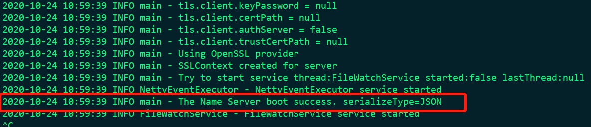
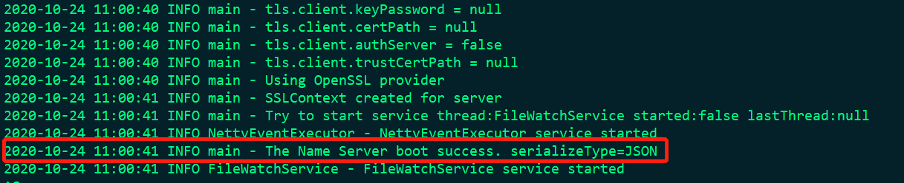
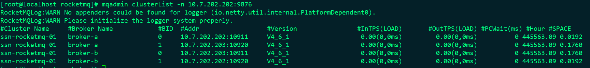
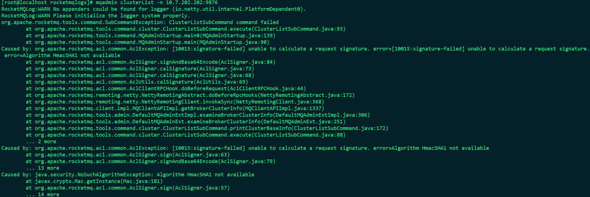
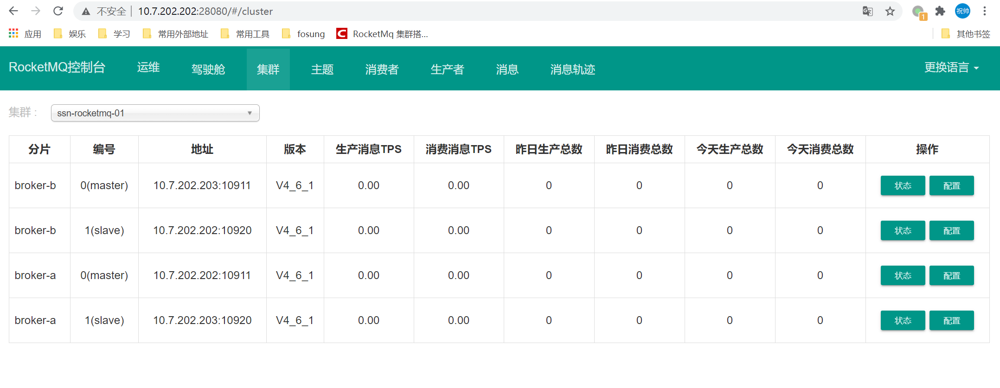

# RocketMQ集群搭建


多master、多slave模式

集群规划

| ip           | 角色          | 备注         |
| ------------ | ------------- | ------------ |
| 10.7.202.202 | master、slave | 为203的slave |
| 10.7.202.203 | master、slave | 为202的slave |
|              |               |              |


解压文件

配置环境变量


使用主从异步的模式

## 配置修改

### 10.7.202.202

> vim conf/2m-2s-async/broker-a.properties

```
#所属集群名字
brokerClusterName=ssn-rocketmq-01
#broker名字，名字可重复,为了管理,每个master起一个名字,他的slave同他,eg:Amaster叫broker-a,他的slave也叫broker-a
brokerName=broker-202_202
#0 表示 Master，>0 表示 Slave
brokerId=0
#nameServer地址，分号分割
namesrvAddr=10.7.202.202:9876;10.7.202.203:9876
brokerIP1=10.7.202.202
brokerIP2=10.7.202.202
#在发送消息时，自动创建服务器不存在的topic，默认创建的队列数
defaultTopicQueueNums=4
#是否允许 Broker 自动创建Topic，建议线下开启，线上关闭
autoCreateTopicEnable=true
#是否允许 Broker 自动创建订阅组，建议线下开启，线上关闭
autoCreateSubscriptionGroup=true
#Broker 对外服务的监听端口,
listenPort=10911
#删除文件时间点，默认凌晨 4点
deleteWhen=04
#文件保留时间，默认 48 小时
fileReservedTime=120
#commitLog每个文件的大小默认1G
mapedFileSizeCommitLog=1073741824
#ConsumeQueue每个文件默认存30W条，根据业务情况调整
mapedFileSizeConsumeQueue=300000
#destroyMapedFileIntervalForcibly=120000
#redeleteHangedFileInterval=120000
#检测物理文件磁盘空间
diskMaxUsedSpaceRatio=88
#存储路径
storePathRootDir=/data/rocketmq/store/broker-a
#commitLog 存储路径
storePathCommitLog=/data/rocketmq/store/broker-a/commitlog
#消费队列存储路径存储路径
storePathConsumeQueue=/data/rocketmq/store/broker-a/consumequeue
#消息索引存储路径
storePathIndex=/data/rocketmq/store/broker-a/index
#checkpoint 文件存储路径
storeCheckpoint=/data/rocketmq/store/checkpoint
#abort 文件存储路径
abortFile=/data/rocketmq/store/abort
#限制的消息大小
maxMessageSize=65536
#flushCommitLogLeastPages=4
#flushConsumeQueueLeastPages=2
#flushCommitLogThoroughInterval=10000
#flushConsumeQueueThoroughInterval=60000
#Broker 的角色
#- ASYNC_MASTER 异步复制Master
#- SYNC_MASTER 同步双写Master
#- SLAVE
brokerRole=ASYNC_MASTER
#刷盘方式
#- ASYNC_FLUSH 异步刷盘
#- SYNC_FLUSH 同步刷盘
flushDiskType=ASYNC_FLUSH
#checkTransactionMessageEnable=false
#发消息线程池数量
#sendMessageThreadPoolNums=128
#拉消息线程池数量
#pullMessageThreadPoolNums=128
```


> vim  conf/2m-2s-async/broker-b-s.properties

```
#所属集群名字
brokerClusterName=ssn-rocketmq-01
#broker名字，名字可重复,为了管理,每个master起一个名字,他的slave同他,eg:Amaster叫broker-a,他的slave也叫broker-a
brokerName=broker-202_203
#0 表示 Master，>0 表示 Slave
brokerId=1
#nameServer地址，分号分割
namesrvAddr=10.7.202.202:9876;10.7.202.203:9876
brokerIP1=10.7.202.202
brokerIP2=10.7.202.203
#在发送消息时，自动创建服务器不存在的topic，默认创建的队列数
defaultTopicQueueNums=4
#是否允许 Broker 自动创建Topic，建议线下开启，线上关闭
autoCreateTopicEnable=true
#是否允许 Broker 自动创建订阅组，建议线下开启，线上关闭
autoCreateSubscriptionGroup=true
#Broker 对外服务的监听端口,
listenPort=10920
#删除文件时间点，默认凌晨 4点
deleteWhen=04
#文件保留时间，默认 48 小时
fileReservedTime=120
#commitLog每个文件的大小默认1G
mapedFileSizeCommitLog=1073741824
#ConsumeQueue每个文件默认存30W条，根据业务情况调整
mapedFileSizeConsumeQueue=300000
#destroyMapedFileIntervalForcibly=120000
#redeleteHangedFileInterval=120000
#检测物理文件磁盘空间
diskMaxUsedSpaceRatio=88
#存储路径
storePathRootDir=/data/rocketmq/store/broker-b-s
#commitLog 存储路径
storePathCommitLog=/data/rocketmq/store/broker-b-s/commitlog
#消费队列存储路径存储路径
storePathConsumeQueue=/data/rocketmq/store/broker-b-s/consumequeue
#消息索引存储路径
storePathIndex=/data/rocketmq/store/broker-b-s/index
#checkpoint 文件存储路径
storeCheckpoint=/data/rocketmq/store/checkpoint
#abort 文件存储路径
abortFile=/data/rocketmq/store/abort
#限制的消息大小
maxMessageSize=65536
#flushCommitLogLeastPages=4
#flushConsumeQueueLeastPages=2
#flushCommitLogThoroughInterval=10000
#flushConsumeQueueThoroughInterval=60000
#Broker 的角色
#- ASYNC_MASTER 异步复制Master
#- SYNC_MASTER 同步双写Master
#- SLAVE
brokerRole=SLAVE
#刷盘方式
#- ASYNC_FLUSH 异步刷盘
#- SYNC_FLUSH 同步刷盘
flushDiskType=ASYNC_FLUSH
#checkTransactionMessageEnable=false
#发消息线程池数量
#sendMessageThreadPoolNums=128
#拉消息线程池数量
#pullMessageThreadPoolNums=128
```


### 10.7.202.203

>  vim conf/2m-2s-async/broker-b.properties

```
#所属集群名字
brokerClusterName=ssn-rocketmq-01
#broker名字，名字可重复,为了管理,每个master起一个名字,他的slave同他,eg:Amaster叫broker-a,他的slave也叫broker-a
brokerName=broker-202_203
#0 表示 Master，>0 表示 Slave
brokerId=0
#nameServer地址，分号分割
namesrvAddr=10.7.202.202:9876;10.7.202.203:9876
brokerIP1=10.7.202.203
brokerIP2=10.7.202.203
#在发送消息时，自动创建服务器不存在的topic，默认创建的队列数
defaultTopicQueueNums=4
#是否允许 Broker 自动创建Topic，建议线下开启，线上关闭
autoCreateTopicEnable=true
#是否允许 Broker 自动创建订阅组，建议线下开启，线上关闭
autoCreateSubscriptionGroup=true
#Broker 对外服务的监听端口,
listenPort=10911
#删除文件时间点，默认凌晨 4点
deleteWhen=04
#文件保留时间，默认 48 小时
fileReservedTime=120
#commitLog每个文件的大小默认1G
mapedFileSizeCommitLog=1073741824
#ConsumeQueue每个文件默认存30W条，根据业务情况调整
mapedFileSizeConsumeQueue=300000
#destroyMapedFileIntervalForcibly=120000
#redeleteHangedFileInterval=120000
#检测物理文件磁盘空间
diskMaxUsedSpaceRatio=88
#存储路径
storePathRootDir=/data/rocketmq/store/broker-b
#commitLog 存储路径
storePathCommitLog=/data/rocketmq/store/broker-b/commitlog
#消费队列存储路径存储路径
storePathConsumeQueue=/data/rocketmq/store/broker-b/consumequeue
#消息索引存储路径
storePathIndex=/data/rocketmq/store/broker-b/index
#checkpoint 文件存储路径
storeCheckpoint=/data/rocketmq/store/checkpoint
#abort 文件存储路径
abortFile=/data/rocketmq/store/abort
#限制的消息大小
maxMessageSize=65536
#flushCommitLogLeastPages=4
#flushConsumeQueueLeastPages=2
#flushCommitLogThoroughInterval=10000
#flushConsumeQueueThoroughInterval=60000
#Broker 的角色
#- ASYNC_MASTER 异步复制Master
#- SYNC_MASTER 同步双写Master
#- SLAVE
brokerRole=ASYNC_MASTER
#刷盘方式
#- ASYNC_FLUSH 异步刷盘
#- SYNC_FLUSH 同步刷盘
flushDiskType=ASYNC_FLUSH
#checkTransactionMessageEnable=false
#发消息线程池数量
#sendMessageThreadPoolNums=128
#拉消息线程池数量
#pullMessageThreadPoolNums=128
```


> vim conf/2m-2s-async/broker-a-s.properties

```
#所属集群名字
brokerClusterName=ssn-rocketmq-01
#broker名字，名字可重复,为了管理,每个master起一个名字,他的slave同他,eg:Amaster叫broker-a,他的slave也叫broker-a
brokerName=broker-202_202
#0 表示 Master，>0 表示 Slave
brokerId=1
#nameServer地址，分号分割
namesrvAddr=10.7.202.202:9876;10.7.202.203:9876
brokerIP1=10.7.202.203
brokerIP2=10.7.202.202
#在发送消息时，自动创建服务器不存在的topic，默认创建的队列数
defaultTopicQueueNums=4
#是否允许 Broker 自动创建Topic，建议线下开启，线上关闭
autoCreateTopicEnable=true
#是否允许 Broker 自动创建订阅组，建议线下开启，线上关闭
autoCreateSubscriptionGroup=true
#Broker 对外服务的监听端口,
listenPort=10920
#删除文件时间点，默认凌晨 4点
deleteWhen=04
#文件保留时间，默认 48 小时
fileReservedTime=120
#commitLog每个文件的大小默认1G
mapedFileSizeCommitLog=1073741824
#ConsumeQueue每个文件默认存30W条，根据业务情况调整
mapedFileSizeConsumeQueue=300000
#destroyMapedFileIntervalForcibly=120000
#redeleteHangedFileInterval=120000
#检测物理文件磁盘空间
diskMaxUsedSpaceRatio=88
#存储路径
storePathRootDir=/data/rocketmq/store/broker-a-s
#commitLog 存储路径
storePathCommitLog=/data/rocketmq/store/broker-a-s/commitlog
#消费队列存储路径存储路径
storePathConsumeQueue=/data/rocketmq/store/broker-a-s/consumequeue
#消息索引存储路径
storePathIndex=/data/rocketmq/store/broker-a-s/index
#checkpoint 文件存储路径
storeCheckpoint=/data/rocketmq/store/checkpoint
#abort 文件存储路径
abortFile=/data/rocketmq/store/abort
#限制的消息大小
maxMessageSize=65536
#flushCommitLogLeastPages=4
#flushConsumeQueueLeastPages=2
#flushCommitLogThoroughInterval=10000
#flushConsumeQueueThoroughInterval=60000
#Broker 的角色
#- ASYNC_MASTER 异步复制Master
#- SYNC_MASTER 同步双写Master
#- SLAVE
brokerRole=SLAVE
#刷盘方式
#- ASYNC_FLUSH 异步刷盘
#- SYNC_FLUSH 同步刷盘
flushDiskType=ASYNC_FLUSH
#checkTransactionMessageEnable=false
#发消息线程池数量
#sendMessageThreadPoolNums=128
#拉消息线程池数量
#pullMessageThreadPoolNums=128
```


## 目录创建

### 10.7.202.202

```
mkdir -p /data/rocketmq/store/{broker-a,checkpoint,abort}
mkdir -p /data/rocketmq/store/broker-a/{commitlog,consumequeue,index}
mkdir -p /data/rocketmq/store/{broker-b-s,checkpoint,abort}
mkdir -p /data/rocketmq/store/broker-b-s/{commitlog,consumequeue,index}
mkdir -p /data/rocketmq/logs
```

### 10.7.202.203

```
mkdir -p /data/rocketmq/store/{broker-b,checkpoint,abort}
mkdir -p /data/rocketmq/store/broker-b/{commitlog,consumequeue,index}
mkdir -p /data/rocketmq/store/{broker-a-s,checkpoint,abort}
mkdir -p /data/rocketmq/store/broker-a-s/{commitlog,consumequeue,index}
mkdir -p /data/rocketmq/logs
```


## 启动nameServer

### 10.7.202.202

```
nohup sh /data/rocketmq/bin/mqnamesrv > /data/rocketmq/logs/mqnamesrv.log 2>&1 &
```



### 10.7.202.203

```
nohup sh /data/rocketmq/bin/mqnamesrv > /data/rocketmq/logs/mqnamesrv.log 2>&1 &
```



## 启动broke-a

### 10.7.202.202

```
nohup sh /data/rocketmq/bin/mqbroker -c /data/rocketmq/conf/2m-2s-async/broker-a.properties > /data/rocketmq/logs/broker-a.log 2>&1 &
```

### 10.7.202.203

```
nohup sh /data/rocketmq/bin/mqbroker -c /data/rocketmq/conf/2m-2s-async/broker-a-s.properties > /data/rocketmq/logs/broker-a-s.log 2>&1 &
```


## 启动broke-b

### 10.7.202.203

```
nohup sh /data/rocketmq/bin/mqbroker -c /data/rocketmq/conf/2m-2s-async/broker-b.properties > /data/rocketmq/logs/broker-b.log 2>&1 &
```


### 10.7.202.202

```
nohup sh /data/rocketmq/bin/mqbroker -c /data/rocketmq/conf/2m-2s-async/broker-b-s.properties > /data/rocketmq/logs/broker-b-s.log 2>&1 &
```


## 集群状态查看

mqadmin clusterList -n 10.7.202.202:9876



如果是使用yum安装的jdk可能会有一下报错，需要修改/data/rocketmq/bin/tools.sh脚本中的JAVA_OPT参数

修改后的参数：

```
JAVA_OPT="${JAVA_OPT} -Djava.ext.dirs=${BASE_DIR}/lib:${JAVA_HOME}/jre/lib/ext:${JAVA_HOME}/lib/ext:/usr/lib/jvm/java-1.8.0-openjdk-1.8.0.262.b10-0.el7_8.x86_64/jre/lib/ext"
```




## 控制台安装

到GITHUP现在相关源码，地址：https://github.com/apache/rocketmq-externals/tree/master/rocketmq-console

修改配置文件：

```
# vim src/main/resources/application.properties
rocketmq.config.namesrvAddr=10.7.202.202:9876;10.7.202.203:9876
```

打包：

```
mvn clean package -Dmaven.test.skip=true
```

将target文件夹下的jar包拷贝到相关服务器上启动即可，默认端口8080，如果端口冲突请自行更改

```
nohup java -jar rocketmq-console-ng-2.0.0.jar --server.port=28080 2>&1 &
```

页面访问即可

