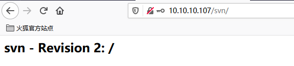

# SVN搭建


## 配置SVN的HTTP访问方式

### 安装相关软件

```shell
yum install svn httpd mod_dav_svn -y
```


### 创建svn仓库

```shell
mkdir /data/svm
svnadmin create /data/svn/game
chown -R apache.apache /data/svn/game
```


### 创建密码文件

这里创建了一个admin用户和一个test用户

```shell
htpasswd -cm /data/svn/game/conf/http.pass admin
htpasswd -m /data/svn/game/conf/http.pass test
```

!!! warning "这里使用htpasswd的时候只有第一次创建文件时使用-c参数，再添加用户时只使用-m参数即可，如果再使用-c参数会覆盖原来的文件"


### 配置SVN用户权限

> vim /data/svn/game/conf/authz

```
[groups]
#定义了一个admin组
admin = admin,test

[/]
#admin组的访问权限
@admin = rw
```


### 配置httpd

```
cd /etc/httpd/conf.d
vim svn.conf
#增加以下内容
<Location /svn>
    DAV svn
    #SVNParentPath /data/svn/game
    SVNPath /data/svn/game
    #SVNListParentPath on

        AuthType Basic
        AuthName "Authorization SVN"
        AuthzSVNAccessFile /data/svn/game/conf/authz
        AuthUserFile /data/svn/game/conf/http.pass
        Require valid-user
</Location>
```


### 启动测试

```
systemctl start httpd
```

通过浏览器访问：http://ip/svn ，输入密码即可看到类似下图页面

