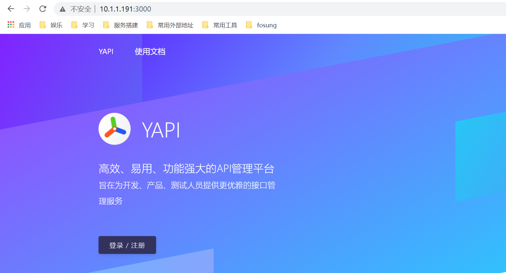

# 接口文档管理工具YAPI


```
mkdir -p /data/docker/yapi/{data,etc}
```

> 用户初始化

```shell
docker run -it --rm \
   --link mongo-yapi:mongo \
   --entrypoint npm \
   --workdir /api/vendors \
   registry.cn-hangzhou.aliyuncs.com/anoy/yapi \
   run install-server
```


> run-mongo.sh

```shell
#!/bin/bash
docker stop mongo-yapi
docker rm mongo-yapi

docker run -dit --name mongo-yapi --user root --restart always \
           -v /data/docker/yapi/data/db:/data/db \
           -v /data/docker/yapi/data/configdb:/data/configdb \
           mongo:4.0

```


> run-yapi.sh

```shell
#!/bin/bash
docker stop yapi
docker rm yapi

docker run -d \
  --restart always \
  --name yapi \
  --link mongo-yapi:mongo \
  --workdir /api/vendors \
  -p 3000:3000 \
  -v /data/docker/yapi/etc/config.json:/api/config.json \
  registry.cn-hangzhou.aliyuncs.com/anoy/yapi \
  server/app.js

```


访问：http://ip:3000

