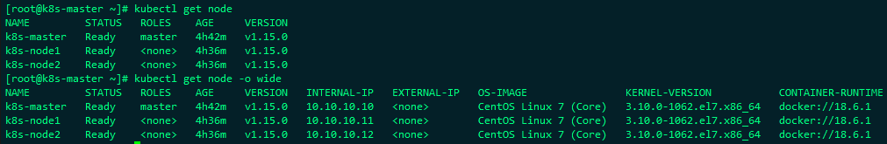
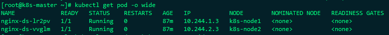
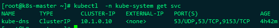

# K8S基础知识

## k8s的组成

Master：集群控制节点，提供HTTP REST服务

Kuber-apiserver：集群控制入口

Kube-controller-manager：资源对象自动化控制中心。

Kube-scheduler：pod调度

Node：工作节点，主要是运行容器应用

kubelet：负责Pod的创建、启动、监控、重启、销毁等工作，与master节点协作，实现集群管理	的基本功能

kube-proxy：负责kubernetes service的通信和负载均衡

Pod：Pod是kubernetes最基本的部署调度单元，每个pod可以有一个或多个业务容器和一个根容器(Pause容器)组成。一个Pod表示某一个应用的一个实例

ReplicaSet：是Pod副本的抽象，用于解决Pod的扩容和伸缩

Deployment：Deployment表示部署，在内部使用ReplicaSet来实现。可以通过Deployment来生成相对应的ReplicaSet完成Pod副本的创建

Service：Service是Kubernetes最重要的资源对象。Kubernetes中的Service对象可以对应微服务架构中的微服务。Service定义了服务的访问入口，服务的调用者通过这个地址访问Service后端的Pod副本实例。Service通过Label Selector同后台端的Pod副本建立关系，Deployment保证后端Pod副本的数量，也就是保证服务的伸缩性。

Kubernetes主要以下几个核心组件组成：

- etcd  保存了整个集群的状态，就是一个数据库
- apiserver  提供了资源操作的唯一入口，并提供认证、授权、访问控制、API注册和发现等机制；
- controller manager 负责维护集群的状态，比如故障检测、自动扩展、滚动更新等；
- scheduler 负责资源的调度，按照预定的调度策略将Pod调度到相应的机器上；
- kubelet 负责维护容器的声明周期，同时也负责Volume(CSI)和网络(CNI)的管理；
- Container runtime 负责镜像管理以及Pod和容器的真正运行（CRI）；
- kube-proy 负责为Service提供cluster内部的服务发现和负载均衡；

 还有一些推荐插件

- kube-dns 负责为整个集群提供DNS服务
- Ingress Controller 为服务提供外网入口
- Heapster 提供资源监控
- Dashboard提供GUI

## kubernetes集群中三种IP地址区别

Kubernetes集群里有三种IP地址，分别如下：

Node IP：Node节点的IP地址，即物理网卡的IP地址。

Pod IP：Pod的IP地址，即docker容器的IP地址，此为虚拟IP地址。

Cluster IP：Service的IP地址，此为虚拟IP地址。

### Node IP

可以是物理机的IP（也可能是虚拟机IP）。每个Service都会在Node节点上开通一个端口，外部可以通过NodeIP:NodePort即可访问Service里的Pod,和我们访问服务器部署的项目一样，IP:端口/项目名

在kubernetes查询Node IP

1.kubectl get nodes

2.kubectl describe node nodeName

3.显示出来的InternalIP就是NodeIP

### Pod IP

Pod IP是每个Pod的IP地址，他是Docker Engine根据docker网桥的IP地址段进行分配的，通常是一个虚拟的二层网络

同Service下的pod可以直接根据PodIP相互通信

不同Service下的pod在集群间pod通信要借助于 cluster ip

pod和集群外通信，要借助于node ip

在kubernetes查询Pod IP

1.kubectl get pods

2.kubectl describe pod podName

### Cluster IP

Service的IP地址，此为虚拟IP地址。外部网络无法ping通，只有kubernetes集群内部访问使用。

在kubernetes查询Cluster IP

kubectl -n 命名空间 get Service即可看到ClusterIP

Cluster IP是一个虚拟的IP，但更像是一个伪造的IP网络，原因有以下几点

Cluster IP仅仅作用于Kubernetes Service这个对象，并由Kubernetes管理和分配P地址

Cluster IP无法被ping，他没有一个“实体网络对象”来响应

Cluster IP只能结合Service Port组成一个具体的通信端口，单独的Cluster IP不具备通信的基础，并且他们属于Kubernetes集群这样一个封闭的空间。

在不同Service下的pod节点在集群间相互访问可以通过Cluster IP

三种IP网络间的通信

service地址和pod地址在不同网段，service地址为虚拟地址，不配在pod上或主机上，外部访问时，先到Node节点网络，再转到service网络，最后代理给pod网络。

