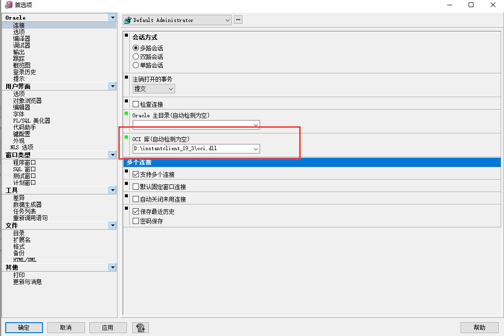

## Oracle远程连接

常用连接工具PLSQL和Navicat

PLSQL官网地址：https://www.oracle.com/database/technologies/appdev/plsql.html


连接Oracle都需要使用oralce的客户端及配置，可以取[Oracle官网](https://www.oracle.com/index.html)下载对应版本的客户端软件，需要注册一个oracle的账号。


我们需要在Oracle客户端/network/ADMIN目录下的tnsnames.ora文件中配置数据库的连接，格式如下：


```
ORCL =  #连接名称
  (DESCRIPTION =
    (ADDRESS_LIST =
      (ADDRESS = (PROTOCOL = TCP)(HOST = 192.168.1.18)(PORT = 1521))  #服务器IP及端口
    )
    (CONNECT_DATA =
      (SERVER = DEDICATED)
      (SERVICE_NAME = orcl)  #sid
    )
  )
```


两个远程工具主要是配置oci库文件地址

PLSQL:

 


Navicat：

 