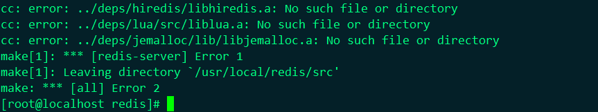

# Redis安装部署

!!! node "文档整理中"

Redis官网：https://redis.io/

## 环境说明

操作系统：Centos 7.7

Redis版本：5.0.9

## 安装

### 下载Redis二进制软件包

自行到官方地址下载即可


### 解压移动软件包

我这里将redis的软件包放到了/usr/loca/src目录下

```sh
[root@localhost ~]# cd /usr/local/src
[root@localhost src]# ls
redis-5.0.9.tar.gz
[root@localhost src]# tar zxf redis-5.0.9.tar.gz 
[root@localhost src]# ls
redis-5.0.9  redis-5.0.9.tar.gz
[root@localhost src]# mv redis-5.0.9 /usr/local/redis
[root@localhost src]# cd /usr/local/redis/
```


### 安装相关依赖

```sh
[root@localhost redis]# yum install -y gcc
[root@localhost redis]# cd deps
[root@localhost deps]# make hiredis jemalloc linenoise lua
```


### 编译安装

```sh
[root@localhost deps]# cd ..
[root@localhost redis]# make && make install
# 注意这样安装后redis相关命令都被安装导致了/usr/local/bin/目录下，也可以在安装的时候使用
# make install PREFIX=/usr/local/redis指定目录进行安装,根据自己的规划来做
[root@localhost redis]# which redis-cli
/usr/local/bin/redis-cli
[root@localhost redis]# ll /usr/local/bin/redis-*
-rwxr-xr-x. 1 root root 4366152 Aug 15 08:56 /usr/local/bin/redis-benchmark
-rwxr-xr-x. 1 root root 8064720 Aug 15 08:56 /usr/local/bin/redis-check-aof
-rwxr-xr-x. 1 root root 8064720 Aug 15 08:56 /usr/local/bin/redis-check-rdb
-rwxr-xr-x. 1 root root 4807120 Aug 15 08:56 /usr/local/bin/redis-cli
lrwxrwxrwx. 1 root root      12 Aug 15 08:56 /usr/local/bin/redis-sentinel -> redis-server
-rwxr-xr-x. 1 root root 8064720 Aug 15 08:56 /usr/local/bin/redis-server
```

!!! Tip "注意，这里如果是指定了安装目录，redis相关命令需要使用绝对路径执行才行，也可以通过增加软连接或者环境变量的方式进行修改"

相关启动脚本都能在utils目录下找到，相关启动脚本的编写可以自行参考。


## 报错说明

如果不安装gcc软件包，会提示我们 "/bin/sh: cc: command not found"

以下报错信息为未安装jemalloc相关包导致的，可以到redis的deps目录下执行make jemalloc进行安装，yum安装的jemalloc在redis启动的时候可能会报Segmentation fault错误


以下错误是由于未执行部分安装导致的

