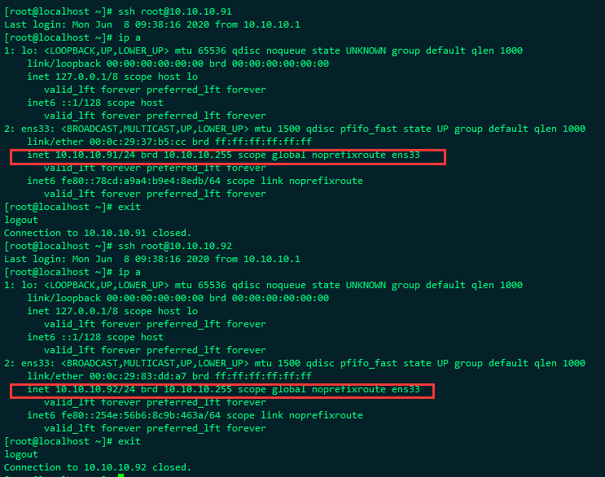
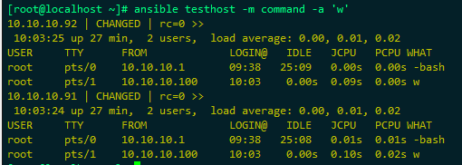
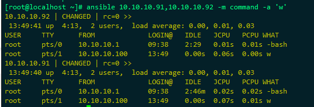
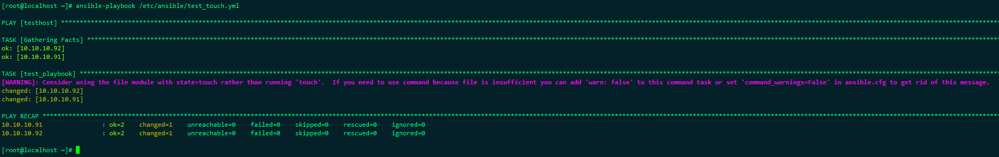
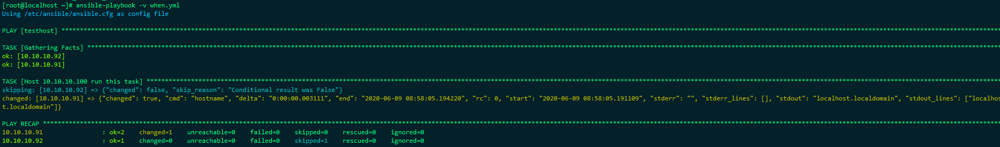

# Ansible


## 实验环境

| IP           | 用途             |      |
| ------------ | ---------------- | ---- |
| 10.10.10.100 | ansiable主控机器 |      |
| 10.10.10.91  | 测试1            |      |
| 10.10.10.92  | 测试2            |      |


## 配置环境

ansiable是居于ssh通道传输数据的，因此需要先做ssh免密通信

此步骤在10.10.10.100上操作即可

> 生成密钥，其余不需要设置，直接回车回车回车即可

```
ssh-keygen
```

 


> 拷贝密钥到远程机器，第一次需要输入确认和密码信息

```
ssh-copy-id -i /root/.ssh/id_rsa.pub root@10.10.10.91
ssh-copy-id -i /root/.ssh/id_rsa.pub root@10.10.10.92
```

 


> 进行免密测试

```
ssh root@10.10.10.91
ssh root@10.10.10.92
```


 


## 安装ansible软件

```
yum install -y epel-release
yum install -y ansible
```


## 简单配置测试

> 配置一个测试主机组，在配置文件最后增加相关配置

```
vi /etc/ansible/hosts
[testhost]
10.10.10.91
10.10.10.92
```


> 简单进行测试

```
ansible testhost -m command -a 'w'
```

这里的testhost是我们开始再配置文件中定义的主机组，也可以写成一个主机列表的形式

 

 

## Ansible的几种简单语法

> 执行远程命令

```
ansible testhost -m command -a 'w'
```

> 拷贝文件或者目录

```
ansible testhost  -m copy -a "src=/etc/ansible dest=/tmp/ansibletest owner=root group=root mode=0644"
```

> 远程执行shell脚本

```
ansible testhost -m copy -a "src=/tmp/test.sh dest=/tmp/test.sh mod=0755"
```

>cron定时任务

```
ansible testhost -m cron -a "name='test cron' job='/bin/touch /tmp/1212.txt' weekday=6"
```

> yum和service

```
ansible testhost -m yum -a "name=httpd"
ansible testhost -m service -a "name=httpd state=started enabled=yes"
```

更多模块支持，使用命令查询即可：

> ​    列出所有的模块

```
ansible-doc -l
```

>  查看指定模块的文档

```
ansible-doc cron 
```


## Ploybook

ploybook相当于将一些模块和命令全都写在一个配置文件当中

>  cat /etc/ansible/test_touch.yml

```yml
---
- hosts: testhost
  remote_user: root
  tasks:
    - name: test_playbook
      shell: touch /tmp/test.txt
```

> 使用ansible-playbook执行脚本

```
ansible-playbook /etc/ansible/test_touch.yml
```




> 例子：

```yml
- hosts: all
  remote_user: root
  tasks:                                    #任务
  - name: install vsftpd                    #任务名
    yum: name=vsftpd state=latest           #调用yum模块
  - name: start redis                       #任务名
    service: name=vsftpd state=started      #调用service模块
  - name: copy config file                  #任务名
    copy: src=/etc/ansible/playbooks/files/vsftpd.conf dest=/etc/vsftpd/vsftpd.conf     #调用copy模块
    notify: a                               #触发动作a
    tags: configfile                        #任务标签为configfile
  handlers:                                 #定义动作
  - name: a                                 #定义动作a
    service: name=vsftpd state=restarted    #调用service模块
```


> 例子：变量引用，执行方法：ansible-playbook test_arg.yml -e "host_ip=10.10.10.92"

```yml
---
- hosts: "{{host_ip}}"
  remote_user: root
  tasks:
    - name: test_playbook
      shell: echo "hello"
```


### 循环

> cat /root/xunhuan.yml

```yml
---
- hosts: 10.10.10.91
  user: root
  tasks:
   - name: change mod for file
     file: path=/tmp/{{item}} state=directory
     with_items:
       - a
       - b
       - c      
```

 


### 条件判断

ansible_default_ipv4.address 这个值是通过ansible 10.10.10.91 -m setup获取而来

```yml
- hosts: testhost
  user: root
  gather_facts: True
  tasks:
    - name: Host 10.10.10.100 run this task
      #shell: touch /tmp/when.txt
      shell: hostname
      when: ansible_default_ipv4.address == "10.10.10.91"
```

执行命令：ansible-playbook -v when.yml

执行结果如下：



when判断参数可以写成变量的形式

```yml
- hosts: testhost
  user: root
  gather_facts: True
  tasks:
    - name: Host 10.10.10.100 run this task
      #shell: touch /tmp/when.txt
      shell: hostname
      when: ansible_default_ipv4.address == (webserver91)
```

执行命令：

```
ansible-playbook -v when.yml -e "webserver91=10.10.10.92"
```

执行结果：

