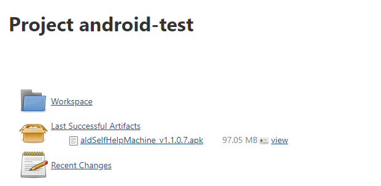

# Jenkins打包安卓APK

## grandle安装配置

grandle安装配置略过

## 项目配置

### 参数化构建配置

> git分支配置

Add Parameter-> Git Parameter

Name：Branch

Description：分支选择

 Parameter Type：Branch or Tag

> 构建类型选择

Add Parameter-> Choice Parameter

Name：BUILD_TYPE

Choices：

​	Release

​	Debug

Description：编译类型

### Build参数配置

Add build step -> Invoke Gradle

Gradle Version：gradle4    这个选择自己配置的gradle即可

Tasks：

clean
assemble${BUILD_TYPE}

勾选"Pass all job parameters as Project properties"

Root Build script：${workspace}/app 

Build File：${workspace}/app/build.gradle

!!!warning "注意：Root Build script和Build File 根据自己的项目配置"

### Post-build Actions配置

根据自己的需要来配置，我这里就只是配置了归档

Add post-build action->Archive the artifacts

 Files to archive：\*\*/app/\*\*/*.apk

## 构建成功后的页面

点击文件即可下载文件

 