# Jenkins使用maven打包JAVA项目

**安装配置maven环境**

**下载maven-3.6.0**

到官网下载maven-3.6.0的二进制包，官网地址：https://maven.apache.org/download.cgi

**上传解压**

将压缩包上传到服务器，解压到指定文件目录

\# tar -zxvf apache-maven-3.6.0-bin.tar.gz -C /usr/local/

\# mv /usr/local/apache-maven-3.6.0 /usr/local/maven-3.6.0

**添加环境变量**

\# vim /etc/profile.d/maven.sh 

增加以下内容，保存并退出：

MAVEN_HOME=/usr/local/maven-3.6.0/

PATH=${PATH}:${MAVEN_HOME}/bin

export MAVEN_HOME PATH

**验证maven**

\# source /etc/profile

\# mavn -v

看到下图界面即为成功

**配置Jenkis工具**

**进入工具配置**

选择“系统管理”->“全局工具配置” 如下图

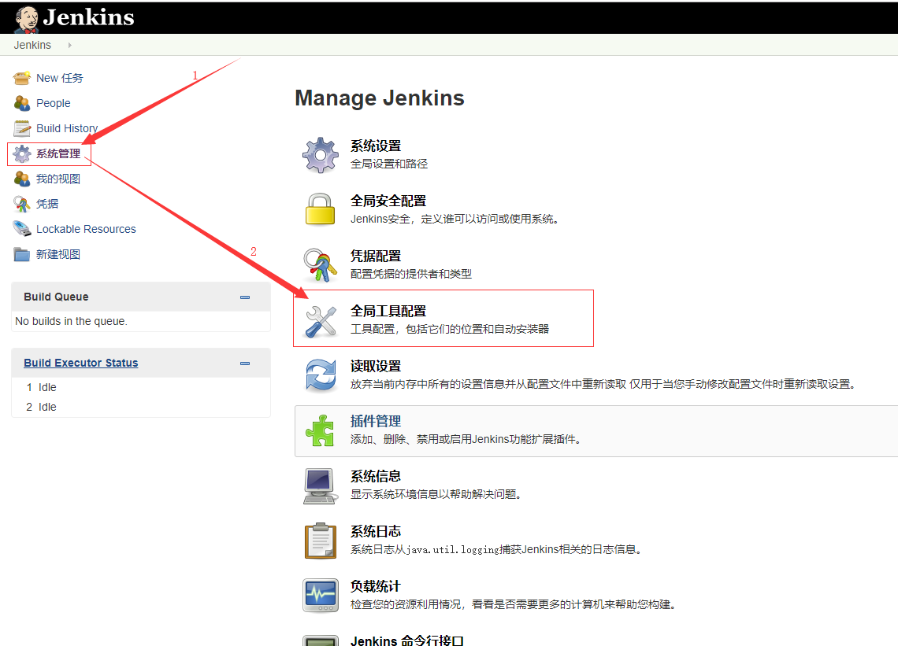

**配置jdk**

**增加JDK**

点击下图中的按钮，如下图：

**取消自动安装**

取消下图中的“自动安装”选项

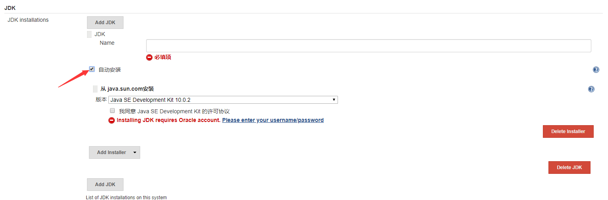

**增加jdk信息**

如下图：

**配置git**

**确定服务器上git的位置**

\# which git

/usr/bin/git

**修改Git信息**

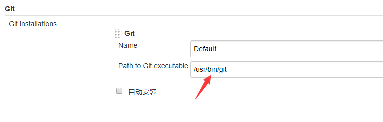

**配置maven**

**增加maven**

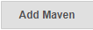

点击下图中按钮，如下图：

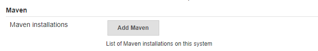

**取消自动安装**

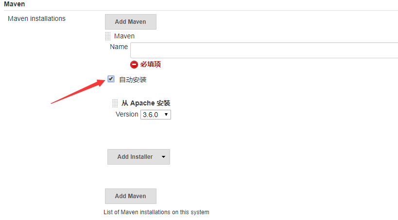

**填写maven信息**

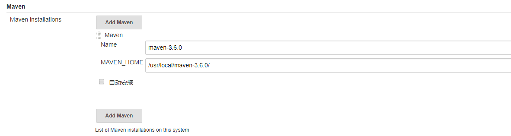

**保存配置**

点击下图中的save按钮保存即可

**安装mavne插件**

进入插件管理页面

选择安装插件

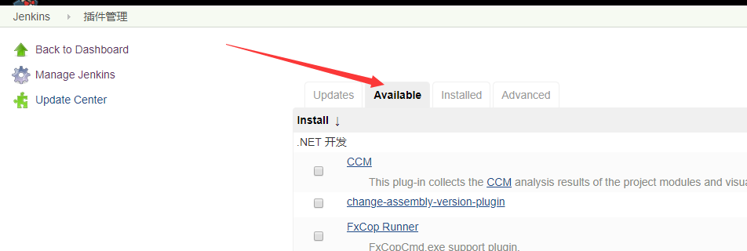

搜索“maven integration”插件

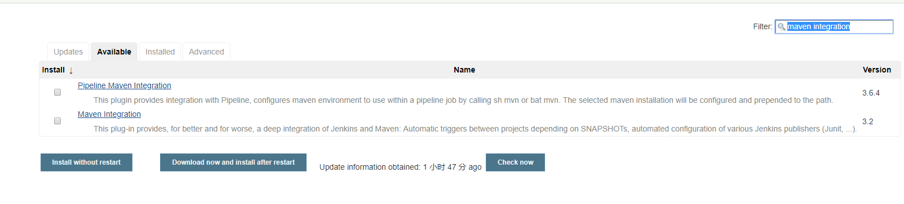

选择安装

可以看到安装成功

**创建一个maven任务**

**新建任务**

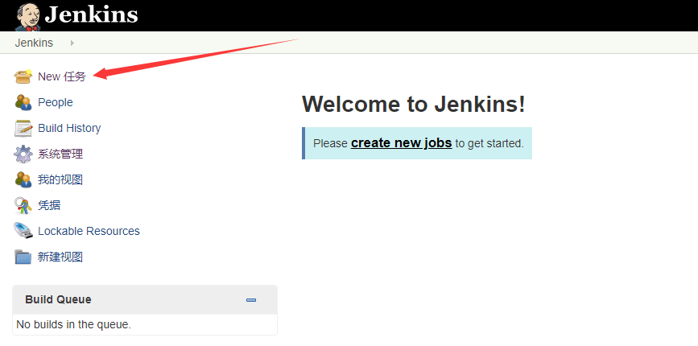

**项目基本信息**

1. 输入项目名称，
2. 选择项目信息
3. 创建项目

**构建基础信息**

**源码获取基础信息**

1. 先填写git或者svn地址
2. 由于没有增加过密码信息，在这里要增加git或者svn的用户名和密码

C、填写获取代码的分支

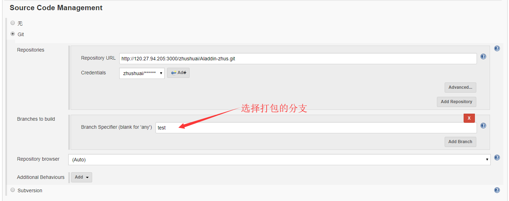

**构建参数填写**

Root POM：Pom.xml文件

Goais and options：mvn打包的参数

**构建测试**

A、触发构建

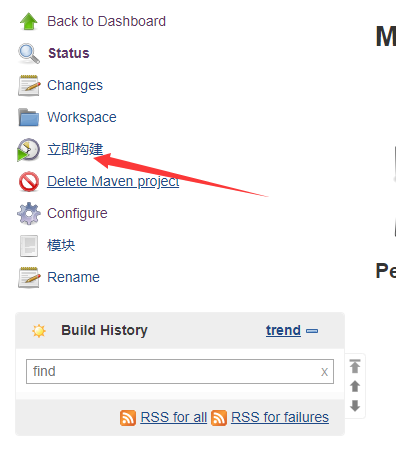

B、查看构建过程

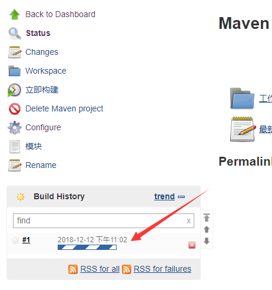

构建控制台中看到下图中的SUCCESS，说明构建成功

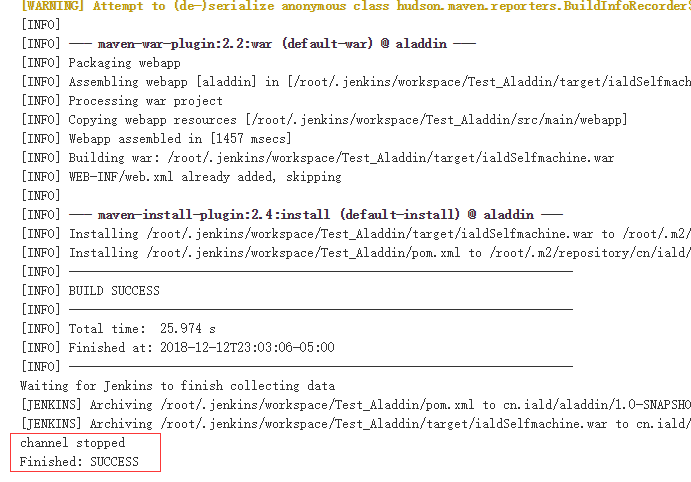