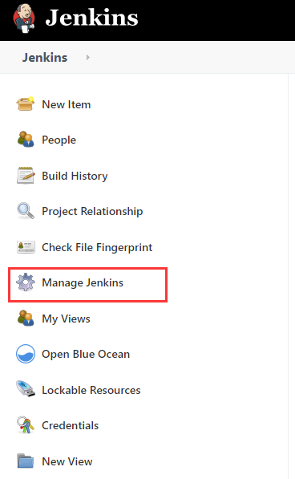
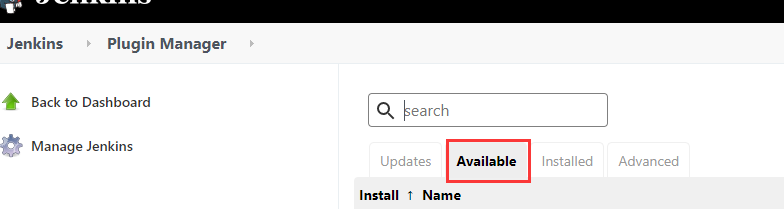
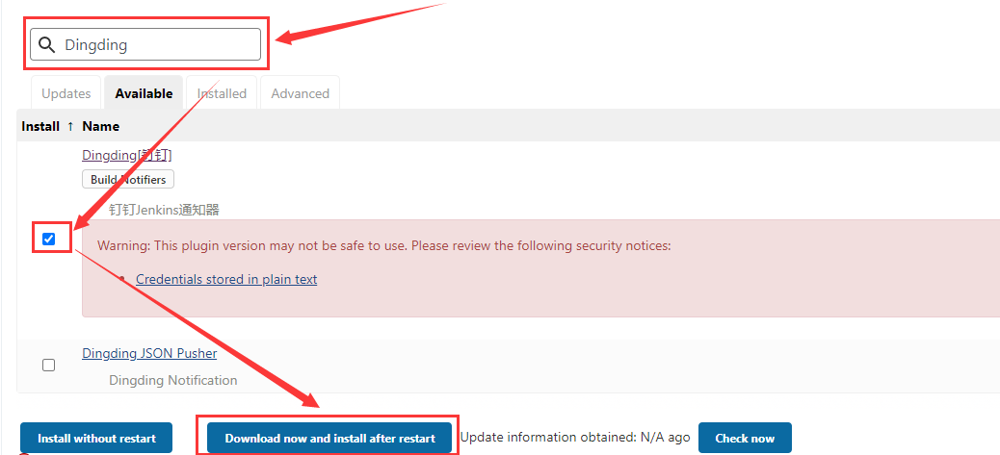
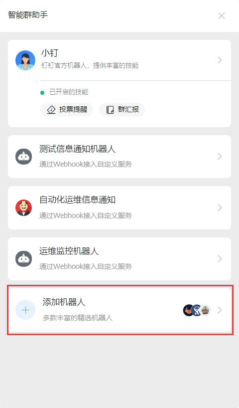
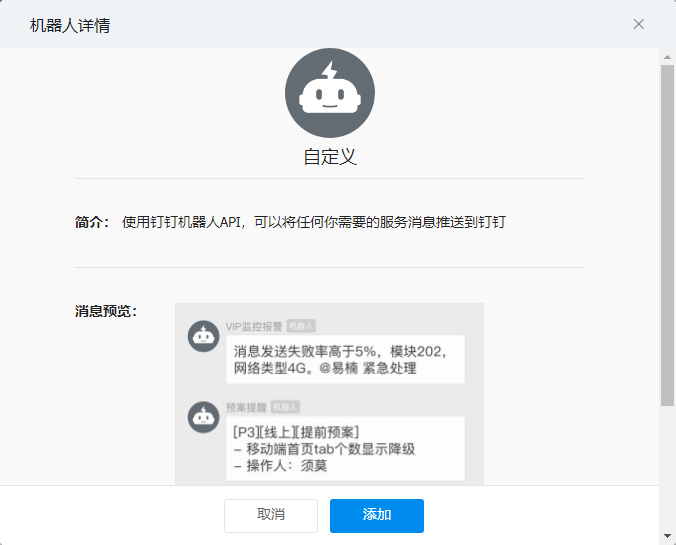
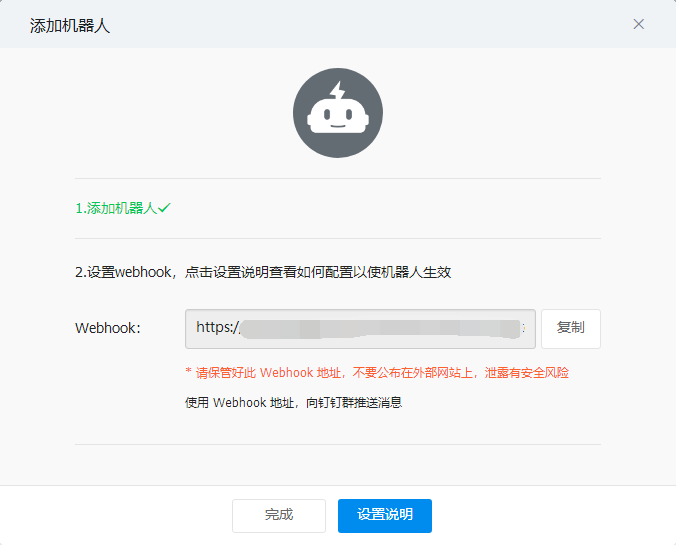
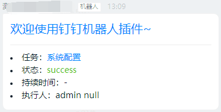
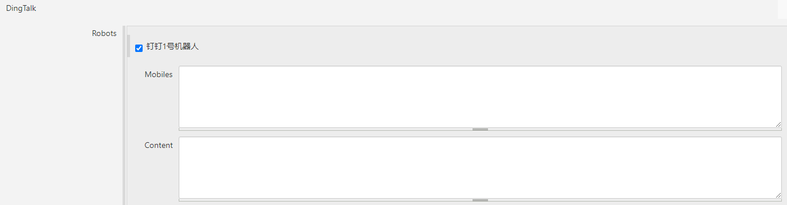

# Jenkins项目构建钉钉通知

钉钉插件代码地址：https://github.com/jenkinsci/dingtalk-plugin

官方文档：https://jenkinsci.github.io/dingtalk-plugin/

## 安装钉钉插件

首先登陆jenkins，

1、选择->Manage Jenkins

2、然后在接下来啊页面找到Manage Plugins

3、选择"Available"

4、搜索钉钉插件,在搜索栏输入"Dingding"即可

5、勾选插件，选择“Download now and install after restart”

6、进入安装界面后，勾选“Restart Jenkins when installation is complete and no jobs are running”，接下来就等着jenkins自动重启即可，趁这个时间我们可以先去配置以下钉钉机器人

## 添加群机器人

首先你要打开钉钉，电脑端

其次你要有一个群组，嗯别问怎么创建群组，问就是百度

打开群组，找到下图中红色框中的图标，如果没有这个图标的，也可以点击最上方的...的图标，找到“智能群助手”功能打开

进入“智能群助手”页面，我这里以及该增加过几个机器人了，这里我们选择最后的选项“添加机器人”选项

继续选择“添加机器人”

选择最后一个“自定义”，选择添加即可，根据给机器人起一个名字，新版本钉钉机器人插件增加了安全配置，这里我选择的是“IP地址(段)”的配置，将机器的公网IP填写进去，由于是在虚拟机做的因此填写的是公司的公网出口地址，请根据自己的情况进行选择，添加机器人后，复制webhook地址。

## 在jenkins中配置机器人

1、选择Manage Jenkins->Configure System，找到DingTalk，首选选择发送通知的时机，这里我只保留了中断构建、失败和成功时发送，其他几项看自己的需求选择

2、添加机器人，点击Add按钮，填写相关信息，然后点击“Test”按钮，可以看到页面中提示“测试成功”，我们的钉钉群组中也会收到相应信息，应用保存即可。

id：可以空着，系统可以自动生成

name：机器人名称，可以根据自己的需要命名

webhoook：机器人的webhook地址

3、在项目中选择通知，在自己的项目中勾选机器人名称，点击Advanced按钮还可以开启高级功能进行自定义@某个人和自定义信息内容，更多玩法请到官方查询

4、保存，进行构建，我们就可以收到钉钉信息的推送了

