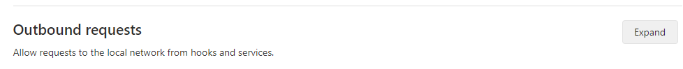
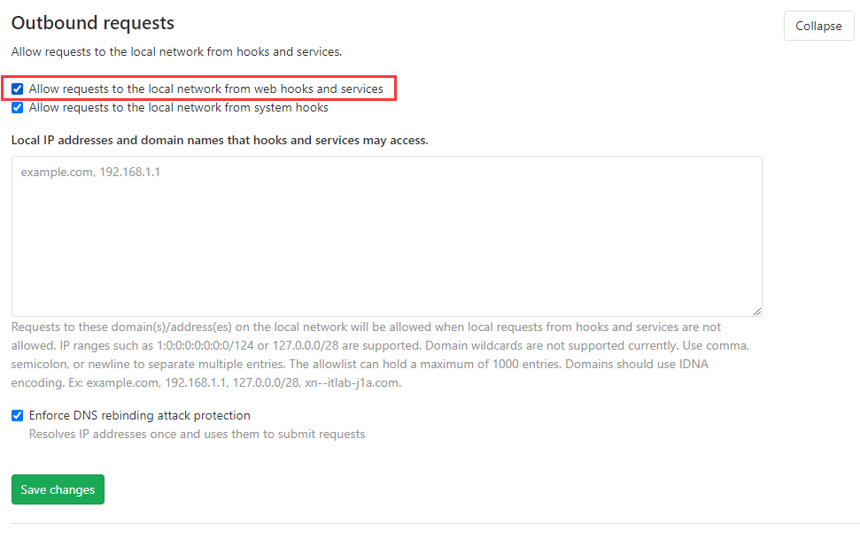
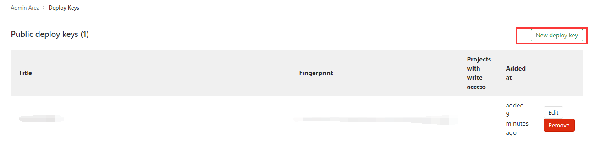
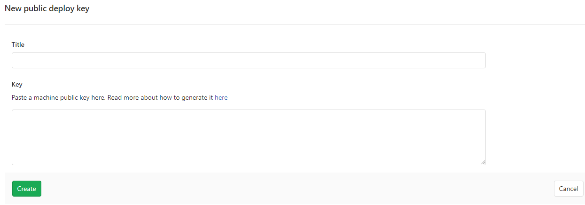
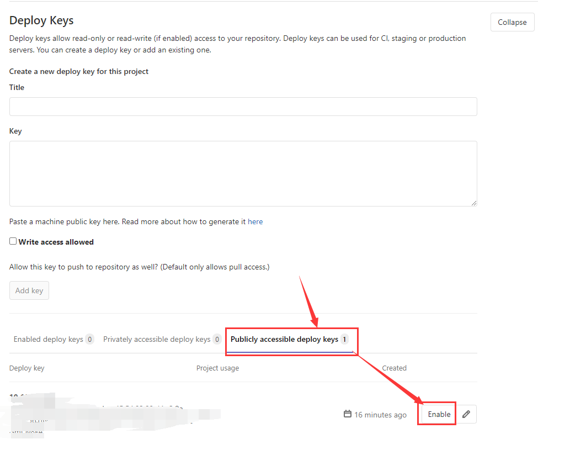
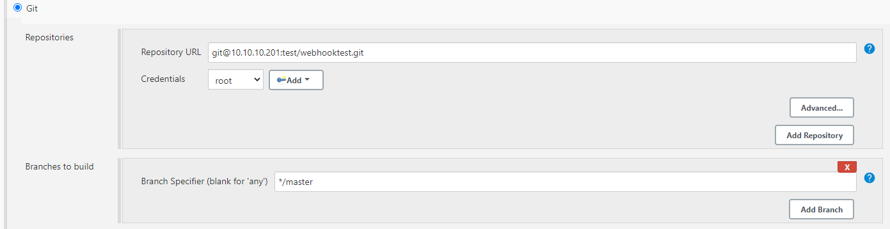
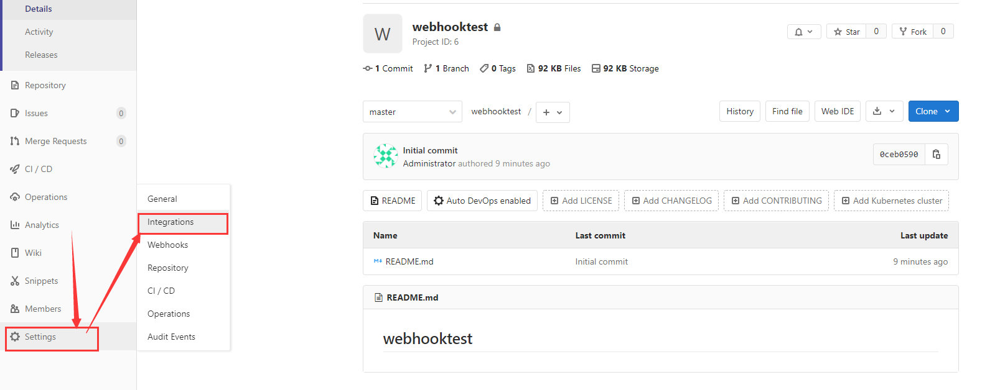
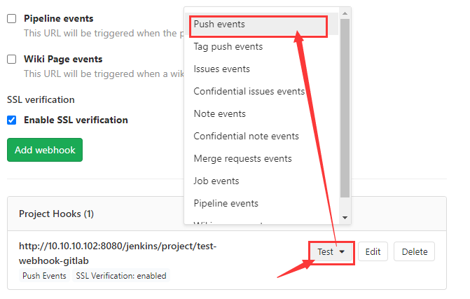

# Jenkins使用webhook自动触发构建

## 实验环境

| IP           | 服务器用途       | 备注 |
| ------------ | ---------------- | ---- |
| 10.10.10.102 | Jenkins(2.235.1) |      |
| 10.10.10.201 | Gitlab代码仓库   |      |

我这里是使用了gitlab当作代码仓库，你也可以选择其他类型的代码仓库，例如：gogs、svn、github等

## Jenkins安装插件

登陆jeknins，选择-->Manage Jenkins-->Manage Plugins-->Available，搜索“Gitlab”，选中插件GitLab和GItlab Hook选择直接安装即可

好像只安装Gitlab也可以

## Gitlab配置

### 创建测试项目

创建一个项目并使用自描述文件初始化仓库

### 设置Gitlab网络

按照下图指示进入网络设置界面

找到“Outbound requests”项目，点击“Expand”展开设置。

勾选”Allow requests to the local network from web hooks and services“，保存设置

### 为项目设置Deploy Keys

gitlab设置密钥有两种方法，一种是直接为单个项目设置Deploy Keys另一个是设置一个全局的Deploy Keys，然后为某个项目启用，这里我使用的是全局方式

#### 生成ssh密钥

ssh-keygen 一路回车即可

#### 配置Gitlab全局Deploy Keys

选择”Admin Area“，就是图中的小扳手，进入管理页面后选择”Deploy Keys“

 

选择"New deploy key"  添加key即可，页面参考图片，输入相关信息点击”Create“即可

进入要启用Deploy Keys的项目，依次选择"Settings"-->"Repository",在接下的页面找个Deploy Keys选项卡，点击”Expand“展开相关设置项目

我们可以看到在这里可以添加Deploy Keys，在这里添加的key仅对此项目生效，我们进入"Publicly accessible deploy keys"，可以看到我们添加的全局Deploy Keys，找到要启用的key选择Enable即可。这样我们就能在Enabled deploy keys中看到我们启用的Deploy Keys

此时就可以到服务器上进行测试了

 

## 配置项目

### 新建并配置项目

1、配置git地址，这个需要我们先创建项目并设置好部署密钥

2、启用git webook，勾选”Build when a change is pushed to GitLab. GitLab webhook URL: http://10.10.10.102:8080/jenkins/project/test-webhook-gitlab“

同时在高级选项中生成token

3、点击下图中的”Generate“生成随机的Secret token，这时先应用一下当前配置，我们去gitlab中配置相关参数

### 设置项目Webhook

1、进入项目依次选择"Settings"-->"Integrations"

2、选择”Go to Webhooks“

3、配置相关参数，这两个参数就是我们jenkins配置生成的相关参数，下面几项是触发场景，根据自己的项目进行配置即可，这里我就选择了默认的push操作。

4、点击”Add webhook“进行保存，下面的页面，可以看到我们增加了一个Project Hooks

 

5、完善jenkins相关配置，保存退出，我这里仅仅是测试webhook触发，因此就没有做其他部署操作。

## 测试webhook

我们在gitlab的当前项目的webhook设置页面手动推送一个测试

 

可以看到上方出现推送成功的信息，这时就可以到jenkins对应的项目中查看构建信息

 

可以从构建历史中看到下图信息，现在就成功了，可以尝试推送文件到仓库中看是不是能构建成功

 

!!! warning "温馨提示，Jenkins要开启匿名访问并且关闭跨站请求伪造保护，否则会提示403错误"

!!! warning "部分版本gitlab需要	设置允许外发请求"