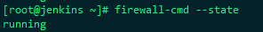
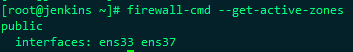
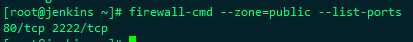

# Firewalld的简单使用

从Centos7开始默认防火墙就已经更换为了firewall，替换了之前的iptables

Firewalld服务采用firewall-cmd或firewall-config来动态管理kernel netfilter的临时或永久的接口规则，并实时生效而无需重启服务。

## Firewalld服务管理

systemctl status firewalld   查看Firewalld的状态

systemctl stop firewalld      停止Firewalld

systemctl start firewalld      启动Firewalld

## firewall-cmd命令使用

### 查看firewall-cmd运行状态

firewall-cmd --state

 

### 查看区域信息

firewall-cmd --get-active-zones

 

### 查看已打开的所有端口

firewall-cmd --zone=public --list-ports  

 

### 开放指定端口

firewall-cmd --zone=public --add-port=8080/tcp --permanent 

--permanent表示永久生效，如果没有此参数，重启后配置会失效

修改配置后必须要重新加载才能生效：firewall-cmd --reload

 

### 查看指定端口开放信息

firewall-cmd --zone=public --query-port=8080/tcp

 

### 指定源地址开放端口

firewall-cmd --permanent --add-rich-rule="rule family="ipv4" source address="10.10.10.92" port protocol="tcp" port="6379" accept"

 

### 删除开放端口

firewall-cmd --zone=public --remove-port=2222/tcp --permanent

 