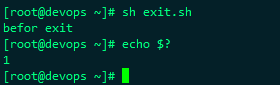

常用判断条件:

le 小于等于

lt 小于

ge 大于等于

gt 大于

ne 不等于	

eq 等于


## 一、IF语句

### A、if常见的判断结构：

1、if..

```shell
if [判断条件]
then
执行shell
fi
```

2、if..else

```shell
if [判断条件]
then 
  执行shell
else
  执行shell
fi
```

3、if..elif..else

```shell
if [判断条件]
then
  执行shell
elif [判断条件]
then
  执行shell
else
  执行shell
fi
```


> shell例子

```
#!/bin/bash
a=5
if [$a -gt 3]  ##判断a是否大于3
then
  echo "a>3"
fi
```


### B、if判断的几种用法

a、if [ -f 1.txt]；then echo okl；fi  ##判断1.txt是否是一个文件

b、if [ -d 1.txt]；then echo okl；fi  ##判断1.txt是否是一个目录

c、if [ -r 1.txt]；then echo okl；fi   ##判断1.txt是否可读

[ -a FILE ]  如果 FILE 存在则为真。  

[ -b FILE ]  如果 FILE 存在且是一个块特殊文件则为真。  

[ -c FILE ]  如果 FILE 存在且是一个字特殊文件则为真。  

[ -d FILE ]  如果 FILE 存在且是一个目录则为真。  

[ -e FILE ]  如果 FILE 存在则为真。  

[ -f FILE ]  如果 FILE 存在且是一个普通文件则为真。  

[ -g FILE ]  如果 FILE 存在且已经设置了SGID则为真。  

[ -h FILE ]  如果 FILE 存在且是一个符号连接则为真。  

[ -k FILE ]  如果 FILE 存在且已经设置了粘制位则为真。  

[ -p FILE ]  如果 FILE 存在且是一个名字管道(F如果O)则为真。  

[ -r FILE ]  如果 FILE 存在且是可读的则为真。  

[ -s FILE ]  如果 FILE 存在且大小不为0则为真。  

[ -t FD ]  如果文件描述符 FD 打开且指向一个终端则为真。  

[ -u FILE ]  如果 FILE 存在且设置了SUID (set user ID)则为真。  

[ -w FILE ]  如果 FILE 如果 FILE 存在且是可写的则为真。  

[ -x FILE ]  如果 FILE 存在且是可执行的则为真。  

[ -O FILE ]  如果 FILE 存在且属有效用户ID则为真。  

[ -G FILE ]  如果 FILE 存在且属有效用户组则为真。  

[ -L FILE ]  如果 FILE 存在且是一个符号连接则为真。  

[ -N FILE ]  如果 FILE 存在 and has been mod如果ied since it was last read则为真。  

[ -S FILE ]  如果 FILE 存在且是一个套接字则为真。  

[ FILE1 -nt FILE2 ]  如果 FILE1 has been changed more recently than FILE2, or 如果 FILE1 exists and FILE2 does not则为真。  

[ FILE1 -ot FILE2 ]  如果 FILE1 比 FILE2 要老, 或者 FILE2 存在且 FILE1 不存在则为真。  

[ FILE1 -ef FILE2 ]  如果 FILE1 和 FILE2 指向相同的设备和节点号则为真。  

[ -o OPTIONNAME ]  如果 shell选项 “OPTIONNAME” 开启则为真。  

[ -z STRING ]  “STRING” 的长度为零则为真。 字符串为空即NULL时为真。 

[ -n STRING ] or [ STRING ]  “STRING” 的长度为非零 non-zero则为真。加-n与不加-n结果相同。  

[ STRING1 == STRING2 ]  如果2个字符串相同。 “=” may be used instead of “==” for strict POSIX compliance则为真。  

[ STRING1 != STRING2 ]  如果字符串不相等则为真。 

[ STRING1 < STRING2 ]  如果 “STRING1” sorts before “STRING2” lexicographically in the current locale则为真。  

[ STRING1 > STRING2 ]  如果 “STRING1” sorts after “STRING2” lexicographically in the current locale则为真。

## 二、case语句

```shell
case 匹配母板 in
模版1)
  shell语句
;;
模版2）
  shell语句
;;
.....
.....

*）
  shell语句
;;
esac
```

*代表除了模版外的条件


> shell例程：

```shell
#!/bin/sh
echo "Please input "yes" or "no""
read var
case "$var" in
[yY][eE][sS] ) 
  echo "Your input is YES" 
  ;;
[nN][oO] ) 
  echo "Your input is no" 
  ;;
* )
  echo "Input Error!" ;;
esac
exit 0
```


## 三、break、continue和exit

break常用于跳出循环使用，一般加数字参数表示跳出当前循环，也可以增加数字参数表示跳出几层循环体

break 用来结束所有循环，循环语句不再有执行的机会；

continue 用来结束本次循环，直接跳到下一次循环，如果循环条件成立，还会继续循环；

exit用来退出当前进程，任何语句不再有执行的机会。


### break

#### 跳出单循环

```shell
#!/bin/bash
sum=0
while read n
do
  if((n>0))
  then
    ((sum+=n))
  else
    break
  fi
done
echo "sum=$sum"
```


#### 跳出双层循环

```shell
#!/bin/bash
i=0
while ((++i))
do
  if((i>4))
  then
    break
  fi
  j=0;
  while ((++j))
  do
    if((j>4)); then
      break  
    fi
   printf "%-4d" $((i*j))
  done
  printf "\n"
done
```


### continue


### exit

exit 命令可以接受一个整数值作为参数，代表退出状态。如果不指定，默认状态值是 0。

一般情况下，退出状态为 0 表示成功，退出状态为非 0 表示执行失败（出错）了。

exit 退出状态只能是一个介于 0~255 之间的整数，其中只有 0 表示成功，其它值都表示失败。

Shell执行出错时，可以根据退出状态来判断具体出现了什么错误，比如打开一个文件时，我们可以指定 1 表示文件不存在，2 表示文件没有读取权限，3 表示文件类型不对。

示例脚本：exit.sh

```shell
#!/bin/bash
echo "befor exit"
exit 1
echo "after exit"
```

执行结果如下：

